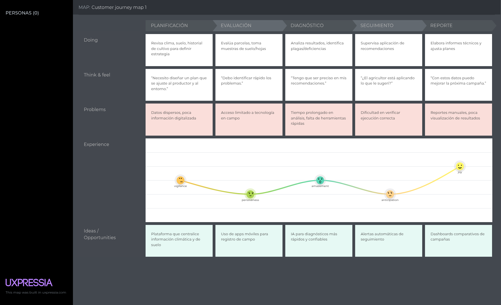

<h3>Universidad Peruana de Ciencias Aplicadas</h3>

 

<strong>Ingeniería de Software - 2025-20</strong> 
<strong>1ASI0729 - Desarrollo de Aplicaciones Open Source</strong> 
<strong>NRC: 7349</strong> 
<strong>Profesor: Efraín Ricardo Bautista Ubillús</strong> 

 <strong>Informe del Trabajo Final</strong>   

<strong>Startup: GITECH </strong> 
<strong>Producto: AgroTrack</strong> 

### Team Members:
  
|                Member                |   Code    |
|:------------------------------------:|:---------:|
| Almandroz Carbajal Pierina Marysabel | 202316845 |
|         Amaro Villar Anjali          | 20221G044 |
|     Jara Benites Quique Vladimir     |    ...    |
|   Quintanilla Pozo Gonzalo Samuel    |    ...    |
|     Vilca Saboya Diego Alejandro     |    ...    |

<strong> Setiembre 2025</strong> 

# Registro de Versiones del Informe

| Versión | Fecha | Autor | Descripción de modificación |
|---------|-------|-------|-----------------------------|
|         |       |       |                             |
|         |       |       |                             |
|         |       |       |                             |
|         |       |       |                             |
|         |       |       |                             |
|         |       |       |                             |

# Project Report Collaboration Insights

---

# Contenido
## Tabla de contenidos
- [Student Outcome](#student-outcome)
- [Capítulo I: Introducción](#capítulo-i-introducción)
    - [1.1. Startup Profile](#11-startup-profile)
        - [1.1.1. Descripción de la Startup](#111-descripción-de-la-startup)
        - [1.1.2. Perfiles de integrantes del equipo](#112-perfiles-de-integrantes-del-equipo)
    - [1.2. Solution Profile](#12-solution-profile)
        - [1.2.1. Antecedentes y problemática](#121-antecedentes-y-problemática)
        - [1.2.2. Lean UX Process](#122-lean-ux-process)
            - [1.2.2.1. Lean UX Problem Statements](#1221-lean-ux-problem-statements)
            - [1.2.2.2. Lean UX Assumptions](#1222-lean-ux-assumptions)
            - [1.2.2.3. Lean UX Hypothesis Statements](#1223-lean-ux-hypothesis-statements)
            - [1.2.2.4. Lean UX Canvas](#1224-lean-ux-canvas)
    - [1.3. Segmentos objetivo](#13-segmentos-objetivo)
- [Capítulo II: Requirements Elicitation & Analysis](#capítulo-ii-requirements-elicitation--analysis)
    - [2.1. Competidores](#21-competidores)
        - [2.1.1. Análisis competitivo](#211-análisis-competitivo)
        - [2.1.2. Estrategias y tácticas frente a competidores](#212-estrategias-y-tácticas-frente-a-competidores)
    - [2.2. Entrevistas](#22-entrevistas)
        - [2.2.1. Diseño de entrevistas](#221-diseño-de-entrevistas)
        - [2.2.2. Registro de entrevistas](#222-registro-de-entrevistas)
        - [2.2.3. Análisis de entrevistas](#223-análisis-de-entrevistas)
    - [2.3. Needfinding](#23-needfinding)
        - [2.3.1. User Personas](#231-user-personas)
        - [2.3.2. User Task Matrix](#232-user-task-matrix)
        - [2.3.3. User Journey Mapping](#233-user-journey-mapping)
        - [2.3.4. Empathy Mapping](#234-empathy-mapping)
    - [2.4. Big Picture Event Storming](#24-big-picture-event-storming)
    - [2.5. Ubiquitous Language](#25-ubiquitous-language)
- [Capítulo III: Requirements Specification](#capítulo-iii-requirements-specification)
    - [3.1. User Stories](#31-user-stories)
    - [3.2. Impact Mapping](#32-impact-mapping)
    - [3.3. Product Backlog](#33-product-backlog)
- [Capítulo IV: Product Design](#capítulo-iv-product-design)
    - [4.1. Style Guidelines](#41-style-guidelines)
        - [4.1.1. General Style Guidelines](#411-general-style-guidelines)
        - [4.1.2. Web Style Guidelines](#412-web-style-guidelines)
    - [4.2. Information Architecture](#42-information-architecture)
        - [4.2.1. Organization Systems](#421-organization-systems)
        - [4.2.2. Labeling Systems](#422-labeling-systems)
        - [4.2.3. SEO Tags and Meta Tags](#423-seo-tags-and-meta-tags)
        - [4.2.4. Searching Systems](#424-searching-systems)
        - [4.2.5. Navigation Systems](#425-navigation-systems)
    - [4.3. Landing Page UI Design](#43-landing-page-ui-design)
        - [4.3.1. Landing Page Wireframe](#431-landing-page-wireframe)
        - [4.3.2. Landing Page Mock-up](#432-landing-page-mock-up)
    - [4.4. Web Applications UX/UI Design](#44-web-applications-uxui-design)
        - [4.4.1. Web Applications Wireframes](#441-web-applications-wireframes)
        - [4.4.2. Web Applications Wireflow Diagrams](#442-web-applications-wireflow-diagrams)
        - [4.4.2. Web Applications Mock-ups](#442-web-applications-mock-ups)
        - [4.4.3. Web Applications User Flow Diagrams](#443-web-applications-user-flow-diagrams)
    - [4.5. Web Applications Prototyping](#45-web-applications-prototyping)
    - [4.6. Domain-Driven Software Architecture](#46-domain-driven-software-architecture)
        - [4.6.1. Design-Level Event Storming](#461-design-level-event-storming)
        - [4.6.2. Software Architecture Context Diagram](#462-software-architecture-context-diagram)
        - [4.6.3. Software Architecture Container Diagrams](#463-software-architecture-container-diagrams)
        - [4.6.4. Software Architecture Components Diagrams](#464-software-architecture-components-diagrams)
    - [4.7. Software Object-Oriented Design](#47-software-object-oriented-design)
        - [4.7.1. Class Diagrams](#471-class-diagrams)
    - [4.8. Database Design](#48-database-design)
        - [4.8.1. Database Diagrams](#481-database-diagrams)
- [Capítulo V: Product Implementation, Validation & Deployment](#capítulo-v-product-implementation-validation--deployment)
    - [5.1. Software Configuration Management](#51-software-configuration-management)
        - [5.1.1. Software Development Environment Configuration](#511-software-development-environment-configuration)
        - [5.1.2. Source Code Management](#512-source-code-management)
        - [5.1.3. Source Code Style Guide & Conventions](#513-source-code-style-guide--conventions)
        - [5.1.4. Software Deployment Configuration](#514-software-deployment-configuration)
    - [5.2. Landing Page, Services & Applications Implementation](#52-landing-page-services--applications-implementation)
        - [5.2.1. Sprint 1](#521-sprint-1)
            - [5.2.1.1. Sprint Planning 1](#5211-sprint-planning-1)
            - [5.2.1.2. Aspect Leaders and Collaborators](#5212-aspect-leaders-and-collaborators)
            - [5.2.1.3. Sprint Backlog 1](#5213-sprint-backlog-1)
            - [5.2.1.4. Development Evidence for Sprint Review](#5214-development-evidence-for-sprint-review)
            - [5.2.1.5. Execution Evidence for Sprint Review](#5215-execution-evidence-for-sprint-review)
            - [5.2.1.6. Services Documentation Evidence for Sprint Review](#5216-services-documentation-evidence-for-sprint-review)
            - [5.2.1.7. Software Deployment Evidence for Sprint Review](#5217-software-deployment-evidence-for-sprint-review)
            - [5.2.1.8. Team Collaboration Insights during Sprint](#5218-team-collaboration-insights-during-sprint)
- [Conclusiones](#conclusiones)
- [Bibliografía](#bibliografía)
- [Anexos](#anexos)

---

## Student Outcome

El curso contribuye al cumplimiento del Student Outcome ABET:

**ABET – EAC - Student Outcome 3**
**Criterio:** *Capacidad de comunicarse efectivamente con un rango de audiencias.*

En el siguiente cuadro se describe las acciones realizadas y enunciados de
conclusiones por parte del grupo, que permiten sustentar el haber alcanzado el logro
del ABET – EAC - Student Outcome 3.

| Criterio específico                                                    | Acciones realizadas | Conclusiones |
|------------------------------------------------------------------------|---------------------|--------------|
| Comunica oralmente con efectividad a diferentes rangos de audiencia.   |                     |              |
| Comunica por escrito con efectividad a diferentes rangos de audiencia. |                     |              |

## Capítulo I: Introducción
### 1.1. Startup Profile
#### 1.1.1. Descripción de la Startup    
#### 1.1.2. Perfiles de integrantes del equipo

### 1.2. Solution Profile
#### 1.2.1. Antecedentes y problemática
#### 1.2.2. Lean UX Process
##### 1.2.2.1. Lean UX Problem Statements
##### 1.2.2.2. Lean UX Assumptions
##### 1.2.2.3. Lean UX Hypothesis Statements
##### 1.2.2.4. Lean UX Canvas
### 1.3. Segmentos objetivo

## Capítulo II: Requirements Elicitation & Analysis
### 2.1. Competidores
#### 2.1.1. Análisis competitivo
#### 2.1.2. Estrategias y tácticas frente a competidores
### 2.2. Entrevistas
#### 2.2.1. Diseño de entrevistas
#### 2.2.2. Registro de entrevistas
#### 2.2.3. Análisis de entrevistas
### 2.3. Needfinding
#### 2.3.1. User Personas
#### 2.3.2. User Task Matrix
##### User Task Matrix - Agrónomos

| Tarea                                                      | Frecuencia | Importancia |
|-------------------------------------------------------------|------------|-------------|
| Diagnosticar estado del suelo y recomendar análisis         | Media      | Alta        |
| Diseñar plan de siembra (cultivos por temporada)            | Media      | Muy Alta    |
| Elaborar plan de fertilización y nutrición vegetal          | Media      | Alta        |
| Monitorear plagas y enfermedades (visitas técnicas/campo)   | Alta       | Muy Alta    |
| Recomendar productos fitosanitarios adecuados               | Alta       | Alta        |
| Asesorar en riego y uso eficiente del agua                  | Alta       | Alta        |
| Capacitar a agricultores en buenas prácticas agrícolas      | Media      | Media       |
| Registrar datos técnicos de ensayos y evaluaciones          | Media      | Alta        |
| Generar reportes técnicos para productores/empresas         | Media      | Muy Alta    |
| Analizar información climática y proyectar riesgos          | Media      | Alta        |
| Investigar y aplicar nuevas tecnologías (agrotech, drones)  | Baja       | Media       |
| Coordinar con instituciones/agencias para apoyo técnico     | Baja       | Media       |

#### 2.3.3. User Journey Mapping
Durante el desarrollo de AgroTrack, aplicamos un user journey mapping orientado a la experiencia de los agrónomos. Nos centramos en comprender cómo estos profesionales recopilan información del campo, analizan variables agronómicas y transforman esos datos en estrategias productivas. El proceso incluyó la observación de sus interacciones con productores, la toma de decisiones técnicas y la elaboración de planes de manejo agrícola.
##### User Jorney Mapping- Agronomos 

[Customer Journey Map](assets/maps/journey_map.png)

#### 2.3.4. Empathy Mapping
##### Empathy Map- Agrónomos

[Empathy map](assets/maps/empathy_map.png)

### 2.4. Big Picture Event Storming
### 2.5. Ubiquitous Language

## Capítulo III: Requirements Specification
### 3.1. User Stories
### 3.2. Impact Mapping
#### Impact map- Agrónomos

### 3.3. Product Backlog

| Orden | User Story Id | Título                           | Descripción                                                                 | Story Points |
|-------|---------------|----------------------------------|-----------------------------------------------------------------------------|--------------|
| 1     | US01          | Crear organización              | Como Agrónomo, deseo crear una organización para centralizar miembros y parcelas. | 5 |
| 2     | US02          | Invitar miembro a organización  | Como Agrónomo, deseo invitar a un Agricultor para sumarlo a mi organización. | 5 |
| 3     | US03          | Remover agricultor              | Como Agrónomo, deseo eliminar a un agricultor para mantener el equipo al día. | 3 |
| 4     | US04          | Crear parcela                   | Como Agrónomo, deseo crear una parcela para gestionar el cultivo y su monitoreo. | 5 |
| 5     | US05          | Modificar parcela               | Como Agrónomo, deseo modificar una parcela para mantener los datos correctos. | 3 |
| 6     | US06          | Definir tipo de cultivo         | Como Agrónomo, deseo definir el tipo de cultivo en una parcela para personalizar el monitoreo. | 5 |
| 7     | US07          | Asignar agricultor a parcela    | Como Agrónomo, deseo asignar un agricultor a una parcela para definir responsables. | 3 |
| 8     | US08          | Añadir recomendaciones          | Como Agrónomo, deseo añadir recomendaciones en una parcela para guiar a los agricultores. | 3 |
| 9     | US09          | Iniciar monitoreo               | Como Agrónomo, deseo iniciar el monitoreo de una parcela para habilitar el registro de datos. | 2 |
| 10    | US13          | Alertas climáticas automáticas  | Como Agrónomo, deseo recibir alertas de clima para anticipar riesgos. | 5 |
| 11    | US14          | Alertas por umbrales de cultivo | Como Agrónomo, deseo configurar umbrales para generar alertas internas. | 5 |
| 12    | US15          | Crear checklist                 | Como Agrónomo, deseo crear un checklist para estandarizar labores en una parcela. | 3 |
| 13    | US16          | Crear tarea                     | Como Agrónomo, deseo crear una tarea con responsable y fecha para planificar el trabajo. | 5 |
| 14    | US19          | Modificar/cancelar tarea        | Como Agrónomo, deseo modificar o cancelar tareas para replanificarlas. | 3 |
| 15    | US21          | Solicitar reporte de parcela    | Como Agrónomo, deseo solicitar un reporte de parcela para analizar su desempeño. | 5 |
| 16    | US22          | Solicitar reporte general       | Como Agrónomo, deseo solicitar un reporte general de la organización para ver indicadores globales. | 5 |
| 17    | US23          | Generar/descargar reporte       | Como Agrónomo, deseo generar y descargar reportes para compartirlos. | 3 |

## Capítulo IV: Product Design
### 4.1. Style Guidelines
#### 4.1.1. General Style Guidelines
#### 4.1.2. Web Style Guidelines
### 4.2. Information Architecture
#### 4.2.1. Organization Systems
#### 4.2.2. Labeling Systems
#### 4.2.3. SEO Tags and Meta Tags
#### 4.2.4. Searching Systems
#### 4.2.5. Navigation Systems
### 4.3. Landing Page UI Design
#### 4.3.1. Landing Page Wireframe
#### 4.3.2. Landing Page Mock-up
### 4.4. Web Applications UX/UI Design
#### 4.4.1. Web Applications Wireframes
#### 4.4.2. Web Applications Wireflow Diagrams
#### 4.4.2. Web Applications Mock-ups
#### 4.4.3. Web Applications User Flow Diagrams
### 4.5. Web Applications Prototyping
### 4.6. Domain-Driven Software Architecture
#### 4.6.1. Design-Level Event Storming
#### 4.6.2. Software Architecture Context Diagram
#### 4.6.3. Software Architecture Container Diagrams
#### 4.6.4. Software Architecture Components Diagrams
### 4.7. Software Object-Oriented Design
#### 4.7.1. Class Diagrams
### 4.8. Database Design
#### 4.8.1. Database Diagrams

## Capítulo V: Product Implementation, Validation & Deployment
### 5.1. Software Configuration Management
#### 5.1.1. Software Development Environment Configuration
#### 5.1.2. Source Code Management
#### 5.1.3. Source Code Style Guide & Conventions
#### 5.1.4. Software Deployment Configuration
### 5.2. Landing Page, Services & Applications Implementation
#### 5.2.1. Sprint 1
##### 5.2.1.1. Sprint Planning 1
##### 5.2.1.2. Aspect Leaders and Collaborators
##### 5.2.1.3. Sprint Backlog 1
##### 5.2.1.4. Development Evidence for Sprint Review
##### 5.2.1.5. Execution Evidence for Sprint Review
##### 5.2.1.6. Services Documentation Evidence for Sprint Review
##### 5.2.1.7. Software Deployment Evidence for Sprint Review
##### 5.2.1.8. Team Collaboration Insights during Sprint

# Conclusiones

# Bibliografía

# Anexos  
