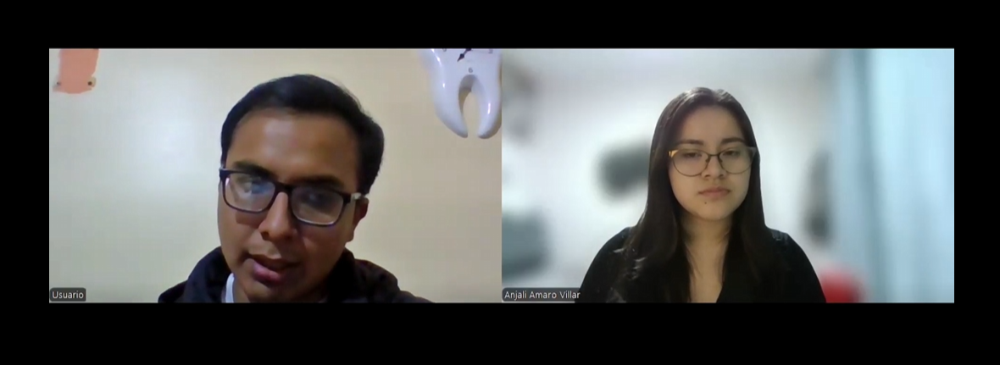
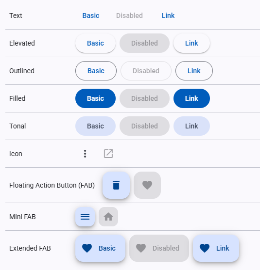
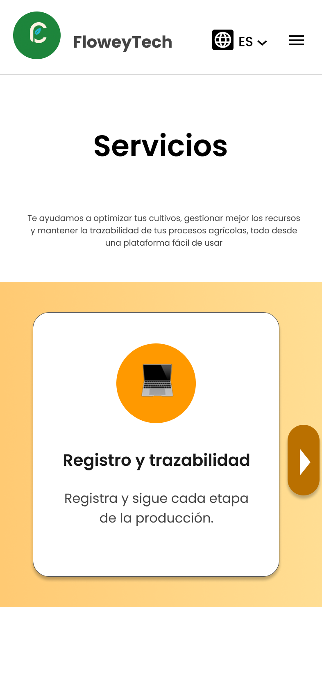
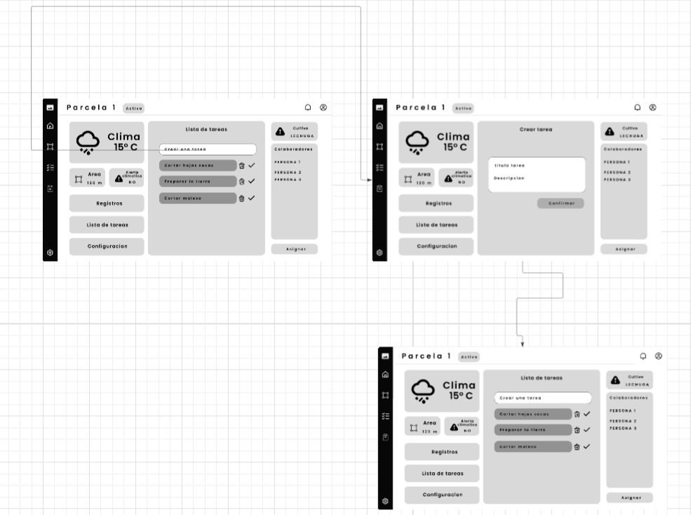
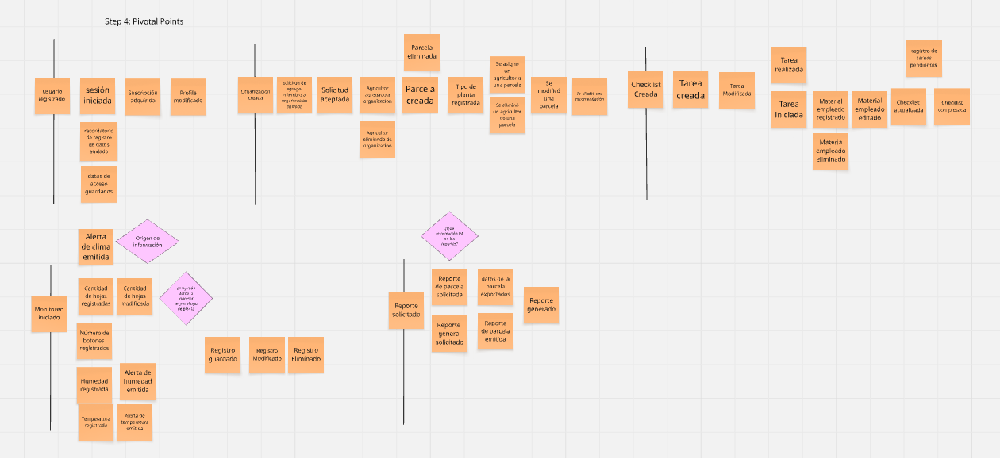
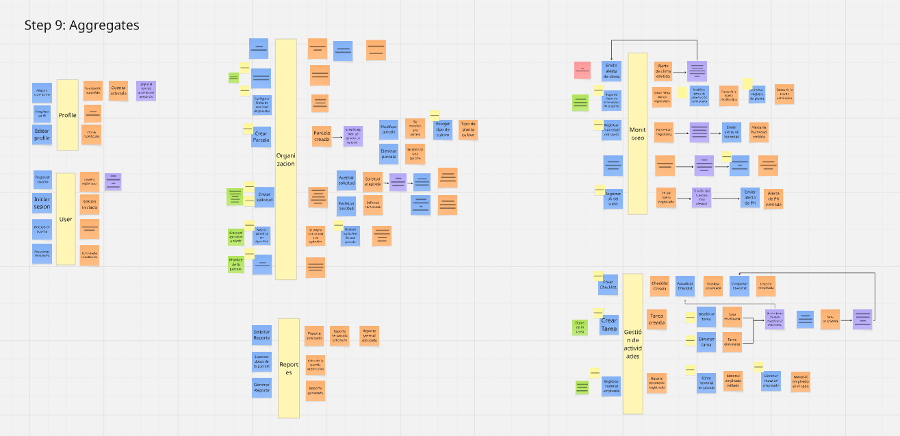
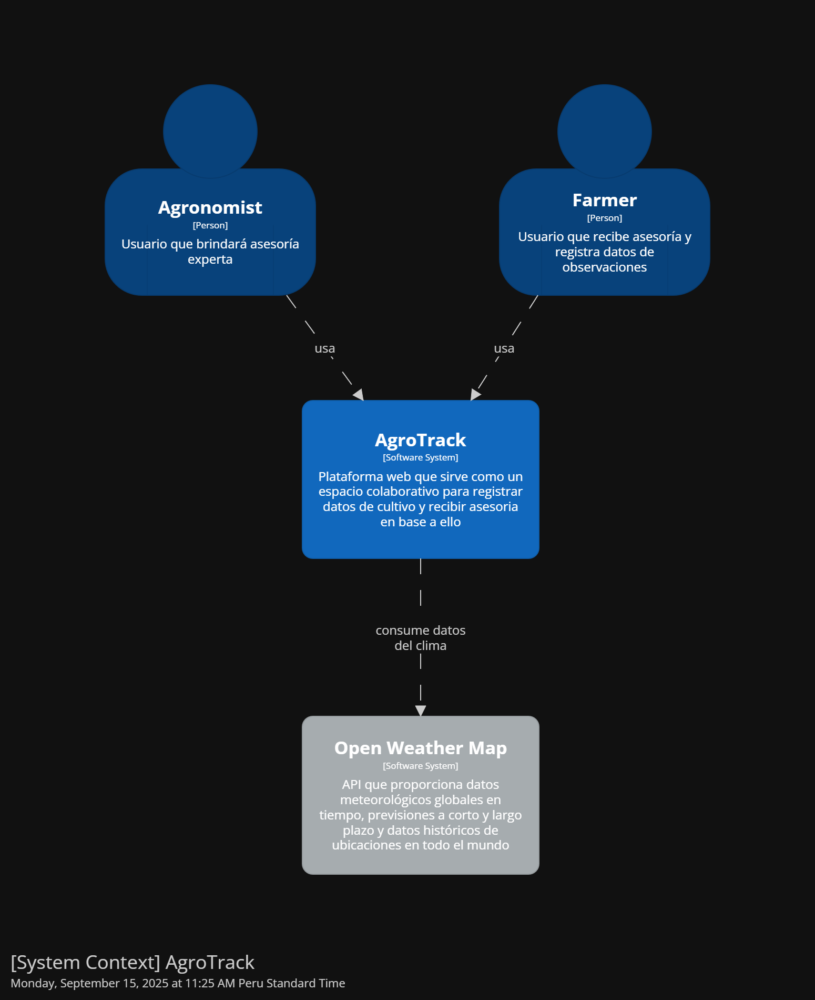
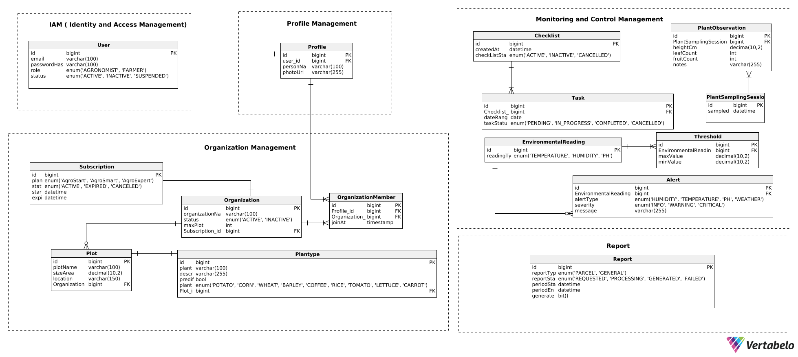

<div align="center">

<h3>Universidad Peruana de Ciencias Aplicadas</h3>

<br>

<strong>Ingeniería de Software - 2025-20</strong><br>
<strong>1ASI0729 - Desarrollo de Aplicaciones Open Source</strong><br>
<strong>NRC: 7349</strong><br>
<strong>Profesor: Efraín Ricardo Bautista Ubillús</strong><br>

<br><strong>Informe del Trabajo Final</strong><br><br> 

<strong>Startup: FloweyTech </strong><br>
<strong>Producto: AgroTrack</strong><br>


### Team Members:
  
|                Member                |        Code        |
|:------------------------------------:|:------------------:|
| Almandroz Carbajal Pierina Marysabel |     202316845      |
|         Amaro Villar Anjali          |     20221G044      |
|     Jara Benites Quique Vladimir     |     202022365      |
|   Quintanilla Pozo Gonzalo Samuel    |     202315007      |
|     Vilca Saboya Diego Alejandro     |     20231A778      |


<strong>30 de Noviembre del 2025</strong><br>
</div>


<div style="page-break-after: always;"></div>

# Registro de Versiones del Informe

**TB1**

| Versión | Fecha      | Autor               | Descripción de modificación                                                                     |
|---------|------------|---------------------|-------------------------------------------------------------------------------------------------|
| TB1      | 19/09/2025 | Anjali Amaro        | Elaboración completa del Capítulo I (Introducción). Diseño y registro de entrevistas.           |
| TB1      | 19/09/2025 | Gonzalo Quintanilla | Desarrollo de análisis competitivo y estrategias frente a competidores. User Stories iniciales. |
| TB1      | 19/09/2025 | Vladimir Jara       | Registro y análisis de entrevistas. Construcción de User Task Matrix y User Journey Mapping.    |
| TB1      | 19/09/2025 | Pierina Almandroz   | Construcción de User Personas, User Task Matrix, Empathy Mapping e Impact Mapping.              |
| TB1      | 19/09/2025 | Diego Vilca         | Elaboración de Ubiquitous Language, Style Guidelines y wireframes de Landing Page.              |
| TB1      | 19/09/2025 | Equipo completo     | Desarrollo de Big Picture Event Storming y Design-Level Event Storming.                         |

**TP**

| Versión | Fecha       | Autor               | Descripción de modificación                                       |
|---------|-------------|---------------------|-------------------------------------------------------------------|
| TP      | 06/10/2025  | Anjali Amaro        | Correcciones TB1 y Sección organization- management de la app Web |
| TP      | 06/10/2025  | Gonzalo Quintanilla | Correcciones TB1 y Estilos de la app Web                          |
| TP      | 07/10/2025  | Vladimir Jara       | Correcciones TB1 y Sección Reports e Iam de la app Web            |
| TP      | 07/10/2025  | Pierina Almandroz   | Correcciones TB1                                                  |
| TP      | 06/10/2025  | Diego Vilca         | Correcciones TB1 y Sección Profile de la app Web                  |
| TP      | 07/10/2025  | Equipo completo     | Correcciones TB1 y Avance general de la app Web                   |

**TB2**

| Versión | Fecha      | Autor               | Descripción de modificación                                                                |
|---------|------------|---------------------|--------------------------------------------------------------------------------------------|
| TB2     | 27/10/2025 | Anjali Amaro        | Estructura del informe para el sprint 3                                                    |
| TB2     | 07/11/2025 | Gonzalo Quintanilla | Correcciones del TP                                                                        |
| TB2     | 07/11/2025 | Vladimir Jara       | Se añadió el Sprint Backlog 3                                                              |
| TB2     | 14/11/2025 | Diego Vilca         | Corrección de Sprint planning anteriores y implementación del sprint planning del sprint 3 |
| TB2     | 15/11/2025 | Equipo completo     | Correcciones TP y Avance general del backend y frontend                                    |


<div style="page-break-after: always;"></div>

# Project Report Collaboration Insights

Enlace para acceder al repositorio del reporte del proyecto: [*Ver en GitHub*](https://github.com/FloweyTech/agrotrack-report)

**TB1**
Para el desarrollo del TB cada participante del equipo realizo las siguientes tareas:

| Integrante                            | Tareas Realizadas                                                                                                                                                                                                                                                                                                                                                                                                        |
|---------------------------------------|--------------------------------------------------------------------------------------------------------------------------------------------------------------------------------------------------------------------------------------------------------------------------------------------------------------------------------------------------------------------------------------------------------------------------|
| Almandroz Carbajal Pierina Marysabel	 | Registro de entrevista User Task Matrix, User Journey Mapping, Empathy Mapping, Impact Mapping, Web Applications Wireframes, Web Applications Mock-ups, Web Applications Prototyping.                                                                                                                                                                                                                                    |
| Amaro Villar Anjali                   | Capítulo I, Diseño de entrevistas, Registro de tres entrevistas, análisis de entrevistas, User Personas, Capítulo IV, Class Diagrams, Database Diagram, Capítulo V.                                                                                                                                                                                                                                                      |
| Jara Benites Quique Vladimir	         | Registro de entrevista, User Task Matrix, User Journey Mapping, Empathy Mapping, Impact Mapping, Web Applications Wireframes, Web Applications Mock-ups, Product Backlog, Spring Backlog 1, Development Evidence for Sprint Review, Execution Evidence for Sprint Review, Services Documentation Evidence for Sprint Review, Software Deployment Evidence for Sprinte Review, Team collaboration insights during sprint. |                                                                                                                                                    
| Quintanilla Pozo Gonzalo Samuel	      | Analisis competitivo, Estrategias y táctica frente a competidores, User Stories, Web Applications Wireframes, Web Applications Mock-ups.                                                                                                                                                                                                                                                                                 |
| Vilca Saboya Diego Alejandro	         | Big Picture Event Storming, Ubiquitous Language, Landing Page UI Design, Web Applications Wireflow Diagrams, Web Applications User Flow Diagrams, Domain-Driven Software Architecture, Spring Planning 1, Aspect Leaders and Collaborators.                                                                                                                                                                              | 

**TP**  

| Integrante                            | Tareas Realizadas                                                                                                                                                     |
|---------------------------------------|-----------------------------------------------------------------------------------------------------------------------------------------------------------------------|
| Almandroz Carbajal Pierina Marysabel	 | Corecciones del tb1                                                                                                                                                   |
| Amaro Villar Anjali                   | Correciones del tb1, Elaboracion diagramas c4 extendidos de modulos Organizaton y Monitoring and Control                                                              |
| Jara Benites Quique Vladimir	         | Elaboracion Sprint planing 2, definicion Aspect Leaders and Collaborators, Construccion Sprint backlog 2, Elaboracion diagramas c4 extendidos de modulos Report e IAM |                                                                                                                                                    
| Quintanilla Pozo Gonzalo Samuel	      | Elaboracion Sprint planing 2, definicion Aspect Leaders and Collaborators, Construccion Sprint backlog 2                                                              |
| Vilca Saboya Diego Alejandro	         | Corecciones del tb1, Elaboracion diagramas c4 extendidos de modulos Profile                                                                                           | 


**TB2**

| Integrante                        | Tareas Realizadas                                                                                                                                                                                                                                           |
|-----------------------------------|-------------------------------------------------------------------------------------------------------------------------------------------------------------------------------------------------------------------------------------------------------------|
| Amaro Villar Anjali               | Monitoring and control bounded context, Software Deployment Evidence for Sprint Review, Diseño de Entrevistas, registro de Entrevistas, Evaluaciones según heurísticas                                                                                      |
| Jara Benites Quique Vladimir	     | IAM bounded context, profile and organization bounded context, Sprint Backlog 3, Development Evidence for Sprint Review, Execution Evidence for Sprint Review, Services Documentation Evidence for Sprint Review, Team Collaboration Insights during Sprint |
| Quintanilla Pozo Gonzalo Samuel	  | Class diagramas, components diagramam.                                                                                                                                                                                                                      |
| Vilca Saboya Diego Alejandro	     | Report bounded context, Sprint Planning 3, Aspect Leaders and Collaborators, registro de Entrevistas, Video About-the-Product                                                                                                                               |

**GitHub Collaboration Insights**

En GitHub se presenta un timeline de las principales ramas creadas por cada integrante del equipo, así como los procesos de _merge_ realizados.
Todas las ramas fueron gestionadas siguiendo el flujo de trabajo GitFlow, adaptado para una organización que utiliza un sistema de control de versiones.

Los integrantes son: 

| Integrante                            | Usuario GitHub |
|---------------------------------------|----------------|
| Almandroz Carbajal Pierina Marysabel	 | pierinaaa29    | 
| Amaro Villar Anjali                   | njlmrvllr      |
| Jara Benites Quique Vladimir	         | QuiqueVladimir |
| Quintanilla Pozo Gonzalo Samuel	      | GoldQP         |
| Vilca Saboya Diego Alejandro	         | diesoks        |

Las principales ramas del repositorio son las siguientes:

* `main`: Rama principal que contiene la versión estable del proyecto.
* `develop`: Rama de desarrollo donde se integran las nuevas características antes de ser fusionadas a `main`.
* `feature/sprintX-pierina`: Rama utilizada por Pierina para el desarrollo de la tareas correspondientes a un determinado sprint.
* `feature/sprintX-anjali`: Rama utilizada por Anjali para el desarrollo de la tareas correspondientes a un determinado sprint.
* `feature/sprintX-quique`: Rama utilizada por Quique para el desarrollo de la tareas correspondientes a un determinado sprint.
* `feature/sprintX-gonzalo`: Rama utilizada por Gonzalo para el desarrollo de la tareas correspondientes a un determinado sprint.
* `feature/sprintX-diego`: Rama utilizada por Diego para el desarrollo de la tareas correspondientes a un determinado sprint.
* `realese/vX.X.X`: Rama creada para preparar versiones candidatas al reporte final, siguiendo Semantic Versioning 2.0.0. En esta rama se realizan ajustes finales como correcciones menores y revisiones antes de integrarla a `main`.
* `hotfix/urgent-fix`: Rama utilizada para aplicar correcciones urgentes a la rama `main` en caso de detectar errores críticos.

**TB1**

Gráfico de red (network graph) de ramas en el repositorio de GitHub.


A continuación, se muestran los gráficos con el análisis de los commits realizados en el repositorio. Estos reflejan tanto la cantidad de líneas de código añadidas por cada integrante del equipo como la actividad de commits registrada.


**TP1**

Gráfico de red (network graph) de ramas en el repositorio de GitHub.


A continuación, se muestran los gráficos con el análisis de los commits realizados en el repositorio. Estos reflejan tanto la cantidad de líneas de código añadidas por cada integrante del equipo como la actividad de commits registrada.


**TB2**

Gráfico de red (network graph) de ramas en el repositorio de GitHub.


A continuación, se muestran los gráficos con el análisis de los commits realizados en el repositorio. Estos reflejan tanto la cantidad de líneas de código añadidas por cada integrante del equipo como la actividad de commits registrada.


<div style="page-break-after: always;"></div>


# Contenido

- [Student Outcome](#student-outcome)
- [Capítulo I: Introducción](#capítulo-i-introducción)
    - [1.1. Startup Profile](#11-startup-profile)
        - [1.1.1. Descripción de la Startup](#111-descripción-de-la-startup)
        - [1.1.2. Perfiles de integrantes del equipo](#112-perfiles-de-integrantes-del-equipo)
    - [1.2. Solution Profile](#12-solution-profile)
        - [1.2.1. Antecedentes y problemática](#121-antecedentes-y-problemática)
        - [1.2.2. Lean UX Process](#122-lean-ux-process)
            - [1.2.2.1. Lean UX Problem Statements](#1221-lean-ux-problem-statements)
            - [1.2.2.2. Lean UX Assumptions](#1222-lean-ux-assumptions)
            - [1.2.2.3. Lean UX Hypothesis Statements](#1223-lean-ux-hypothesis-statements)
            - [1.2.2.4. Lean UX Canvas](#1224-lean-ux-canvas)
    - [1.3. Segmentos objetivo](#13-segmentos-objetivo)
- [Capítulo II: Requirements Elicitation & Analysis](#capítulo-ii-requirements-elicitation--analysis)
    - [2.1. Competidores](#21-competidores)
        - [2.1.1. Análisis competitivo](#211-análisis-competitivo)
        - [2.1.2. Estrategias y tácticas frente a competidores](#212-estrategias-y-tácticas-frente-a-competidores)
    - [2.2. Entrevistas](#22-entrevistas)
        - [2.2.1. Diseño de entrevistas](#221-diseño-de-entrevistas)
        - [2.2.2. Registro de entrevistas](#222-registro-de-entrevistas)
        - [2.2.3. Análisis de entrevistas](#223-análisis-de-entrevistas)
    - [2.3. Needfinding](#23-needfinding)
        - [2.3.1. User Personas](#231-user-personas)
        - [2.3.2. User Task Matrix](#232-user-task-matrix)
        - [2.3.3. User Journey Mapping](#233-user-journey-mapping)
        - [2.3.4. Empathy Mapping](#234-empathy-mapping)
    - [2.4. Big Picture Event Storming](#24-big-picture-event-storming)
    - [2.5. Ubiquitous Language](#25-ubiquitous-language)
- [Capítulo III: Requirements Specification](#capítulo-iii-requirements-specification)
    - [3.1. User Stories](#31-user-stories)
    - [3.2. Impact Mapping](#32-impact-mapping)
    - [3.3. Product Backlog](#33-product-backlog)
- [Capítulo IV: Product Design](#capítulo-iv-product-design)
    - [4.1. Style Guidelines](#41-style-guidelines)
        - [4.1.1. General Style Guidelines](#411-general-style-guidelines)
        - [4.1.2. Web Style Guidelines](#412-web-style-guidelines)
    - [4.2. Information Architecture](#42-information-architecture)
        - [4.2.1. Organization Systems](#421-organization-systems)
        - [4.2.2. Labeling Systems](#422-labeling-systems)
        - [4.2.3. SEO Tags and Meta Tags](#423-seo-tags-and-meta-tags)
        - [4.2.4. Searching Systems](#424-searching-systems)
        - [4.2.5. Navigation Systems](#425-navigation-systems)
    - [4.3. Landing Page UI Design](#43-landing-page-ui-design)
        - [4.3.1. Landing Page Wireframe](#431-landing-page-wireframe)
        - [4.3.2. Landing Page Mock-up](#432-landing-page-mock-up)
    - [4.4. Web Applications UX/UI Design](#44-web-applications-uxui-design)
        - [4.4.1. Web Applications Wireframes](#441-web-applications-wireframes)
        - [4.4.2. Web Applications Wireflow Diagrams](#442-web-applications-wireflow-diagrams)
        - [4.4.3. Web Applications Mock-ups](#443-web-applications-mock-ups)
        - [4.4.3. Web Applications User Flow Diagrams](#443-web-applications-user-flow-diagrams)
    - [4.5. Web Applications Prototyping](#45-web-applications-prototyping)
    - [4.6. Domain-Driven Software Architecture](#46-domain-driven-software-architecture)
        - [4.6.1. Design-Level Event Storming](#461-design-level-event-storming)
        - [4.6.2. Software Architecture Context Diagram](#462-software-architecture-context-diagram)
        - [4.6.3. Software Architecture Container Diagrams](#463-software-architecture-container-diagrams)
        - [4.6.4. Software Architecture Components Diagrams](#464-software-architecture-components-diagrams)
    - [4.7. Software Object-Oriented Design](#47-software-object-oriented-design)
        - [4.7.1. Class Diagrams](#471-class-diagrams)
    - [4.8. Database Design](#48-database-design)
        - [4.8.1. Database Diagrams](#481-database-diagrams)
- [Capítulo V: Product Implementation, Validation & Deployment](#capítulo-v-product-implementation-validation--deployment)
    - [5.1. Software Configuration Management](#51-software-configuration-management)
        - [5.1.1. Software Development Environment Configuration](#511-software-development-environment-configuration)
        - [5.1.2. Source Code Management](#512-source-code-management)
        - [5.1.3. Source Code Style Guide & Conventions](#513-source-code-style-guide--conventions)
        - [5.1.4. Software Deployment Configuration](#514-software-deployment-configuration)
    - [5.2. Landing Page, Services & Applications Implementation](#52-landing-page-services--applications-implementation)
        - [5.2.1. Sprint 1](#521-sprint-1)
            - [5.2.1.1. Sprint Planning 1](#5211-sprint-planning-1)
            - [5.2.1.2. Aspect Leaders and Collaborators](#5212-aspect-leaders-and-collaborators)
            - [5.2.1.3. Sprint Backlog 1](#5213-sprint-backlog-1)
            - [5.2.1.4. Development Evidence for Sprint Review](#5214-development-evidence-for-sprint-review)
            - [5.2.1.5. Execution Evidence for Sprint Review](#5215-execution-evidence-for-sprint-review)
            - [5.2.1.6. Services Documentation Evidence for Sprint Review](#5216-services-documentation-evidence-for-sprint-review)
            - [5.2.1.7. Software Deployment Evidence for Sprint Review](#5217-software-deployment-evidence-for-sprint-review)
            - [5.2.1.8. Team Collaboration Insights during Sprint](#5218-team-collaboration-insights-during-sprint)
        - [5.2.2. Sprint 2](#522-sprint-2)
            - [5.2.2.1. Sprint Planning 2.](#5221-sprint-planning-2)
            - [5.2.2.2. Aspect Leaders and Collaborators.](#5222-aspect-leaders-and-collaborators)
            - [5.2.2.3. Sprint Backlog 2.](#5223-sprint-backlog-2)
            - [5.2.2.4. Development Evidence for Sprint Review.](#5224-development-evidence-for-sprint-review)
            - [5.2.2.5. Execution Evidence for Sprint Review.](#5225-execution-evidence-for-sprint-review)
            - [5.2.2.6. Services Documentation Evidence for Sprint Review.](#5226-services-documentation-evidence-for-sprint-review)
            - [5.2.2.7. Software Deployment Evidence for Sprint Review.](#5227-software-deployment-evidence-for-sprint-review)
            - [5.2.2.8. Team Collaboration Insights during Sprint.](#5228-team-collaboration-insights-during-sprint)
        - [5.2.3. Sprint 3](#523-sprint-3)
            - [5.2.3.1. Sprint Planning 3](#5231-sprint-planning-3)
            - [5.2.3.2. Aspect Leaders and Collaborators](#5232-aspect-leaders-and-collaborators)
            - [5.2.3.3. Sprint Backlog 3](#5233-sprint-backlog-3)
            - [5.2.3.4. Development Evidence for Sprint Review](#5234-development-evidence-for-sprint-review)
            - [5.2.3.5. Execution Evidence for Sprint Review](#5235-execution-evidence-for-sprint-review)
            - [5.2.3.6. Services Documentation Evidence for Sprint Review](#5236-services-documentation-evidence-for-sprint-review)
            - [5.2.3.7. Software Deployment Evidence for Sprint Review](#5237-software-deployment-evidence-for-sprint-review)
            - [5.2.3.8. Team Collaboration Insights during Sprint](#5238-team-collaboration-insights-during-sprint)
        - [5.2.4. Sprint 3](#524-sprint-4)
            - [5.2.4.1. Sprint Planning 4](#5241-sprint-planning-4)
            - [5.2.4.2. Aspect Leaders and Collaborators](#5242-aspect-leaders-and-collaborators)
            - [5.2.4.3. Sprint Backlog 4](#5243-sprint-backlog-4)
            - [5.2.4.4. Development Evidence for Sprint Review](#5244-development-evidence-for-sprint-review)
            - [5.2.4.5. Execution Evidence for Sprint Review](#5245-execution-evidence-for-sprint-review)
            - [5.2.4.6. Services Documentation Evidence for Sprint Review](#5246-services-documentation-evidence-for-sprint-review)
            - [5.2.4.7. Software Deployment Evidence for Sprint Review](#5247-software-deployment-evidence-for-sprint-review)
            - [5.2.4.8. Team Collaboration Insights during Sprint](#5248-team-collaboration-insights-during-sprint)
    - [5.3. Validation Interviews](#53-validation-interviews)
        - [5.3.1. Diseño de entrevistas](#531-diseño-de-entrevistas)
        - [5.3.2. Registro de entrevistas](#532-registro-de-entrevistas)
        - [5.3.3. Evaluaciones según heurísticas](#533-evaluaciones-según-heurísticas)
- [5.4. Video About the Product](#54-video-about-the-product)

- [Conclusiones](#conclusiones)
- [Bibliografía](#bibliografía)
- [Anexos](#anexos)

---

<div style="page-break-after: always;"></div>


# Student Outcome

El curso contribuye al cumplimiento del Student Outcome ABET:

**ABET – EAC - Student Outcome 3**
**Criterio:** *Capacidad de comunicarse efectivamente con un rango de audiencias.*

En el siguiente cuadro se describe las acciones realizadas y enunciados de
conclusiones por parte del grupo, que permiten sustentar el haber alcanzado el logro
del ABET – EAC - Student Outcome 3.

| **Criterio específico**                                                    | **Acciones realizadas (reformuladas)**                                                                                                                                                                                                                                                                                                                                                                                                                                                                                                                                                                                                                                                                                                                                                                                                                                                                                                                                                                                                                             | **Conclusiones**                                                                                                                                                                                                                                                                                                                                                                                                                                                                                                                                                                                                                   |
| -------------------------------------------------------------------------- | ---------------------------------------------------------------------------------------------------------------------------------------------------------------------------------------------------------------------------------------------------------------------------------------------------------------------------------------------------------------------------------------------------------------------------------------------------------------------------------------------------------------------------------------------------------------------------------------------------------------------------------------------------------------------------------------------------------------------------------------------------------------------------------------------------------------------------------------------------------------------------------------------------------------------------------------------------------------------------------------------------------------------------------------- | -------------------------------------------------------------------------------------------------------------------------------------------------------------------------------------------------------------------------------------------------------------------------------------------------------------------------------------------------------------------------------------------------------------------------------------------------------------------------------------------------------------------------------------------------------------------------------------------------------------------------------- |
| **Comunica oralmente con efectividad a diferentes rangos de audiencia.**   | **Anjali**<br>**TB1:** Realizar el diseño y análisis de entrevistas, así como la elaboración de diagramas de clases y base de datos, me ayudó a explicar los hallazgos del proyecto con claridad y confianza ante el equipo.<br>**TP:** Exponer los resultados del análisis y los diagramas me ayudó a reforzar mi capacidad para transmitir información técnica de manera comprensible.<br>**TB2:** Realizar el registro de entrevistas de validación me permitió saber si estamos cumpliendo y entendiendo las necesidades de los usuarios.<br><br>**Quique**<br>**TB1:** Desarrollar el backlog, mock-ups y evidencias del sprint me ayudó a estructurar la información técnica para luego comunicarla efectivamente al grupo.<br>**TP:** Presentar los avances del sprint me permitió explicar con seguridad el progreso técnico y la lógica detrás de cada entrega.<br>**TB2:** Presentar el sprint backlog 3 me permitió comunicar a mis compañeros las tareas que tenía cada uno asignadas y que así todos puedan tener un seguimiento de ellas.<br><br>**Gonzalo**<br>**TB1:** Realizar el análisis competitivo y las estrategias frente a competidores me ayudó a ordenar ideas clave para exponer con claridad los resultados del estudio.<br>**TP:** Exponer las user stories y hallazgos estratégicos me permitió adaptar mi comunicación a un público académico y técnico a la vez.<br>**TB2:** Realizar el diseño de entrevistas de validación me permitió comunicar a mi equipo las características que teníamos que validar de nuestra aplicación.<br><br>**Diego**<br>**TB1:** Elaborar el Event Storming, el lenguaje ubicuo y los diagramas de arquitectura me ayudó a desarrollar un discurso técnico sólido.<br>**TP:** Presentar los flujos de usuario y la arquitectura del sistema me ayudó a explicar conceptos complejos con lenguaje accesible.<br>**TB2:** Realizar el registro de entrevistas me permitió saber si la comunicación que tenemos con los usuarios es la adecuada, para cumplir sus necesidades de negocio. | **Conclusión TB1:**<br>Durante la TB1, se fortalecieron las habilidades de exposición oral al comunicar hallazgos, análisis y diagramas con claridad, mostrando dominio del contenido y adaptación a distintos públicos.<br><br>**Conclusión TP:**<br>En las presentaciones del TP, el equipo demostró confianza, claridad y cohesión al exponer resultados técnicos y de diseño, generando comprensión y retroalimentación efectiva entre docentes y compañeros.<br><br>**Conclusión TB2:**<br>En la TB2, el equipo pudo tener una comunicación sólida y organizada, mejor que en los anteriores avances y también pudo comprobar si la comunicación que tuvieron con sus segmentos fue la mejor. |
| **Comunica por escrito con efectividad a diferentes rangos de audiencia.** | **Anjali**<br>**TB1:** Redactar los capítulos del informe y los diagramas técnicos me ayudó a comunicar de forma escrita los resultados con precisión y estructura.<br>**TP:** Elaborar los reportes finales y documentación técnica me permitió aplicar un lenguaje formal y técnico adecuado a diferentes lectores.<br>**TB2:** Documentar las evidencias de este avance del sprint me ayudó a describir con claridad lo que se avanzó para este mismo.<br><br>**Quique**<br>**TB1:** Registrar las evidencias del sprint y la planificación del backlog me ayudó a desarrollar una comunicación técnica escrita organizada y detallada.<br>**TP:** Redactar la documentación de los avances técnicos me permitió mantener coherencia entre los entregables y los resultados del proyecto.<br>**TB2:** Redactar los endpoints documentados me permitió saber cómo expresar oralmente la implementación de servicios web.<br><br>**Gonzalo**<br>**TB1:** Elaborar los reportes de análisis competitivo y user stories me ayudó a comunicar resultados técnicos con un lenguaje claro y profesional.<br>**TP:** Escribir sobre la validación de las user stories me permitió reforzar mi capacidad para estructurar información técnica con propósito comunicativo.<br>**TB2:** Redactar el diseño de entrevistas de validación me permitió saber comunicar por escrito las necesidades y características que tenemos que validar.<br><br>**Diego**<br>**TB1:** Documentar los diagramas de arquitectura y el lenguaje ubicuo me ayudó a expresar ideas complejas de manera comprensible y formal.<br>**TP:** Redactar los informes de diseño y arquitectura me permitió consolidar mis habilidades de escritura técnica para audiencias diversas.<br>**TB2:** Documentar el sprint planning me permitió comunicarle a mi equipo el objetivo del sprint 3 y un *review* del anterior sprint para que todos tengamos en cuenta qué mejorar. | **Conclusión TB1:**<br>Durante la TB1, se desarrolló una comunicación escrita sólida, organizada y coherente, que permitió documentar con claridad los análisis, diagramas y hallazgos del proyecto.<br><br>**Conclusión TP:**<br>En el TP, los integrantes consolidaron un estilo de redacción técnica más profesional, adaptando su lenguaje a distintos públicos y generando documentación de calidad que respaldó las decisiones del equipo.<br><br>**Conclusión TB2:**<br>En la TB2, el equipo pudo tener una comunicación sólida y organizada, mejor que en los anteriores avances y también pudo comprobar si la comunicación que tuvieron con sus segmentos fue la mejor. |

<div style="page-break-after: always;"></div>


# Capítulo I: Introducción
## 1.1. Startup Profile
### 1.1.1. Descripción de la Startup
 
**FloweyTech** es una startup tecnológica creada por estudiantes de Ingeniería de Software de la Universidad Peruana de Ciencias Aplicadas, enfocada en el desarrollo de soluciones digitales para el sector agrícola. Nuestro producto principal, **AgroTrack**, es una aplicación diseñada para mejorar la productividad y la trazabilidad en el campo, conectando a agricultores y agrónomos a través de un ecosistema digital colaborativo que facilita el registro, monitoreo y análisis de cultivos en tiempo real.

**Misión:** Desarrollar soluciones tecnológicas innovadoras que impulsen la eficiencia y sostenibilidad del sector agrícola, ofreciendo herramientas que fortalezcan la relación entre agricultores y agrónomos, y que contribuyan al crecimiento económico y la seguridad alimentaria.

**Visión:** Convertirnos en la startup agrotech líder en Latinoamérica, reconocida por transformar la manera en que se gestiona la producción agrícola mediante tecnología intuitiva, generando un impacto positivo en la productividad, la trazabilidad y la competitividad del sector.

### 1.1.2. Perfiles de integrantes del equipo

|                                                        Miembro                                                        |                                                                                                                                                                                                                                                      Descripción                                                                                                                                                                                                                                                      |
|:---------------------------------------------------------------------------------------------------------------------:|:---------------------------------------------------------------------------------------------------------------------------------------------------------------------------------------------------------------------------------------------------------------------------------------------------------------------------------------------------------------------------------------------------------------------------------------------------------------------------------------------------------------------:|
|                                                        | **Anjali Amaro Villar \- u20221g044** <br> Mi nombre es Anjali Amaro, tengo 20 años y actualmente curso el 5to ciclo de la carrera de Ingeniería de Software en la UPC. Me considero una persona organizada y responsable, con el objetivo de fomentar un ambiente colaborativo y productivo dentro de mi equipo. Contribuyo con dedicación y compromiso para alcanzar los mejores resultados, apoyándome en mis habilidades técnicas en documentación y en el uso de GitHub para una gestión eficiente de proyectos. |
|  |                                                                                    **Quique Vladimir Jara Benites - u202022365** <br> Estudiante de sexto ciclo de la carrera Ingenieria de Software, tengo conocimientos técnicos en Java, Js y python. Asimismo, para el desarrollo en equipo, cuento con habilidades como participación comunicativa, creatividad, resolución de problemas, adaptabilidad y toma de decisiones                                                                                     | 
|                                                               |                                                                   **Diego Vilca Saboya \-  U20231A778** <br> Mi nombre es Diego Vilca, tengo 19 años y actualmente curso el 6to ciclo de la carrera de Ingeniería de Software. Me gusta fomentar la comunicación en el equipo y contribuir con mis habilidades de captura de requisitos, Domain Driven Design y software architecture junto con herramientas de control de versiones como GitHub.**                                                                   | 
|                                                             |                                                                                                  **Gonzalo Samuel Quintanilla Pozo \- U202315007**   <br> Soy estudiante de la carrera de Ingenieria de Software en la UPC y tengo 20 años, como compañero me gusta apoyar y tomar iniciativa en trabajos grupales. Me especializo en los lenguajes CSS, Java y Pyhton. Tengo experiencia desarrollando paginas web                                                                                                   | 
|                                                             |                                                                                                                **Pierina Almandroz Carbajal \- U202316845**       <br> Soy Pierina, tengo 19 años, soy estudiante de 5to ciclo de Ing. de Software. Me encuentro comprometida con el grupo y tengo un gran interés en el desarrollo de aplicaciones web, área en la que busco seguir especializándome.                                                                                                                | 


## 1.2. Solution Profile
### 1.2.1. Antecedentes y problemática

#### What? (¿Qué?)

#### ¿Cuál es el problema?

El problema es que los agricultores en el Perú todavia registran sus cultivos de manera manual o desordenada, lo que provoca falta de control sobre costos, baja productividad, lo que provoca falta de control sobre costos, baja productividad, y dificulta la trazabilidad de los productos agrícolas causando mayores perdidas económicas. Además, la comunicación entre agricultores y agrónomos es limitada, lo que impide el acceso a asesoramiento técnico oportuno y personalizado.

#### When? (¿Cuándo?)

#### ¿Cuándo ocurre el problema?

El problema ocurre de manera continua durante todo el ciclo agrícola, desde la siembra hasta la cosecha. En las etapas iniciales surge por la falta de planificación y registro de insumos, durante el desarrollo del cultivo por la ausencia de un seguimiento ordenado de labores como riego y fertilización, y al momento de la cosecha por la carencia de datos claros sobre rendimientos y trazabilidad que permitan acceder a mercados más exigentes. En consecuencia, se trata de una dificultad recurrente en cada campaña agrícola.

#### Where? (¿Dónde?)

#### ¿Dónde surge el problema?

El problema ocurre principalmente en zonas rurales y agrícolas del Perú, donde la agricultores aún dependen de registros manuales que generan desorden, baja productividad y falta de trazabilidad. Los agrónomos que los asesoran tampoco cuentan con herramientas digitales simples para centralizar información y gestionar mejor a sus clientes. 

#### ¿A dónde se dirige?

La solución se dirige a agricultores y agrónomos en el Perú que buscan mejorar la gestión de sus cultivos mediante herramientas digitales.

#### Who? (¿Quién?)

#### ¿Quiénes están involucrados? 

Los principales usuarios serán los agricultores y los agrónomos.

#### ¿Quién lo utilizará?

Los agricultores utilizarán la aplicación para registrar labores agrícolas, insumos y rendimientos de sus cultivos, mientras que los agrónomos la emplearán para supervisar fincas, dar seguimiento a las actividades registradas y generar reportes técnicos que respalden sus recomendaciones

#### Why? (¿Por qué?)

#### ¿Cuál es la causa del problema?

La causa principal del problema es la baja digitalización en el sector agrícola en el Perú. Muchos agricultores aún continuan usando registros manuales porque no cuentan con herramientas tecnológicas accesibles, simples y adaptadas a su realidad. A esto se suma la resistencia al cambio hacia métodos digitales y la escasez de soluciones locales, lo que mantiene la brecha entre agricultores y agrónomos.

#### How? (¿Cómo?)

#### ¿En qué condiciones los usuarios usarán nuestro producto?

Los agricultores y agrónomos usarán AgroTrack principalmente durante sus actividades de campo y en la planificación de campañas agrícolas. El agricultor lo empleará para registrar labores y rendimientos al finalizar o durante sus jornadas de trabajo, mientras que el agrónomo lo usará para supervisar los datos de sus clientes y generar reportes técnicos que respalden su asesoría.

#### ¿Cómo nos conocieron nuestros compradores?

Nuestros usuarios podrán conocernos a través de campañas digitales dirigidas al sector agro, ferias especializadas en innovación agrícola, y el contacto directo entre agrónomos y agricultores que ya utilicen la app y la recomienden dentro de su red de trabajo.

#### ¿Cómo prefieren nuestros consumidores acceder a nuestro producto?

Los agricultores prefieren acceder a AgroTrack desde sus teléfonos móviles mediante la plataforma web responsive, ya que les permite registrar sus actividades de manera rápida y práctica mientras gestionan sus labores. Por su parte, los agrónomos prefieren usar la misma plataforma tanto en el celular como en la computadora, para analizar la información de varias fincas, comparar resultados y generar reportes técnicos de manera más detallada.

#### How much? (¿Cuánto?)

#### Estadísticas que sustentan la problemática.

Según el Ministerio de Desarrollo Agrario y Riego (MIDAGRI, 2023), la agricultura familiar representó el 97,6% de todas las unidades agropecuarias en el Perú, lo que refleja que la gran mayoría de productores depende de métodos tradicionales de gestión. Dentro de esta, el 88% corresponde a subsistencia, el 10,6% a intermedia y el 1,4% a consolidada, evidenciando que solo una pequeña parte de agricultores cuenta con mejores condiciones para integrarse a mercados exigentes.

Sin embargo, existe un potencial de mejora: un 36,6% de los agricultores de subsistencia ya destina más de la mitad de su producción a la venta, lo que demuestra que incluso dentro de este grupo existe interés por generar ingresos. Asimismo, un 29,7% de los agricultores familiares intermedios y consolidados transforma su producción para la venta, lo que evidencia un sector con disposición a mejorar sus procesos y dar valor agregado.

Estas cifras muestran que gran parte de la agricultura en el país carece de herramientas digitales que faciliten la organización y la trazabilidad. En este contexto, AgroTrack puede ser una solución útil al permitir que agricultores y agrónomos registren información, organicen sus actividades y generen reportes que respalden la calidad de la producción, mejorando la productividad y el acceso a mercados más competitivos.

### 1.2.2. Lean UX Process

El **Lean UX Process** es una metodología ágil que se centra en la colaboración, la experimentación rápida y el aprendizaje validado. En este proyecto se utiliza este enfoque para comprender las experiencias y problemáticas de agricultores y agrónomos, validando hipótesis mediante prototipos y retroalimentación constante.

##### 1.2.2.1. Lean UX Problem Statements

Nuestro sistema busca facilitar a los agricultores el registro de sus actividades agrícolas para mejorar la organización de su producción.

Hemos observado que muchos agricultores llevan sus registros de forma manual o dispersa, lo que dificulta el seguimiento de sus cultivos y la planificación futura.

**¿Cómo podemos lograr que los agricultores registren y gestionen sus actividades de manera más ordenada y confiable?**

El producto tiene como objetivo apoyar a los agrónomos con datos de campo que respalden sus recomendaciones técnicas.

Actualmente, los agrónomos no reciben información actualizada ni centralizada, lo que afecta la precisión de sus decisiones.

**¿Cómo podemos mejorar el acceso de los agrónomos a información confiable y en tiempo real para optimizar la asesoría técnica?**

Nuestro servicio está orientado a que los agricultores con parcelas reducidas optimicen la planificación de sus cultivos.

Sin embargo, observamos que muchos productores carecen de información organizada para proyectar rendimientos y tomar decisiones de siembra eficientes.

**¿Cómo podemos ayudar a los agricultores a planificar sus cultivos de forma más clara y estructurada para mejorar su productividad?**

##### 1.2.2.2. Lean UX Assumptions

#### Business Assumptions

1. **Creo que mis clientes necesitan** una forma confiable y sencilla de organizar, dar seguimiento y profesionalizar la gestión de sus cultivos.
2. **Estas necesidades se pueden resolver con** una aplicación web que integre registro productivo, alertas y asesoría especializada.
3. **Mis clientes iniciales serán** agricultores pequeños y medianos interesados en digitalizar su producción, y agrónomos que requieren datos de campo.
4. **EL valor más importante que el cliente quiere de mi servicio es** mejorar la productividad y reducir riesgos al tomar decisiones basadas en datos reales.
5. **El cliente también puede obtener estos beneficios adicionales:** acceso a alertas por clima e IoT, gestión de inventario, trazabilidad y asesoría profesional.
6. **Voy a adquirir la mayoría de mis clientes a través de** alianzas con asociaciones de agricultores, ferias agropecuarias, y marketing digital en redes sociales.
7. **Haré dinero a través de** un modelo de suscripción mensual con planes escalonados: AgroStart (5 USD), AgroSmart (25 USD) y AgroExpert (50 USD).
8. **Mi competencia principal en el mercado será** otras apps agrícolas de gestión y plataformas de IoT que ofrecen monitoreo de cultivos.
9. **Los venceremos debido a** un enfoque local adaptado al contexto peruano, facilidad de uso y el valor agregado de la asesoría profesional.
10. **Mi mayor riesgo de producto es que** los agricultores pequeños no adopten la aplicación por falta de familiaridad con la tecnología o baja disposición a pagar.
11. **Resolveremos esto a través de** capacitaciones simples, tutoriales dentro de la app, y un plan de entrada accesible (AgroStart) que facilite la adopción gradual.

#### User Assumptions

**¿Quién es el usuario?**

Los usuarios de Agrotrack son agricultores de diferentes escalas (pequeños y medianos) que buscan organizar y mejorar la gestión de sus cultivos, así como agrónomos que necesitan información de campo confiable y en tiempo real para optimizar sus recomendaciones técnicas.

**¿Qué problemas tiene nuestro producto que resolver?**

Agrotrack busca resolver la desorganización en el registro de actividades agrícolas, la falta de trazabilidad en la producción, la ausencia de alertas preventivas relacionadas con el clima o riesgos del cultivo y la baja adopción tecnológica que limita la eficiencia de los productores.

**¿Que caraterísticas son importantes?**

Las características clave son la posibilidad de registrar y dar seguimiento a los cultivos de manera sencilla, recibir alertas climáticas e integrar datos de IoT, gestionar inventarios agrícolas, mantener trazabilidad de la producción y, en planes avanzados, acceder a asesoría especializada de agrónomos.

**¿Dónde encaja nuestro producto en su trabajo o vida?**

El producto encaja en la rutina diaria de los agricultores como una herramienta que reemplaza los registros manuales y centraliza la información productiva, convirtiéndose en apoyo esencial para la planificación de cultivos, la toma de decisiones y la mejora continua de la productividad.

**¿Cuándo y cómo nuestro producto es usado?**

Agrotrack se utiliza en distintos momentos del ciclo agrícola: al planificar cultivos, registrar actividades de campo, gestionar inventario y recibir notificaciones relacionadas con el clima o posibles riesgos. Su uso principal es a través de una aplicación web accesible desde navegadores en computadoras o dispositivos móviles, lo que permite a los usuarios consultarla y actualizar información de manera práctica en cualquier lugar con conexión a internet.

**¿Cómo debe verse nuetro producto y cómo comportarse?**

El producto debe tener un diseño visual simple y claro, con iconos intuitivos y un lenguaje accesible que permita a los usuarios aprender a usarlo rápidamente; además, debe comportarse de forma ágil, confiable y proactiva, enviando notificaciones oportunas y garantizando una experiencia sin fricciones.

##### 1.2.2.3. Lean UX Hypothesis Statements

- **Hypothesis 01:**

    **Creemos que** los agricultores pequeños registrarán con mayor frecuencia sus actividades agrícolas si cuentan con una herramienta digital sencilla.

    **Sabremos que** hemos tenido éxito. 

    **Cuando** los usuarios ingresen al menos dos registros semanales en la aplicación.


- **Hypothesis 02:**

  **Creemos que** los agricultores medianos reducirán pérdidas productivas si reciben alertas en tiempo real sobre el clima y condiciones críticas.

  **Sabremos que** hemos tenido éxito.

  **Cuando** los usuarios reporten menos incidentes climáticos en entrevistas y un 20% de reducción en pérdidas en sus cultivos.


- **Hypothesis 03:**

  **Creemos que** los agricultores aumentarán su eficiencia si pueden controlar su inventario agrícola desde la plataforma.

  **Sabremos que** hemos tenido éxito.

  **Cuando** los usuarios utilicen la función de inventario al menos una vez por semana y reporten mejoras en la gestión de insumos.


- **Hypothesis 04:**

  **Creemos que** los agricultores estarán más satisfechos y fidelizados si reciben asesoría directa de agrónomos desde la plataforma.

  **Sabremos que** hemos tenido éxito.

  **Cuando** la tasa de retención del plan AgroExpert supere el 80% después de seis meses de uso.

  
- **Hypothesis 05:**

  **Creemos que** los agrónomos podrán brindar recomendaciones más precisas y rápidas si tienen acceso a datos actualizados de los cultivos en Agrotrack.

  **Sabremos que** hemos tenido éxito.

  **Cuando** los agrónomos reporten en entrevistas que la aplicación mejora su trabajo diario y al menos el 60% use la plataforma para consultar datos antes de dar asesorías.


##### 1.2.2.4. Lean UX Canvas

El Lean UX Canvas es una herramienta visual que permite alinear al equipo en torno a problemas, usuarios e hipótesis de manera ágil. En este proyecto se utilizó para comprender mejor a los agricultores y agrónomos, identificar sus necesidades y definir cómo Agrotrack puede generar valor real en su trabajo diario.

Aquí se presenta el Lean UX Canvas desarrollado para Agrotrack:

**Figura 1. Lean UX Canvas de Agrotrack**


**Enlace al Lean UX Canvas:** [*Ver en Miro*](https://miro.com/welcomeonboard/cFdpMVVSM1czSlJINm93ZFcyN3R0VWNrKyt1ZVA3K3NNa1BBNHhRdDJsQzFTcjRQbTVSRm1YMzBqaUswUnFieHQ3dHJsbk93eWVVVkovak9aeStNY2EvcDg3VGJkSDlsU1BUbVpLT3U1N3AxekZweHhDb1E0c1h6VjQxa0FxN3h3VHhHVHd5UWtSM1BidUtUYmxycDRnPT0hdjE=?share_link_id=945675870248)

## 1.3. Segmentos objetivo

En el análisis del segmento objetivo para Agrotrack, hemos previsto que nuestros principales usuarios serán **agricultores y agrónomos.**

### Agricultores

Según el Ministerio de Desarrollo Agrario y Riego (MIDAGRI, 2023) **el 78,5% de las unidades agropecuarias en Perú tienen menos de 5 hectáreas**, lo que refleja la prevalencia de productores de pequeña escala con limitaciones de organización y acceso a mercados. Este grupo requiere soluciones digitales simples que les permitan mejorar la gestión de sus cultivos y profesionalizar sus procesos productivos.

- **Edad:** 25 a 60 años.

- **Necesidad clave:** Organizar cultivos, prevenir riesgos climáticos y mejorar trazabilidad.

- **Nivel educativo:** Organizar cultivos, prevenir riesgos climáticos y mejorar trazabilidad.

- **Uso de tecnología:** Uso básico de teléfonos móviles o computadoras, con necesidad de soluciones adaptadas a su contexto.

### Agrónomos

De acuerdo con Puntel et al. (2022), la adopción de la agricultura digital en Sudamérica aún presenta limitaciones, lo que genera dificultades para acceder a datos confiables y actualizados en el campo. En este contexto, los agrónomos requieren plataformas que centralicen la información y les permitan brindar recomendaciones técnicas más precisas y oportunas.

- **Edad:** 28 a 5 años.

- **Necesidad clave:** Acceso a datos de campo confiables para optimizar asesorías.

- **Nivel educativo:** Profesionales con formación en agronomía o ciencias agrícolas.

- **Uso de tecnología:** Familiarizados con herramientas digitales, pero necesitan soluciones específicas para el sector agro.

# Capítulo II: Requirements Elicitation & Analysis
## 2.1. Competidores
### 2.1.1. Análisis competitivo

Ahora veremos un analisis competitivo para identificar a los principales actores del mercado agrotech en Perú y evaluar sus fortalezas
y debilidades. Esto nos permite definir la propuesta de valor de AgroTrack y crear estrategia que vayan a ayudar a ser diferentes y
capturar la atencion de nuestro usuarios, tanto agricultores como agrónomos.


<table>
  <thead>
    <tr>
      <th colspan="7"><b>Competitive Analysis Landscape</b></th>
    </tr>
  </thead>
  <tbody>
    <tr>
      <td colspan="2" align="center">¿Por qué llevar a cabo este análisis?</td>
      <td colspan="5" align="center">El objetivo de este análisis es identificar las características de los competidores, evaluar sus fortalezas y debilidades, y encontrar maneras de diferenciarnos para obtener una ventaja competitiva.</td>
    </tr>
      <tr>
    <td colspan="2" rowspan="2" valign="top">Startup y Competidores</td>
        <td valign="top" align="center">Nuestra Startup</td>
        <td valign="top" align="center">Space AG</td>
        <td valign="top" align="center">AGROS</td>
        <td valign="top" align="center">AgriSoft</td>
  </tr>
  <tr>
    <td valign="top" align="center"></td>
    <td valign="top" align="center"></td>
    <td valign="top" align="center"></td>
    <td valign="top" align="center"></td>
   </tr>
  <tr>
    <td rowspan="2" valign="top">Perfil</td>
    <td valign="top">Overview</td>
    <td valign="top">Es una plataforma web orientada a la gestión de cultivos en la agricultura familiar. Permite registrar, supervisar y analizar la producción, además de vincular a los agricultores con agrónomos dentro de un ecosistema digital colaborativo que impulsa la productividad y garantiza la trazabilidad.</td>
    <td valign="top">Plataforma web para la gestión de cultivos en la agricultura familiar, enfocada en registros productivos y asesoría técnica.</td>
    <td valign="top">Software para la gestión de operaciones agrícolas de gran escala, con módulos específicos para control de plagas y mano de obra.</td>
    <td valign="top">Solución tecnológica para optimizar la cadena de valor agrícola, mejorando la productividad y la conexión entre productores.</td>
  </tr>
  <tr>
    <td valign="top">Ventaja competitiva ¿Qué valor ofrece a los clientes?</td>
    <td valign="top">Nosotros ofrecemos a los agricultores y agrónomos una herramienta simple y adaptada a la realidad peruana. Su principal valor es la conexión directa entre los usuarios y agrónomos, el registro sencillo de labores de campo y alertas en tiempo real, lo que no se encuentra en las demás.</td>
    <td valign="top">Ellos se destacan en la gestión integral de operaciones a gran escala para empresas agroindustriales. También, sus módulos especializados en Fito-sanidad, riego y gestión de personal le permiten ofrecer un control detallado de grandes volúmenes de gran producción.</td>
    <td valign="top">La ventaja de ellos se ve en la digitalización de la cadena de valor, permitiendo a los productores no solo gestionar sus cultivos, sino también conectar con un ecosistema más amplio de proveedores y compradores.</td>
    <td valign="top">Ellos ofrecen una gestión financiera y productiva integral a través de su Software. Capaz de centralizar todos los procesos de negocios de empresas agrícolas en una única plataforma.</td>
  </tr>
  <tr>
    <td rowspan="2" valign="top">Perfil de Marketing</td>
    <td valign="top">Mercado objetivo</td>
    <td valign="top">Agricultores de pequeña y mediana escala, y agrónomos en Perú que buscan una gestión mas ordenada y profesional de sus cultivos.</td>
    <td valign="top">Es una empresa agroindustriales y grandes productores que requieren una gestión compleja de sus operaciones, personal y producción a una gran escala.</td>
    <td valign="top">Productores y empresas que buscan optimizar la cadena de valor y conectar con otros actores del sector agrícola para mejorar sus procesos.</td>
    <td valign="top">Empresas agrícolas que necesitan un Sistema Completo para integrar y gestionar todas sus áreas tanto desde la contabilidad y finanzas hasta la producción.</td>
  </tr>
  <tr>
    <td valign="top">Estrategias de marketing</td>
    <td valign="top">Marketing digital dirigido a audiencias del sector agrícola, alianzas estratégicas con asociaciones de agricultores y participación en ferias especializadas.</td>
    <td valign="top">Ventas B2B directas, alianzas con consultores del sector y campañas dirigidas a empresas, enfatizando el retorno de inversión a gran escala.</td>
    <td valign="top">Publicidad en plataformas especializadas, eventos del sector y colaboraciones con organizaciones que promueven la innovación en la agricultura.</td>
    <td valign="top">Ventas consultivas, demostraciones del producto a equipos gerenciales y campañas de marketing de contenidos que demuestran la funcionalidad de su Sistema.</td>
  </tr>
  <tr>
    <td rowspan="3" valign="top">Perfil de Producto</td>
    <td valign="top">Productos & Servicios</td>
    <td valign="top">Registro de cultivos y actividades, gestión de inventario, alertas en tiempo real(Clima/IoT), canal de asesoría con agrónomos y reportes técnicos</td>
    <td valign="top">Módulos para gestión de riego, sanidad vegetal, control de personal y empaque, con un enfoque en la digitalización de operaciones en campo.</td>
    <td valign="top">Solución para la trazabilidad y optimización de la cadena de valor, facilitando la conexión entre productores y otros actores del sector.</td>
    <td valign="top">Suite de Software ERP que integra unos módulos de ventanas, inventario, finanzas, contabilidad y producción en un solo sistema.</td>
  </tr>
  <tr>
    <td valign="top">Precios & Costos</td>
    <td valign="top">Modelo de suscripción mensual con planes escalonados de $5, $25, $50 USD </td>
    <td valign="top">Se basa en un modelo de cotización personalizada, con planes de precios que varían según el tamaño de la finca y los módulos requeridos por la empresa.</td>
    <td valign="top">Dependen de los servicios específicos y necesidades de cada usuario.</td>
    <td valign="top">Precios de cotización personalizada del usuario o se basa en la venta de licencias o servicio.</td>
  </tr>
  <tr>
    <td valign="top">Canales de distribución (Web y/o Móvil)</td>
    <td valign="top">Plataforma web responsiva para PC, Tablet y celular, disponible desde cualquier navegador y no requiere descargar de una app nativa.</td>
    <td valign="top">Acceso a través de una plataforma web y app móvil para equipos de campo. Las ventas de estas suelen ser a través de contacto directo con las empresas.</td>
    <td valign="top">Aplicación web y móvil para la gestión de las operaciones, complementada con las ventas directas a empresas y agricultores.</td>
    <td valign="top">Ventas consultivas directas y demostración de su software, ya que esta implementación requiere de un proceso de asesoría técnica.</td>
  </tr>
  <tr>
    <td rowspan="4" valign="top">Análisis SWOT</td>
    <td valign="top">Fortalezas</td>
    <td valign="top">Tenemos un enfoque local para el pequeño y mediano agricultor peruano. Conexión directa entre los agricultores y agrónomos. Facilidad de uso con una interfaz simple.</td>
    <td valign="top">Solución robusta y completa para la gestión de operaciones de empresas a gran escala. Cuenta con módulos especializados y un alto nivel de integración.</td>
    <td valign="top">Su modelo se enfoca en la conexión de la cadena de valor, uniendo a productores con un ecosistema de negocios. Permite una visión integral del sector.</td>
    <td valign="top">Es un ERP completo y escalable que centraliza la gestión financiera y productiva. Es una solución ideal para empresas que buscan un control total de sus procesos.</td>
  </tr>
  <tr>
    <td valign="top">Debilidades</td>
    <td valign="top">Al ser esta un nuevo Startup tiene un bajo notoriedad de marca. También un riesgo de resistencia al cambio por los agricultores. Requerimiento de un esfuerzo en capacitación y adopción al iniciar.</td>
    <td valign="top">Precios elevados y una curva de aprendizaje compleja para usuarios sin experiencia. No está diseñada para las necesidades específicas de la agricultura familiar.</td>
    <td valign="top">La complejidad de su solución podría ser una barrera para la adopción en productores individuales y pequeños negocios.</td>
    <td valign="top">Tiene unos costos muy elevados de implementación y mantenimiento. No es accesible para los productores de pequeña escala y se enfoca en un nicho de mercado reducido.</td>
  </tr>
  <tr>
    <td valign="top">Oportunidades</td>
    <td valign="top">Gran mercado de agricultores familiares que aun usan métodos manuales. Asociaciones de agricultores como potenciales aliados. Crecimiento del interés en la trazabilidad de productos en el mercado.</td>
    <td valign="top">Expansión a nuevos mercados o la oferta de soluciones para otros segmentos de la cadena de valor como distribuidores o exportadores.</td>
    <td valign="top">La tendencia a la digitalización del sector va a ser una oportunidad de expandir su base de clientes y fortalecer su red de valor.</td>
    <td valign="top">Desarrollar versiones simplificadas o que sean adaptables a las pequeñas y medianas empresas.</td>
  </tr>
  <tr>
    <td valign="top">Amenazas</td>
    <td valign="top">La baja digitalización y resistencia al cambio en este sector. La aparición de soluciones gratuitas o muy simples de los competidores.</td>
    <td valign="top">El surgimiento de competidores más agiles que ofrecerán soluciones especializadas a un costo menor.</td>
    <td valign="top">Posible dependencia de alianzas con grandes empresas del sector.  La falta de adaptación a las necesidades de pequeños productores que podría limitar su crecimiento.</td>
    <td valign="top">El desarrollo de herramientas mas accesibles que no requieren una solución tan compleja o costosa como un ERP completo.</td>
  </tr>
  <tr>
    <td rowspan="4" valign="top">Precios y costos</td>
    <td valign="top">Costo Anual</td>
    <td valign="top">Desde $60 USD hasta $600 USD.</td>
    <td valign="top">Cotización personalizada.</td>
    <td valign="top">Cotización personalizada.</td>
    <td valign="top">Cotización personalizada.</td>
  </tr>
  <tr>
    <td valign="top">Mensual</td>
    <td valign="top">Plan escalonado de $5, $25,$50 USD.</td>
    <td valign="top">No es disponible públicamente ya que se define a través de un estudio.</td>
    <td valign="top">No es disponible públicamente ya que varía en una función de módulos y funcionalidades que necesite el cliente.</td>
    <td valign="top">No disponible públicamente ya que el costo es negociado y basada en unas licencias y la implementación.</td>
  </tr>
</table>

### 2.1.2. Estrategias y tácticas frente a competidores

#### Estrategias:

- Posicionar a AgroTrack como una solución accesible e intuitiva, diseñada para el pequeño agricultor peruano, a diferencia de las plataformas complejas y costosas de la competencia.

- Enfocarse en la funcionalidad única de conectar a agrónomos y agricultores, transformando de una simple herramienta registro a un canal de asesoría y valor agregado.

- Ofreceremos un modelo de suscripción escalonado con un plan de entrada de bajo costo lo cual lo hace mas atractivo que los métodos manuales (gratos, pero con ineficiencias) y más accesible que los ERP completos.

- Superar brechas tecnológicas y la resistencia al cambio, demostrando que la aplicación puede reemplazar los métodos manuales y desordenados con una solución simple y más efectiva.

#### Tácticas:

- Desarrollar tutoriales y guías dentro de la aplicación para facilitar la adopción por parte de usuarios con baja familiaridad tecnológica.

- Colaborar con asociaciones agricultores y cooperativas para llegar a un gran número de usuarios de manera directa y generar confianza.

- Participar activamente en ferias agrícolas y utilizar campañas de marketing digital en redes sociales como Instagram, tiktok, Facebook, X, etc.., para educar a los usuarios sobre los beneficios de la digitalización.

- Crear una herramienta dentro del sitio web que muestre a los agricultores potencial de ahorro y aumento de productividad al usar AgroTrack versus sus métodos actuales.


## 2.2. Entrevistas
Esta sección expone la investigación basada en entrevistas realizadas a agricultores y agrónomos, segmentos clave del proyecto. A través de sus testimonios se buscó identificar las principales dificultades en la gestión agrícola y explorar cómo una solución digital podría responder de manera efectiva a sus necesidades.

### 2.2.1. Diseño de entrevistas

Las entrevistas fueron diseñadas con el objetivo de explorar en profundidad las prácticas, necesidades y dificultades de agricultores y agrónomos. A través de preguntas principales y complementarias se buscó obtener información demográfica, tecnológica y de gestión, que permita construir arquetipos representativos y validar la pertinencia de una solución digital como AgroTrack.

### Segmento 1: Agricultores

#### Gestión agrícola actual

- ¿Cómo organizas tus actividades en la parcela día a día?
- ¿Qué herramientas utilizas para registrar información sobre tus cultivos (libretas, Excel, ninguna)?
- ¿Sueles planificar la siembra, riego o cosecha con anticipación? ¿Cómo lo haces?

#### Monitoreo y control

- ¿Cómo haces seguimiento al crecimiento de tus plantas (conteo de hojas, botones, frutos,tamaño, etc.)?
- ¿Qué información te sería útil recibir en reportes para mejorar tu producción?
- ¿Qué tan fácil es para ti acceder a un agrónomo cuando necesitas apoyo en el campo?

#### Uso de tecnología

- ¿Usas el celular u otro dispositivo para apoyar tu trabajo agrícola?
- ¿Has probado alguna herramienta digital relacionada con agricultura? ¿Qué te gustó o no?

#### Dolores y frustraciones

- ¿Qué es lo más complicado de gestionar tus cultivos?
- ¿Cómo te afecta no tener datos organizados de tu parcela?

#### Expectativas

- Si tuvieras una aplicación para apoyarte en la gestión agrícola, ¿qué problemas te gustaría que te ayude a resolver?
- ¿Qué tipo de información o apoyo te sería más útil recibir en una aplicación agrícola?
- ¿Estarías dispuesto a aprender a usar una aplicación si esta te ayuda a mejorar la gestión de tus cultivos?
- ¿Qué necesitarías para sentirte cómodo usando una aplicación agrícola (capacitación, soporte, facilidad de uso)?

### Segmento 2: Agrónomos

#### Trabajo actual

- ¿Cómo recopilas la información de las parcelas que supervisas?
- ¿Qué métodos usas para dar recomendaciones a agricultores?
- ¿Con qué frecuencia visitas a tus clientes o parcelas?

#### Herramientas y procesos

- ¿Qué herramientas digitales (si alguna) usas actualmente para tu trabajo?
- ¿Cómo te comunicas con los agricultores (WhatsApp, llamadas, correo)?
- ¿Qué tipo de reportes o datos sueles preparar para tus clientes?

#### Problemas y limitaciones

- ¿Qué es lo más difícil al dar asesoría a agricultores?
- ¿Qué obstáculos encuentras al transmitir tus recomendaciones a agricultores?

#### Tecnología y digitalización

- ¿Has probado apps o sistemas digitales para agricultura? ¿Cómo fue tu experiencia?
- ¿Qué funcionalidades valoras más en un sistema para dar asesoría técnica?

#### Expectativas

- ¿Qué tipo de datos o reportes consideras indispensables para brindar recomendaciones más precisas?

### 2.2.2. Registro de entrevistas

#### Segmento 1: Agricultores

#### Entrevista 1:
|              Atributo               | Detalle                                                                                                                                                                                                                                                                                                                                                                                                                                                                                                                                                                                                                                                                                                                                                                                                                                                                                                                                                                                                                                                                                                                                                                                                                                                                                                                                                                                                                         |    
|:-----------------------------------:|:--------------------------------------------------------------------------------------------------------------------------------------------------------------------------------------------------------------------------------------------------------------------------------------------------------------------------------------------------------------------------------------------------------------------------------------------------------------------------------------------------------------------------------------------------------------------------------------------------------------------------------------------------------------------------------------------------------------------------------------------------------------------------------------------------------------------------------------------------------------------------------------------------------------------------------------------------------------------------------------------------------------------------------------------------------------------------------------------------------------------------------------------------------------------------------------------------------------------------------------------------------------------------------------------------------------------------------------------------------------------------------------------------------------------------------|
|               Nombre                | Luis Perez                                                                                                                                                                                                                                                                                                                                                                                                                                                                                                                                                                                                                                                                                                                                                                                                                                                                                                                                                                                                                                                                                                                                                                                                                                                                                                                                                                                                                      |
|                Edad                 | 25 años                                                                                                                                                                                                                                                                                                                                                                                                                                                                                                                                                                                                                                                                                                                                                                                                                                                                                                                                                                                                                                                                                                                                                                                                                                                                                                                                                                                                                         |
|              Distrito               | La Libertad                                                                                                                                                                                                                                                                                                                                                                                                                                                                                                                                                                                                                                                                                                                                                                                                                                                                                                                                                                                                                                                                                                                                                                                                                                                                                                                                                                                                                     |
|              Ocupación              | Agricultor                                                                                                                                                                                                                                                                                                                                                                                                                                                                                                                                                                                                                                                                                                                                                                                                                                                                                                                                                                                                                                                                                                                                                                                                                                                                                                                                                                                                                      |
|         Fecha de entrevista         | 07 de Setiembre del 2025                                                                                                                                                                                                                                                                                                                                                                                                                                                                                                                                                                                                                                                                                                                                                                                                                                                                                                                                                                                                                                                                                                                                                                                                                                                                                                                                                                                                        |
|               Timing                | 00:00 - 13:52                                                                                                                                                                                                                                                                                                                                                                                                                                                                                                                                                                                                                                                                                                                                                                                                                                                                                                                                                                                                                                                                                                                                                                                                                                                                                                                                                                                                                   |
|        Enlace a la grabación        | [*Ver en Microsoft Stream*](https://upcedupe-my.sharepoint.com/:v:/g/personal/u20221g044_upc_edu_pe/Eb5p8prHz3lNkfEcyEUSZg8BTjhyqkRodsYTODdSiwzCyw?e=8WdIO6&nav=eyJyZWZlcnJhbEluZm8iOnsicmVmZXJyYWxBcHAiOiJTdHJlYW1XZWJBcHAiLCJyZWZlcnJhbFZpZXciOiJTaGFyZURpYWxvZy1MaW5rIiwicmVmZXJyYWxBcHBQbGF0Zm9ybSI6IldlYiIsInJlZmVycmFsTW9kZSI6InZpZXcifSwicGxheWJhY2tPcHRpb25zIjp7InN0YXJ0VGltZUluU2Vjb25kcyI6NC4zNH19)                                                                                                                                                                                                                                                                                                                                                                                                                                                                                                                                                                                                                                                                                                                                                                                                                                                                                                                                                                                                                   |
| Captura de pantalla de la grabación |                                                                                                                                                                                                                                                                                                                                                                                                                                                                                                                                                                                                                                                                                                                                                                                                                                                                                                                                                                                                                                                                                                                                                                                                                                                                                                                                               |
|               Resumen               | Luis comenta que organiza sus actividades proyectándose a partir del historial de las plantaciones de años anteriores y considerando la demanda del mercado. Para ello, elaboran un calendario escrito. No suelen usar programas digitales, pues prefieren hacer anotaciones en cuadernos o simplemente de memoria. El seguimiento del crecimiento de las plantas lo realizan de manera visual, revisando si avanzan correctamente, y toman en cuenta aspectos como la calidad del suelo y el uso de pesticidas, además de llevar un control básico de gastos. Generalmente no recurren a agrónomos. Ha probado algunas aplicaciones para llevar registros, pero no le resultaron útiles, ya que eran demasiado complejas y contenían conceptos difíciles de comprender, sin brindarle resultados favorables. Su mayor dificultad está en el control de fertilizantes, tanto para evitar pérdidas como para prevenir un uso excesivo de otros insumos. Por ello, valoraría una aplicación que le permita controlar el consumo de insumos y que además le envíe recordatorios de actividades como el riego, alertas sobre el clima, recomendaciones de profesionales y un historial de su producción. Afirma que estaría dispuesto a aprender a usar una app que le ofrezca estos beneficios, ya que le ayudaría a ahorrar tiempo y costos. Además, apreciaría que la aplicación fuera intuitiva y que incluyera capacitaciones. |

#### Entrevista 2:
|              Atributo               | Detalle                                                                                                                                                                                                                                                                                                                                                                                                                                                                                                                                                                                                                                                                                                                                                                                                                                                                                                                                                                                                    |
|:-----------------------------------:|:-----------------------------------------------------------------------------------------------------------------------------------------------------------------------------------------------------------------------------------------------------------------------------------------------------------------------------------------------------------------------------------------------------------------------------------------------------------------------------------------------------------------------------------------------------------------------------------------------------------------------------------------------------------------------------------------------------------------------------------------------------------------------------------------------------------------------------------------------------------------------------------------------------------------------------------------------------------------------------------------------------------|
|               Nombre                | Ana Lopez                                                                                                                                                                                                                                                                                                                                                                                                                                                                                                                                                                                                                                                                                                                                                                                                                                                                                                                                                                                                  |
|                Edad                 | 23 años                                                                                                                                                                                                                                                                                                                                                                                                                                                                                                                                                                                                                                                                                                                                                                                                                                                                                                                                                                                                    |
|              Distrito               | Lima                                                                                                                                                                                                                                                                                                                                                                                                                                                                                                                                                                                                                                                                                                                                                                                                                                                                                                                                                                                                       |
|              Ocupación              | Agricultor                                                                                                                                                                                                                                                                                                                                                                                                                                                                                                                                                                                                                                                                                                                                                                                                                                                                                                                                                                                                 |
|         Fecha de entrevista         | 09 de Setiembre del 2025                                                                                                                                                                                                                                                                                                                                                                                                                                                                                                                                                                                                                                                                                                                                                                                                                                                                                                                                                                                   |
|               Timing                | 13:52 - 19:52                                                                                                                                                                                                                                                                                                                                                                                                                                                                                                                                                                                                                                                                                                                                                                                                                                                                                                                                                                                              |
|        Enlace a la grabación        | [*Ver en Microsoft Stream*](https://upcedupe-my.sharepoint.com/:v:/g/personal/u20221g044_upc_edu_pe/Eb5p8prHz3lNkfEcyEUSZg8BTjhyqkRodsYTODdSiwzCyw?e=bkvDsP&nav=eyJyZWZlcnJhbEluZm8iOnsicmVmZXJyYWxBcHAiOiJTdHJlYW1XZWJBcHAiLCJyZWZlcnJhbFZpZXciOiJTaGFyZURpYWxvZy1MaW5rIiwicmVmZXJyYWxBcHBQbGF0Zm9ybSI6IldlYiIsInJlZmVycmFsTW9kZSI6InZpZXcifSwicGxheWJhY2tPcHRpb25zIjp7InN0YXJ0VGltZUluU2Vjb25kcyI6ODMyLjgzfX0%3D)                                                                                                                                                                                                                                                                                                                                                                                                                                                                                                                                                                                        |
| Captura de pantalla de la grabación |                                                                                                                                                                                                                                                                                                                                                                                                                                                                                                                                                                                                                                                                                                                                                                                                                                                                                                                          |
|               Resumen               | Ana comenta que lleva varios años trabajando en las parcelas de su familia. Organiza sus actividades según el clima y las necesidades de cada cultivo, sin utilizar herramientas digitales, ya que se guían “de memoria”. El registro de sus cultivos lo realiza de manera visual. Considera que le sería útil contar con información sobre riego, estado del suelo, plagas y tiempos de cosecha. Sin embargo, menciona que le resulta difícil encontrar agrónomos cerca de su zona. Actualmente utiliza su celular únicamente para revisar el clima. Ana reconoce que la gestión de tareas es un desafío, ya que a veces se repiten actividades, lo que genera pérdida de tiempo y recursos. Por ello, valoraría una aplicación que le brinde notificaciones sobre riego y clima, además de apoyo en la gestión de su parcela. Afirma que estaría dispuesta a aprender a usar una app de este tipo, siempre que incluya una capacitación sencilla y que le aporte beneficios claros en su trabajo diario. |


#### Entrevista 3:
|              Atributo               | Detalle                                                                                                                                                                                                                                                                                                                                                                                                                                                                                                                                                                                                                                                                                                                                                                                                                                                                                                                                                                                                                                                                                                                                                                                                                                                                                                              |
|:-----------------------------------:|:---------------------------------------------------------------------------------------------------------------------------------------------------------------------------------------------------------------------------------------------------------------------------------------------------------------------------------------------------------------------------------------------------------------------------------------------------------------------------------------------------------------------------------------------------------------------------------------------------------------------------------------------------------------------------------------------------------------------------------------------------------------------------------------------------------------------------------------------------------------------------------------------------------------------------------------------------------------------------------------------------------------------------------------------------------------------------------------------------------------------------------------------------------------------------------------------------------------------------------------------------------------------------------------------------------------------|
|               Nombre                | Sebastián Retuerto                                                                                                                                                                                                                                                                                                                                                                                                                                                                                                                                                                                                                                                                                                                                                                                                                                                                                                                                                                                                                                                                                                                                                                                                                                                                                                   |
|                Edad                 | 28 años                                                                                                                                                                                                                                                                                                                                                                                                                                                                                                                                                                                                                                                                                                                                                                                                                                                                                                                                                                                                                                                                                                                                                                                                                                                                                                              |
|              Distrito               | Huaral                                                                                                                                                                                                                                                                                                                                                                                                                                                                                                                                                                                                                                                                                                                                                                                                                                                                                                                                                                                                                                                                                                                                                                                                                                                                                                               |
|              Ocupación              | Agricultor                                                                                                                                                                                                                                                                                                                                                                                                                                                                                                                                                                                                                                                                                                                                                                                                                                                                                                                                                                                                                                                                                                                                                                                                                                                                                                           |
|         Fecha de entrevista         | 07 de Setiembre del 2025                                                                                                                                                                                                                                                                                                                                                                                                                                                                                                                                                                                                                                                                                                                                                                                                                                                                                                                                                                                                                                                                                                                                                                                                                                                                                             |
|              Timing                 | 19:52 - 33:36                                                                                                                                                                                                                                                                                                                                                                                                                                                                                                                                                                                                                                                                                                                                                                                                                                                                                                                                                                                                                                                                                                                                                                                                                                                                                                        |
|        Enlace a la grabación        | [*Ver en Microsoft Stream*](https://upcedupe-my.sharepoint.com/:v:/g/personal/u20221g044_upc_edu_pe/Eb5p8prHz3lNkfEcyEUSZg8BTjhyqkRodsYTODdSiwzCyw?e=0lYEcc&nav=eyJyZWZlcnJhbEluZm8iOnsicmVmZXJyYWxBcHAiOiJTdHJlYW1XZWJBcHAiLCJyZWZlcnJhbFZpZXciOiJTaGFyZURpYWxvZy1MaW5rIiwicmVmZXJyYWxBcHBQbGF0Zm9ybSI6IldlYiIsInJlZmVycmFsTW9kZSI6InZpZXcifSwicGxheWJhY2tPcHRpb25zIjp7InN0YXJ0VGltZUluU2Vjb25kcyI6MTE5My4yMX19)                                                                                                                                                                                                                                                                                                                                                                                                                                                                                                                                                                                                                                                                                                                                                                                                                                                                                                    |
| Captura de pantalla de la grabación |                                                                                                                                                                                                                                                                                                                                                                                                                                                                                                                                                                                                                                                                                                                                                                                                                                                                                                                                                                                                                                                                                                                                                                                                                                    |
|               Resumen               | Sebastián comenta que no cuenta con un plan exacto para revisar sus cultivos, sino que se guía por su experiencia y lo que observa directamente en el campo. Utiliza una libreta para llevar sus registros, aunque admite que a veces se olvida de anotar. Suele planificar sus siembras según la temporada, y el seguimiento de sus plantas lo hace únicamente de manera visual. Considera que le sería útil contar con datos sobre el clima y con recordatorios para realizar tareas como el riego o el abonado. Señala que contactar con un agrónomo no es sencillo, ya que son pocos en la zona y sus servicios suelen ser costosos. En el pasado intentó usar una aplicación para el clima, pero no fue precisa. Su mayor dificultad está en la gestión del riego y del abono, pues a veces los olvida, lo que afecta la calidad de la cosecha y favorece la aparición de plagas. Además, reconoce que no disponer de datos exactos le dificulta saber cuánto gana o pierde realmente. Sebastián valoraría una aplicación que le ayude con recordatorios de riego, abonado y clima. Afirma estar dispuesto a aprender a usar una herramienta que le permita mejorar su producción. Le gustaría que la aplicación fuera intuitiva, simple, útil y que incluyera tutoriales de uso para facilitar su aprendizaje. |


#### Segmento 2: Agrónomos

#### Entrevista 1: 

|              Atributo               | Detalle                                                                                                                                                                                                                                                                                                                                                                                                                                                                                                                                                                                                                                                                                                                |
|:-----------------------------------:|:-----------------------------------------------------------------------------------------------------------------------------------------------------------------------------------------------------------------------------------------------------------------------------------------------------------------------------------------------------------------------------------------------------------------------------------------------------------------------------------------------------------------------------------------------------------------------------------------------------------------------------------------------------------------------------------------------------------------------|
|               Nombre                | Sofia Riquez Esteban                                                                                                                                                                                                                                                                                                                                                                                                                                                                                                                                                                                                                                                                                                   |
|                Edad                 | 25 años                                                                                                                                                                                                                                                                                                                                                                                                                                                                                                                                                                                                                                                                                                                |
|              Distrito               | San Mateo de Otao                                                                                                                                                                                                                                                                                                                                                                                                                                                                                                                                                                                                                                                                                                      |
|              Ocupación              | Ingeniera Agrónoma                                                                                                                                                                                                                                                                                                                                                                                                                                                                                                                                                                                                                                                                                                     |
|         Fecha de entrevista         | 05 de Setiembre del 2025                                                                                                                                                                                                                                                                                                                                                                                                                                                                                                                                                                                                                                                                                               |
|               Timing                | 33:36 - 39:10                                                                                                                                                                                                                                                                                                                                                                                                                                                                                                                                                                                                                                                                                                          |
|        Enlace a la grabación        | [*Ver en Microsoft Stream*](https://upcedupe-my.sharepoint.com/:v:/g/personal/u20221g044_upc_edu_pe/Eb5p8prHz3lNkfEcyEUSZg8BTjhyqkRodsYTODdSiwzCyw?e=uM3iAB&nav=eyJyZWZlcnJhbEluZm8iOnsicmVmZXJyYWxBcHAiOiJTdHJlYW1XZWJBcHAiLCJyZWZlcnJhbFZpZXciOiJTaGFyZURpYWxvZy1MaW5rIiwicmVmZXJyYWxBcHBQbGF0Zm9ybSI6IldlYiIsInJlZmVycmFsTW9kZSI6InZpZXcifSwicGxheWJhY2tPcHRpb25zIjp7InN0YXJ0VGltZUluU2Vjb25kcyI6MjAxNy4zNH19)                                                                                                                                                                                                                                                                                                      |
| Captura de pantalla de la grabación |                                                                                                                                                                                                                                                                                                                                                                                                                                                                                                                                                                                                                                        |
|               Resumen               | Sofía comenta que realiza el recuento de datos utilizando plataformas como Excel y Python. Su trabajo se centra en identificar plagas, enfermedades de las plantas y en evaluar el estado del suelo de cada parcela. Generalmente, realiza visitas de campo cada 15 días o una vez al mes, lo que le lleva a manejar una gran cantidad de información por parcela. Sin embargo, enfrenta conflictos con los agricultores, ya que muchos suelen confiar únicamente en sus propios conocimientos. Además, las aplicaciones que ha probado hasta ahora no le han resultado útiles. Para ella, sería valioso contar con una aplicación que le permita registrar la información necesaria y recibir alertas sobre el clima. |

#### Entrevista 2:

|              Atributo               | Detalle                                                                                                                                                                                                                                                                                                                                                                                                                                                                                                                                                                                                                                                                                                                                                                                                                                                                                                          |
|:-----------------------------------:|:-----------------------------------------------------------------------------------------------------------------------------------------------------------------------------------------------------------------------------------------------------------------------------------------------------------------------------------------------------------------------------------------------------------------------------------------------------------------------------------------------------------------------------------------------------------------------------------------------------------------------------------------------------------------------------------------------------------------------------------------------------------------------------------------------------------------------------------------------------------------------------------------------------------------|
|               Nombre                | Luis Mendoza                                                                                                                                                                                                                                                                                                                                                                                                                                                                                                                                                                                                                                                                                                                                                                                                                                                                                                     |
|                Edad                 | 30 años                                                                                                                                                                                                                                                                                                                                                                                                                                                                                                                                                                                                                                                                                                                                                                                                                                                                                                          |
|              Distrito               | Villa el Salvador                                                                                                                                                                                                                                                                                                                                                                                                                                                                                                                                                                                                                                                                                                                                                                                                                                                                                                |
|              Ocupación              | Ingeniero Agrónomo                                                                                                                                                                                                                                                                                                                                                                                                                                                                                                                                                                                                                                                                                                                                                                                                                                                                                               |
|         Fecha de entrevista         | 06 de Setiembre del 20245                                                                                                                                                                                                                                                                                                                                                                                                                                                                                                                                                                                                                                                                                                                                                                                                                                                                                        |
|               Timing                | 39:10 - 46:53                                                                                                                                                                                                                                                                                                                                                                                                                                                                                                                                                                                                                                                                                                                                                                                                                                                                                                    |
|        Enlace a la grabación        | [*Ver en Microsoft Stream*](https://upcedupe-my.sharepoint.com/:v:/g/personal/u20221g044_upc_edu_pe/Eb5p8prHz3lNkfEcyEUSZg8BTjhyqkRodsYTODdSiwzCyw?e=IvjKAV&nav=eyJyZWZlcnJhbEluZm8iOnsicmVmZXJyYWxBcHAiOiJTdHJlYW1XZWJBcHAiLCJyZWZlcnJhbFZpZXciOiJTaGFyZURpYWxvZy1MaW5rIiwicmVmZXJyYWxBcHBQbGF0Zm9ybSI6IldlYiIsInJlZmVycmFsTW9kZSI6InZpZXcifSwicGxheWJhY2tPcHRpb25zIjp7InN0YXJ0VGltZUluU2Vjb25kcyI6MjM1MS4xNn19)                                                                                                                                                                                                                                                                                                                                                                                                                                                                                                |
| Captura de pantalla de la grabación |                                                                                                                                                                                                                                                                                                                                                                                                                                                                                                                                                                                                                                                                                                                                                                                                                                  |
|               Resumen               | Luis comenta que utiliza su celular para anotar en el bloc de notas los conteos que realiza y luego transfiere la información a Excel. Señala que, en ocasiones, resulta complicado trabajar con los agrónomos, ya que muchos no cuentan con conocimientos especializados sobre el suelo y otros aspectos técnicos. Considera que lo ideal sería realizar visitas semanales, y en su labor prepara reportes sobre análisis de suelo, consumo de agua y estudios meteorológicos. También menciona que los agricultores suelen mostrarse reacios a incorporar nuevos conocimientos. En el pasado probó una aplicación que solo permitía registrar conteos, pero no le resultó útil porque funcionaba prácticamente como un bloc de notas. Para él, sería valioso contar con una aplicación que le permita registrar información más completa y que, además, facilite la comunicación directa con los agricultores. |


#### Entrevista 3:

|              Atributo               | Detalle                                                                                                                                                                                                                                                                                                                                                                                                                                                                                                                                                                                                                                                                                                                                                                                                                                                                                                                                                                                                                                                       |
|:-----------------------------------:|:--------------------------------------------------------------------------------------------------------------------------------------------------------------------------------------------------------------------------------------------------------------------------------------------------------------------------------------------------------------------------------------------------------------------------------------------------------------------------------------------------------------------------------------------------------------------------------------------------------------------------------------------------------------------------------------------------------------------------------------------------------------------------------------------------------------------------------------------------------------------------------------------------------------------------------------------------------------------------------------------------------------------------------------------------------------|
|               Nombre                | Lucas Aliaga                                                                                                                                                                                                                                                                                                                                                                                                                                                                                                                                                                                                                                                                                                                                                                                                                                                                                                                                                                                                                                                  |
|                Edad                 | 24 años                                                                                                                                                                                                                                                                                                                                                                                                                                                                                                                                                                                                                                                                                                                                                                                                                                                                                                                                                                                                                                                       |
|              Distrito               | Jicamarca                                                                                                                                                                                                                                                                                                                                                                                                                                                                                                                                                                                                                                                                                                                                                                                                                                                                                                                                                                                                                                                     |
|              Ocupación              | Ingeniero Agrónomo                                                                                                                                                                                                                                                                                                                                                                                                                                                                                                                                                                                                                                                                                                                                                                                                                                                                                                                                                                                                                                            |
|         Fecha de entrevista         | 05 de  Setiembre del 2025                                                                                                                                                                                                                                                                                                                                                                                                                                                                                                                                                                                                                                                                                                                                                                                                                                                                                                                                                                                                                                     | 
|               Timing                | 46:53 - 58:24                                                                                                                                                                                                                                                                                                                                                                                                                                                                                                                                                                                                                                                                                                                                                                                                                                                                                                                                                                                                                                                 |
|        Enlace a la grabación        | [*Ver en Microsoft Stream*](https://upcedupe-my.sharepoint.com/:v:/g/personal/u20221g044_upc_edu_pe/Eb5p8prHz3lNkfEcyEUSZg8BTjhyqkRodsYTODdSiwzCyw?e=2qWdTw&nav=eyJyZWZlcnJhbEluZm8iOnsicmVmZXJyYWxBcHAiOiJTdHJlYW1XZWJBcHAiLCJyZWZlcnJhbFZpZXciOiJTaGFyZURpYWxvZy1MaW5rIiwicmVmZXJyYWxBcHBQbGF0Zm9ybSI6IldlYiIsInJlZmVycmFsTW9kZSI6InZpZXcifSwicGxheWJhY2tPcHRpb25zIjp7InN0YXJ0VGltZUluU2Vjb25kcyI6MjgxMy4wMX19)                                                                                                                                                                                                                                                                                                                                                                                                                                                                                                                                                                                                                                             |
| Captura de pantalla de la grabación |                                                                                                                                                                                                                                                                                                                                                                                                                                                                                                                                                                                                                                                                                                                                                                                                                                                                                                                                                                               |
|               Resumen               | Lucas comenta que, para recopilar información, debe necesariamente acudir al lugar. Su trabajo se enfoca en el control de plagas y en la selección de productos adecuados para resolver esos problemas. Generalmente, realiza visitas al campo una vez o cuando lo llaman. Actualmente no utiliza ninguna aplicación digital que le ayude a registrar sus datos y señala que resulta complicado conectar con los agricultores al intentar enseñarles nuevas prácticas. Sin embargo, percibe una oportunidad de mejora en los jóvenes, quienes muestran mayor disposición a adaptarse a los cambios y a mejorar los procesos. En el pasado probó una aplicación que brindaba información sobre insecticidas y sus componentes, pero no fue suficiente para sus necesidades. Para él, sería valioso contar con una aplicación que le permita conocer el tipo de suelo, las condiciones climáticas y la información básica de los cultivos en cada parcela. Además, considera útil que la app ofrezca gráficos de barras para representar los datos recopilados. |


### 2.2.3. Análisis de entrevistas

### Segmento: Agricultores
**Total de entrevistados:** 3  
**Edades:** 25, 23, 28  
**Distritos:** La Libertad, Lima, Huaral

#### Características objetivas
- **Uso limitado de herramientas digitales:** 100% (3/3) no emplean programas especializados, prefieren cuadernos, libretas o la memoria.
- **Registro visual/manual:** 100% (3/3) hacen seguimiento observando el crecimiento de las plantas, sin datos precisos.
- **Dificultad para acceder a agrónomos:** 67% (2/3) señalan problemas para encontrar o costear asesoría profesional.
- **Planificación basada en experiencias previas o temporada:** 100% (3/3) organizan actividades considerando el clima, temporadas o historial de cultivos.
- **Uso básico del celular:** 67% (2/3) solo para funciones simples como consultar el clima.

#### Características subjetivas
- **Percepción de dificultad con apps previas:** 100% (3/3) probaron o conocen apps, pero las consideran complejas, poco útiles o inexactas.
- **Interés en recibir recordatorios y alertas:** 100% (3/3) valoran especialmente notificaciones de riego, abonado y clima.
- **Preocupación por pérdidas y eficiencia:** 100% (3/3) expresan dificultades en el control de fertilizantes, riego o tareas, lo que genera pérdidas de recursos o calidad en la producción.
- **Apertura al aprendizaje digital:** 100% (3/3) estarían dispuestos a aprender a usar una app si es intuitiva, simple y con capacitaciones.
- **Valoración de apoyo profesional dentro de la app:** 33% (1/3: Luis) menciona explícitamente que valoraría recomendaciones de expertos.


### Segmento: Agrónomos
**Total de entrevistados:** 3  
**Edades:** 25, 30, 24  
**Distritos:** San Mateo de Otao, Villa El Salvador, Jicamarca

#### Características objetivas
- **Uso de herramientas digitales básicas (Excel, bloc de notas, etc.):** 100% (3/3) usan herramientas simples para registrar datos, sin plataformas especializadas.
- **Visitas de campo frecuentes:** 100% (3/3) realizan visitas para recopilar información, aunque con distinta frecuencia (cada 15 días, semanal o cuando los llaman).
- **Enfoque en análisis técnico (plagas, suelo, clima, agua):** 100% (3/3) centran su labor en recopilar información técnica de los cultivos.
- **Aplicaciones digitales probadas sin éxito:** 100% (3/3) han probado apps, pero no les fueron útiles por ser limitadas o poco funcionales.

#### Características subjetivas
- **Conflicto con agricultores reacios al cambio:** 100% (3/3) mencionan que los agricultores suelen desconfiar o resistirse a nuevos conocimientos.
- **Valoración de una app más completa y práctica:** 100% (3/3) coinciden en que necesitan una app que les permita registrar datos relevantes (clima, suelo, plagas, cultivos).
- **Interés en funciones específicas adicionales:**
    - 67% (2/3) valoran información climática en tiempo real.
    - 33% (1/3) destaca la necesidad de comunicación directa con los agricultores.
    - 33% (1/3) menciona la utilidad de gráficos visuales (barras) para mostrar datos.
- **Reconocimiento de oportunidades en jóvenes agricultores:** 33% (1/3: Lucas) percibe que los jóvenes son más receptivos a adaptarse al cambio tecnológico.

## 2.3. Needfinding

### 2.3.1. User Personas

Los User Personas se construyeron con base en los resultados obtenidos en las entrevistas, representando perfiles típicos de los segmentos meta. Cada ficha resume características demográficas, de comportamiento y emocionales que orientan tanto el diseño funcional como la parte visual de la plataforma.

User Persona 1: Agricultor Tradicional

José Gutiérrez es un joven agricultor que trabaja en las parcelas familiares. Se organiza con libretas y observación directa del campo, aunque a veces depende de la memoria. Su reto principal es gestionar de manera eficiente el riego y los fertilizantes, mientras busca mejorar el rendimiento de sus cultivos con prácticas sencillas y efectivas.


User Persona 2: Agrónoma Joven

Mariana Huamán es una ingeniera agrónoma joven que trabaja en zonas rurales de Lima. Su labor se centra en el análisis de suelos, detección de plagas y apoyo a agricultores, combinando conocimiento técnico con la experiencia del campo.


### 2.3.2. User Task Matrix

##### User Task Matrix - Agricultores

| **Tareas / Tasks**                                         | **Frecuencia**          | **Importancia**          |
|------------------------------------------------------------|-------------------------|--------------------------|
| Organizar actividades de la parcela según clima/temporada  | Alta                    | Alta                     |
| Planificar siembra y cosecha                               | Alta                    | Alta                     |
| Planificar y ejecutar riego                                | Alta                    | Muy Alta                 |
| Registrar información de cultivos (siembra, gastos, abono) | Media                   | Alta                     |
| Monitorear crecimiento de plantas (observación directa)    | Alta                    | Alta                     |
| Controlar fertilizantes y pesticidas                       | Media                   | Muy Alta                 |
| Coordinar actividades familiares para evitar duplicidad    | Media                   | Media                    |
| Recopilar información del clima                            | Media                   | Alta                     |
| Consultar a agrónomos u otros agricultores                 | Baja                    | Media                    |
| Control de gastos y rendimiento                            | Media                   | Alta                     |
| Manejo de plagas                                           | Media                   | Alta                     |
| Uso de celular/aplicaciones de apoyo                       | Media                   | Media                    |
| Aprender nuevas tecnologías                                | Media                   | Alta                     |


##### User Task Matrix - Agrónomos

| Tarea                                                       | Frecuencia | Importancia |
|-------------------------------------------------------------|------------|-------------|
| Diagnosticar estado del suelo y recomendar análisis         | Media      | Alta        |
| Diseñar plan de siembra (cultivos por temporada)            | Media      | Muy Alta    |
| Elaborar plan de fertilización y nutrición vegetal          | Media      | Alta        |
| Monitorear plagas y enfermedades (visitas técnicas/campo)   | Alta       | Muy Alta    |
| Recomendar productos fitosanitarios adecuados               | Alta       | Alta        |
| Asesorar en riego y uso eficiente del agua                  | Alta       | Alta        |
| Capacitar a agricultores en buenas prácticas agrícolas      | Media      | Media       |
| Registrar datos técnicos de ensayos y evaluaciones          | Media      | Alta        |
| Generar reportes técnicos para productores/empresas         | Media      | Muy Alta    |
| Analizar información climática y proyectar riesgos          | Media      | Alta        |
| Investigar y aplicar nuevas tecnologías (agrotech, drones)  | Baja       | Media       |
| Coordinar con instituciones/agencias para apoyo técnico     | Baja       | Media       |


### 2.3.3. User Journey Mapping

En el proceso de desarrollo de AgroTrack, realizamos un detallado user journey mapping para comprender las experiencias y necesidades de los agricultores peruanos. Analizamos cada etapa de su labor, desde la planificación de la siembra hasta la cosecha y gestión de recursos, identificando obstáculos y oportunidades de mejora. Este enfoque nos permitió diseñar una solución que se integra de manera efectiva en la rutina diaria del agricultor, optimizando la gestión agrícola y mejorando la productividad en el sector agropecuario peruano

##### User Journey Mapping - Agricultor


[Ver Imagen](https://github.com/user-attachments/assets/315bd4d5-3bd8-4f3c-be87-297735872585)

##### User Journey Mapping - Agronomo


[Customer Journey Map](assets/maps/journey_map.png)

### 2.3.4. Empathy Mapping

En esta parte, se exhibirán los Empathy Maps basados en los User Personas creados, considerando los dos segmentos objetivos. La utilización de estos mapas de empatía será beneficiosa, ya que nos permitirá comprender con mayor profundidad a nuestros clientes, lo que a su vez nos posibilitará mejorar diversos aspectos de la aplicación.

##### Empathy Map - Agricultor


[Ver Imagen](https://github.com/user-attachments/assets/77357a79-be28-4c51-a647-312cf5503bbf)

##### Empathy Map- Agrónomos


[Empathy map](assets/maps/empathy_map.png)

## 2.4. Big Picture Event Storming
En esta sección se introduce y resume el proceso realizado por el equipo para el Big Picture Event Storming, que fue realizado mediante una llamada en discord y plasmado con la ayuda de la herramienta Miro. A continuación, se explica el proceso:

**1. Open:**  
En esta etapa el equipo se concentró en generar la mayor cantidad de eventos de dominio posibles (cosas que suceden en el negocio) escribiendo en los post-its naranjas.  


**2. Explore:**  
Después de la anterior etapa, en esta se concentró en ordenar cronológicamente los eventos, eliminar los eventos repetidos, identificar sus actores y posibles sistemas externos, y finalmente algunos puntos de dolor en post-its morados.  


**3. Close:**  
En esta última etapa, se documentaron en post-its rosados los problemas más relevantes detectados, junto con aspectos que debíamos investigar más a fondo o descartar según el alcance definido.  


Luego de conversar un poco, el equipo descartó algunos eventos y identificó mejor un sistema externo:


Finalmente, se presenta el Big Picture Event Storming:

  

[Enlace del Miro donde se realizó el Big Picture Event Storming](https://miro.com/app/board/uXjVJOtE1kQ=/?share_link_id=250621093579)  

Este proceso permitió al equipo obtener una visión de alto nivel de los principales eventos del negocio, identificar puntos críticos y definir prioridades para las siguientes etapas del proyecto

## 2.5. Ubiquitous Language


**Farmer(Agricultor)**  
Persona que se dedica a trabajar la tierra y cultivar alimentos, ya sea para una empresa o para sustento propio. 


**Agronomist(Agrónomo)**  
Profesional que trabaja a par con los Agricultores y les brinda asesoría experta sobre técnicas de cultivo, fertilización, protección contra plagas y enfermedades. Así mismo, les ayuda a gestionar sus recursos y evalúan la salud y rendimiento de sus cultivos.

**Plot(Parcela)**  
Porción de tierra que mide entre 100 y 500 metros cuadrados, donde se siembra un tipo de cultivo y representa un espacio delimitado para registrar observaciones sobre los cultivos.


**Crop (Cultivo):**  
Conjunto de plantas de un mismo tipo sembradas en una parcela.

**Plant(Planta)**  
Ejemplar individual o muestra representativa de un cultivo en una parcela.  
Se utiliza para registrar observaciones específicas como altura o cantidad de hojas.

**Organization(Organización)**      
Espacio de trabajo colaborativo entre el agrónomo y varios agricultores asignados en varias parcelas

**Monitoring(Monitoreo)**  
Es la revisión del entorno donde crece el cultivo como la temperatura, humedad o pH del suelo.


**Activity management (Gestión de actividades)**  
Es la gestión de tareas dejadas por el agrónomo a realizar en una o varias parcelas, donde también se registra el material empleado dado el caso.


# Capítulo III: Requirements Specification
## 3.1. User Stories

Las historias de usuario son una herramienta clave para traducir las necesidades de los usuarios en requisitos funcionales. Su formulación clara y orientada al usuario facilita la comunicación con el equipo de desarrollo
y asegura que el producto final se alinee con las expectativas del cliente. Para el proyecto AgroTrack, este enfoque nos permite definir los requisitos de la aplicación de manera precisa y planificar su desarrollo de forma eficiente.

### User Story
<table>
<thead>
<tr>
<td>User Story ID</td>
<td>Título</td>
<td>Descripción</td>
<td>Criterios de aceptación</td>
<td>Relacionado con (Epic ID)</td>
</tr>
</thead>
<tbody>
<tr>
<td>US01</td>
<td>Crear organización</td>
<td>Como Agrónomo, quiero crear una organización para centralizar miembros y parcelas.</td>
<td>
<b>Escenario 1: Organización Creada</b><br>
Given el Agrónomo está autenticado y no tiene una organización.<br>
When crea una organización con nombre a su elección y datos válidos obligatorios<br>
Then el sistema registra la organización con un organizationId<br>
And asigna al Agrónomo el rol Owner<br>
And muestra el mensaje “Organización creada”<br><br>
<b>Escenario 2: Error en la creación de la organización</b><br>
Given el Agrónomo está autenticado<br>
When envía el formulario sin nombre o con caracteres inválidos<br>
Then el sistema muestra “Revisa los campos requeridos”<br>
And no crea la organización
</td>
<td>EP01</td>
</tr>
<tr>
<td>US02</td>
<td>Invitar miembro a organización</td>
<td>Como Agrónomo, quiero enviar invitación a un Agricultor para sumarlo a mi organización.</td>
<td>
<b>Escenario 1: Invitación enviada correctamente</b><br>
Given el Agrónomo es Owner de la organización.<br>
When selecciona desde la app a un Agricultor registrado en el sistema y envía una invitación<br>
Then el sistema crea la invitación con estado Pendiente<br>
And la invitación aparece en la sección de notificaciones o invitaciones del Agricultor<br>
And muestra al Agrónomo “Invitación enviada”.<br><br>
<b>Escenario 2: Agricultor acepta la invitación</b><br>
Given el Agricultor tiene una invitación Pendiente en la app<br>
When abre la invitación y presiona “Aceptar”<br>
Then el sistema agrega al Agricultor como miembro de la organización con rol “Farmer”<br>
And cambia el estado de la invitación a Aceptada<br>
And notifica al Agrónomo que el Agricultor se unió.<br><br>
<b>Escenario 3: Agricultor rechaza la invitación</b><br>
Given el Agricultor tiene una invitación Pendiente en la app<br>
When abre la invitación y presiona “Rechazar”<br>
Then el sistema cambia el estado de la invitación a Rechazada<br>
And no agrega al Agricultor a la organización<br>
And notifica al Agrónomo que la invitación fue rechazada.
</td>
<td>EP01</td>
</tr>
<tr>
<td>US03</td>
<td>Remover agricultor de organización</td>
<td>Como Agrónomo, quiero eliminar a un agricultor para mantener el equipo al día.</td>
<td>
<b>Escenario 1: Remoción exitosa</b><br>
Given el Agrónomo es Propietario/Admin y la organización tiene agricultores registrados<br>
When selecciona a un agricultor y confirma la acción de eliminar<br>
Then el sistema lo remueve de la lista de miembros<br>
And muestra “Miembro eliminado”.<br><br>
<b>Escenario 2: Cancelación de la eliminación</b><br>
Given el Agrónomo selecciona a un agricultor para eliminar<br>
When cancela la acción en el cuadro de confirmación<br>
Then el sistema mantiene al agricultor en la lista.
</td>
<td>EP01</td>
</tr>
<tr>
<td>US04</td>
<td>Crear parcela</td>
<td>Como Agrónomo, quiero crear una parcela para gestionar el cultivo y su monitoreo.</td>
<td>
<b>Escenario 1: Creación exitosa</b><br>
Given el Agrónomo pertenece a una organización<br>
When completa el formulario de parcela con nombre, área y ubicación válidos<br>
Then el sistema registra la parcela con un identificador único<br>
And muestra “Parcela creada”.<br><br>
<b>Escenario 2: Datos inválidos</b><br>
Given el Agrónomo pertenece a una organización<br>
When ingresa un área ≤ 0 o deja campos obligatorios vacíos<br>
Then el sistema rechaza la acción<br>
And muestra “Datos de parcela inválidos”.
</td>
<td>EP02</td>
</tr>
<tr>
<td>US05</td>
<td>Modificar parcela</td>
<td>Como Agrónomo, quiero modificar una parcela para mantener los datos correctos.</td>
<td>
<b>Escenario 1: Modificación exitosa</b><br>
Given la parcela ya existe en la organización<br>
When el Agrónomo actualiza área y ubicación con datos válidos<br>
Then el sistema guarda los cambios<br>
And muestra “Parcela actualizada”.<br><br>
<b>Escenario 2: Datos inválidos</b><br>
Given la parcela existe<br>
When el Agrónomo ingresa área negativa o coordenadas inválidas<br>
Then el sistema rechaza la acción<br>
And muestra “Datos de parcela inválidos”.
</td>
<td>EP02</td>
</tr>
<tr>
<td>US06</td>
<td>Definir tipo de cultivo por parcela</td>
<td>Como agrónomo de la organización, quiero escoger un tipo de cultivo para personalizar el monitoreo y recomendaciones.</td>
<td>
<b>Escenario 1: Asignación exitosa</b><br>
Given el Agrónomo tiene acceso a la parcela<br>
When selecciona “Arándano” de la lista de cultivos disponibles<br>
Then el sistema asigna ese cultivo a la parcela<br>
And habilita configuraciones de monitoreo relacionadas.<br><br>
<b>Escenario 2: Cultivo no válido</b><br>
Given la lista de cultivos disponibles no incluye “X”<br>
When el Agrónomo intenta asignarlo<br>
Then el sistema rechaza la acción<br>
And muestra “El cultivo seleccionado no es válido”.<br><br>
<b>Escenario 3: Reasignación con historial</b><br>
Given la parcela ya tiene “Maíz” asignado<br>
When el Agrónomo cambia a “Arándano”<br>
Then el sistema actualiza el cultivo<br>
And guarda un historial de cambios con fecha y usuario.<br><br>
<b>Escenario 4: Registro de cultivo inexistente</b><br>
Given la lista de cultivos disponibles no incluye “Pitahaya”<br>
When el Agrónomo selecciona la opción “Agregar nuevo cultivo” e ingresa el nombre “Pitahaya”<br>
Then el sistema registra “Pitahaya” en el catálogo de cultivos<br>
And lo asigna inmediatamente a la parcela seleccionada<br>
And muestra “Nuevo cultivo agregado y asignado”.
</td>
<td>EP02</td>
</tr>
<tr>
<td>US09</td>
<td>Iniciar monitoreo</td>
<td>Como Agrónomo, quiero iniciar el monitoreo de una parcela para habilitar el registro de datos.</td>
<td>
<b>Escenario 1: Inicio exitoso</b><br>
Given la parcela no tiene un monitoreo activo<br>
When el Agrónomo pulsa “Iniciar monitoreo”<br>
Then el sistema activa el monitoreo para esa parcela.<br><br>
<b>Escenario 2: Ya activo</b><br>
Given la parcela ya tiene un monitoreo en curso<br>
When el Agrónomo intenta activarlo otra vez<br>
Then el sistema rechaza la acción<br>
And muestra un mensaje de advertencia.
</td>
<td>EP03</td>
</tr>
<tr>
<td>US10</td>
<td>Registrar datos de la planta</td>
<td>Como Agricultor, quiero registrar cantidad de hojas y botones para llevar control del estado fenológico del cultivo.</td>
<td>
<b>Escenario 1: Registro exitoso</b><br>
Given la parcela está en monitoreo activo<br>
When el Agricultor registra la cantidad de hojas y botones<br>
Then el sistema guarda el registro.<br><br>
<b>Escenario 2: Datos inválidos</b><br>
Given la parcela está en monitoreo activo<br>
When el Agricultor ingresa valores negativos o vacíos<br>
Then el sistema rechaza el registro<br>
And muestra un mensaje de error.
</td>
<td>EP03</td>
</tr>
<tr>
<td>US11</td>
<td>Registrar condiciones ambientales</td>
<td>Como Agricultor, quiero registrar humedad y temperatura para monitorear el ambiente de la parcela</td>
<td>
<b>Escenario 1: Registro exitoso</b><br>
Given la parcela está en monitoreo activo<br>
When el Agricultor registra valores válidos de humedad y temperatura<br>
Then el sistema guarda el registro.<br><br>
<b>Escenario 2: Datos fuera de rango</b><br>
Given la parcela está en monitoreo activo<br>
When el Agricultor ingresa valores imposibles o en formato inválido<br>
Then el sistema rechaza la acción<br>
And muestra un mensaje de error.
</td>
<td>EP03</td>
</tr>
<tr>
<td>US12</td>
<td>Editar/eliminar registro</td>
<td>Como Agricultor, quiero editar o eliminar un registro para corregir errores.</td>
<td>
<b>Escenario 1: Edición válida</b><br>
Given existe un registro reciente<br>
When el Agricultor actualiza la información<br>
Then el sistema guarda los cambios<br>
And conserva un historial de modificaciones.<br><br>
<b>Escenario 2: Eliminación válida</b><br>
Given existe un registro propio<br>
When el Agricultor confirma su eliminación<br>
Then el sistema lo elimina<br>
And muestra un mensaje de confirmación.
</td>
<td>EP03</td>
</tr>
<tr>
<td>US13</td>
<td>Alertas climáticas automáticas</td>
<td>Como Agrónomo, quiero recibir alertas de clima para anticipar riesgos.</td>
<td>
<b>Escenario 1: Alerta por evento climático</b><br>
Given existe un pronóstico de un cambio climático que puede afectar el cultivo<br>
When el sistema procesa la información meteorológica<br>
Then envía una alerta de riesgo al Agrónomo y al Agricultor responsable.<br><br>
<b>Escenario 2: Silenciar alertas</b><br>
Given el Agrónomo ya recibió una alerta<br>
When decide silenciar notificaciones por un periodo de tiempo<br>
Then el sistema respeta esa configuración y no envía nuevas alertas en ese lapso.
</td>
<td>EP03</td>
</tr>
<tr>
<td>US14</td>
<td>Alertas por umbrales de cultivo</td>
<td>Como Agrónomo, quiero configurar umbrales (humedad/temperatura) para generar alertas internas.</td>
<td>
<b>Escenario 1: Alerta por humedad baja</b><br>
Given el Agrónomo configuró un rango válido de humedad<br>
When el Agricultor registra un valor por debajo de ese rango<br>
Then el sistema genera una alerta de humedad baja.<br><br>
<b>Escenario 2: Edición de umbrales</b><br>
Given ya existen umbrales configurados<br>
When el Agrónomo los actualiza<br>
Then el sistema guarda la nueva configuración<br>
And usa esos valores para futuras alertas.
</td>
<td>EP03</td>
</tr>
<tr>
<td>US16</td>
<td>Crear tarea</td>
<td>Como Agrónomo, quiero crear una tarea (con responsable Agricultor, fecha, prioridad y checklist opcional) para planificar el trabajo de campo</td>
<td>
<b>Escenario 1: Creación exitosa</b><br>
Given el Agrónomo tiene una parcela con checklist opcional<br>
When crea una tarea con responsable, fecha y prioridad<br>
Then el sistema guarda la tarea como pendiente<br>
And notifica al responsable.<br><br>
<b>Escenario 2: Datos faltantes</b><br>
Given el Agrónomo crea una tarea<br>
When no indica responsable o fecha<br>
Then el sistema rechaza la creación<br>
And muestra un mensaje de error.
</td>
<td>EP04</td>
</tr>
<tr>
<td>US17</td>
<td>Aceptar e iniciar tarea</td>
<td>Como Agricultor asignado, quiero aceptar e iniciar una tarea para registrar que empecé a ejecutarla.</td>
<td>
<b>Escenario 1: Aceptación e inicio</b><br>
Given existe una tarea pendiente asignada al Agricultor<br>
When la acepta e inicia desde la app<br>
Then el sistema cambia el estado a “En progreso”.<br><br>
<b>Escenario 2: Rechazo de tarea</b><br>
Given existe una tarea pendiente<br>
When el Agricultor la rechaza e indica un motivo<br>
Then el sistema cambia el estado a “Rechazada”<br>
And notifica al Agrónomo.
</td>
<td>EP04</td>
</tr>
<tr>
<td>US18</td>
<td>Completar tarea </td>
<td>Como Agricultor, quiero marcar la tarea como completada para cerrar la labor.</td>
<td>
<b>Escenario 1: Completar la tarea</b><br>
Given la tarea está en progreso<br>
When el Agricultor marca todos los ítems y completa la tarea<br>
Then el sistema cambia el estado a “Completada”.<br><br>
<b>Escenario 2: Tarea incompleto</b><br>
Given la tarea está en progreso<br>
When no se completan todos los ítems<br>
Then el sistema impide finalizar la tarea<br>
And muestra un mensaje de advertencia.
</td>
<td>EP04</td>
</tr>
<tr>
<td>US19</td>
<td>Modificar/cancelar tarea</td>
<td>Como Agrónomo, quiero modificar fecha, prioridad, responsable o cancelar una tarea para replanificarla.</td>
<td>
<b>Escenario 1: Modificación de fecha y prioridad</b><br>
Given la tarea está pendiente<br>
When el Agrónomo actualiza la fecha y prioridad<br>
Then el sistema guarda los cambios.<br><br>
<b>Escenario 2: Cambio de responsable</b><br>
Given la tarea está pendiente<br>
When el Agrónomo asigna a otro agricultor<br>
Then el sistema actualiza la asignación<br>
And notifica al nuevo responsable.<br><br>
<b>Escenario 3: Cancelación</b><br>
Given la tarea está pendiente<br>
When el Agrónomo la cancela<br>
Then el sistema cambia el estado a “Cancelada”.
</td>
<td>EP04</td>
</tr>
<tr>
<td>US20</td>
<td>Registrar materiales de la tarea</td>
<td>Como Agricultor, quiero registrar/editar/eliminar materiales usados para el control de insumos.</td>
<td>
<b>Escenario 1: Registro de material</b><br>
Given la tarea está en progreso<br>
When el Agricultor agrega un material con nombre y cantidad<br>
Then el sistema guarda el material en la tarea.<br><br>
<b>Escenario 2: Edición y eliminación</b><br>
Given ya existe un material registrado<br>
When el Agricultor actualiza su cantidad o lo elimina<br>
Then el sistema guarda los cambios<br>
And actualiza la lista de materiales.
</td>
<td>EP04</td>
</tr>
<tr>
<td>US21</td>
<td>Solicitar reporte de parcela</td>
<td>Como Agrónomo, quiero solicitar un reporte de una parcela para analizar su desempeño.</td>
<td>
<b>Escenario 1: Solicitud exitosa</b><br>
Given el Agrónomo tiene acceso a la parcela<br>
When selecciona un periodo y solicita el reporte<br>
Then el sistema inicia la generación<br>
And muestra un mensaje de confirmación.<br><br>
<b>Escenario 2: Periodo inválido</b><br>
Given el Agrónomo solicita un reporte<br>
When elige fechas incorrectas (ej. desde mayor que hasta)<br>
Then el sistema rechaza la acción<br>
And muestra un mensaje de error.
</td>
<td>EP05</td>
</tr>
<tr>
<td>US22</td>
<td>Solicitar reporte general</td>
<td>Como Agrónomo, quiero solicitar un reporte general de la organización para ver indicadores globales.</td>
<td>
<b>Escenario 1: Solicitud exitosa</b><br>
Given el Agrónomo tiene rol de owner<br>
When solicita el reporte general de un periodo<br>
Then el sistema inicia la generación del reporte.<br><br>
<b>Escenario 2: Sin permisos</b><br>
Given el usuario no tiene rol de owner<br>
When intenta solicitar el reporte general<br>
Then el sistema rechaza la acción<br>
And muestra un mensaje de permisos insuficientes
</td>
<td>EP05</td>
</tr>
<tr>
<td>US23</td>
<td>Generar/descargar reporte</td>
<td>Como Agrónomo, quiero generar y descargar el reporte para compartirlo.</td>
<td>
<b>Escenario 1: Descarga disponible</b><br>
Given el reporte ya está generado<br>
When el Agrónomo lo descarga<br>
Then el sistema entrega el archivo<br>
And registra la descarga.<br><br>
<b>Escenario 2: Reporte en proceso</b><br>
Given el reporte aún está generándose<br>
When el Agrónomo intenta descargarlo<br>
Then el sistema bloquea la acción<br>
And muestra un mensaje de espera.
</td>
<td>EP05</td>
</tr>
<tr>
<td>US24</td>
<td>Registrar cuenta</td>
<td>Como usuario nuevo, quiero registrar mi cuenta con correo y contraseña para acceder a la plataforma.</td>
<td>
<b>Escenario 1: Registro exitoso</b><br>
Given el usuario ingresa correo válido y contraseña segura<br>
When envía el formulario de registro<br>
Then el sistema crea la cuenta pendiente de activación.<br><br>
<b>Escenario 2: Error de registro</b><br>
Given el correo ya existe o la contraseña no cumple la política<br>
When el usuario intenta registrarse<br>
Then el sistema rechaza la acción<br>
And muestra el motivo.
</td>
<td>EP06</td>
</tr>
<tr>
<td>US25</td>
<td>Iniciar sesión</td>
<td>Como usuario registrado, quiero iniciar sesión con mis credenciales para entrar de forma segura.</td>
<td>
<b>Escenario 1: Inicio exitoso</b><br>
Given el usuario tiene cuenta activa<br>
When ingresa correo y contraseña correctos<br>
Then el sistema le da acceso a la plataforma.<br><br>
<b>Escenario 2: Error de inicio</b><br>
Given el usuario ingresa datos incorrectos o la cuenta no está activa<br>
When intenta iniciar sesión<br>
Then el sistema rechaza la acción<br>
And muestra un mensaje con el motivo.
</td>
<td>EP06</td>
</tr>
<tr>
<td>US26</td>
<td>Recuperar cuenta</td>
<td>Como usuario, quiero recuperar mi cuenta mediante un correo de recuperación para restablecer el acceso si olvidé mis credenciales.</td>
<td>
<b>Escenario 1: Solicitud de recuperación</b><br>
Given el usuario olvidó su contraseña<br>
When ingresa su correo registrado y solicita recuperación<br>
Then el sistema envía un enlace o código de restablecimiento.<br><br>
<b>Escenario 2: Restablecimiento exitoso</b><br>
Given el usuario recibió un enlace válido<br>
When define una nueva contraseña<br>
Then el sistema actualiza la contraseña<br>
And permite iniciar sesión con la nueva clave.
</td>
<td>EP06</td>
</tr>
<tr>
<td>US27</td>
<td>Completar perfil</td>
<td>Como usuario recién registrado, quiero completar mi perfil inicial con mis datos básicos (nombre, rol, contacto) para terminar de configurar mi cuenta.</td>
<td>
<b>Escenario 1: Completar datos básicos</b><br>
Given la cuenta fue creada<br>
When el usuario agrega nombre, rol y datos de contacto<br>
Then el sistema guarda la información<br>
And marca el perfil como completo.<br><br>
<b>Escenario 2: Datos incompletos</b><br>
Given el perfil está en edición<br>
When se omiten campos obligatorios<br>
Then el sistema rechaza la acción<br>
And muestra un mensaje de error.
</td>
<td>EP06</td>
</tr>
<tr>
<td>US28</td>
<td>Editar perfil</td>
<td>Como usuario, quiero editar mi perfil en cualquier momento para mantener mis datos actualizados.</td>
<td>
<b>Escenario 1: Edición exitosa</b><br>
Given el perfil ya existe<br>
When el usuario actualiza sus datos<br>
Then el sistema guarda los cambios<br>
And muestra un mensaje de confirmación.<br><br>
<b>Escenario 2: Datos inválidos</b><br>
Given el perfil ya existe<br>
When el usuario ingresa información en formato inválido<br>
Then el sistema rechaza la acción<br>
And muestra un mensaje de error.
</td>
<td>EP06</td>
</tr>
<tr>
<td>US29</td>
<td>Adquirir suscripción</td>
<td>Como Usuario, quiero adquirir un plan de suscripción para habilitar las funcionalidades disponibles según mi rol y plan contratado.</td>
<td>
<b>Escenario 1: Compra exitosa</b><br>
Given el usuario está autenticado<br>
When selecciona un plan y realiza el pago correctamente<br>
Then el sistema activa la suscripción<br>
And muestra un mensaje de confirmación.<br><br>
<b>Escenario 2: Pago fallido</b><br>
Given el usuario está autenticado<br>
When intenta pagar y el proceso falla<br>
Then el sistema no activa la suscripción<br>
And muestra un mensaje de error.
</td>
<td>EP06</td>
</tr>
<tr>
<td>US30</td>
<td>Activar cuenta</td>
<td>Como usuario, quiero que mi cuenta se active automáticamente al cumplir los requisitos (registro, perfil completado, suscripción activa) para empezar a usar todas las funcionalidades.</td>
<td>
<b>Escenario 1: Activación automática</b><br>
Given el usuario completó su registro, perfil y suscripción<br>
When el sistema verifica los requisitos<br>
Then la cuenta se activa<br>
And se notifica al usuario.<br><br>
<b>Escenario 2: Requisito faltante</b><br>
Given al usuario le falta completar algún requisito<br>
When el sistema verifica el estado<br>
Then la cuenta sigue pendiente<br>
And muestra qué falta para la activación.
</td>
<td>EP06</td>
</tr>
<td>LPS01</td>
<td>Ver sección Hero</td>
<td>Como visitante, quiero visualizar una sección inicial llamativa para entender rápidamente qué ofrece AgroTrack.</td>
<td>
<b>Scenario 1: Visualización inicial</b><br>
<b>Given</b> accedo al sitio desde cualquier dispositivo<br>
<b>When</b> se carga la página<br>
<b>Then</b> se muestra el nombre de AgroTrack, un slogan claro y un botón “Comenzar ahora” que redirige al registro.
</td>
<td>EP07</td>
<tr>
<td>LPS02</td>
<td>Ver sección “About the product”</td>
<td>Como visitante, quiero conocer en qué consiste AgroTrack para entender cómo ayuda a agrónomos y agricultores en la gestión de cultivos.</td>
<td>
<b>Scenario 1: Ver detalles del producto</b><br>
<b>Given</b> estoy navegando por la landing<br>
<b>When</b> hago scroll o clic en “¿Qué es AgroTrack?”<br>
<b>Then</b> se despliega una descripción clara del producto y su propósito.
</td>
<td>EP07</td>
</tr>
<tr>
<td>LPS03</td>
<td>Ver beneficios y funcionalidades</td>
<td>Como visitante, quiero conocer los beneficios clave de AgroTrack, para identificar si resuelve mis necesidades en el trabajo agrícola.</td>
<td>
<b>Scenario 1: Visualización de beneficios</b><br>
<b>Given</b> estoy en la sección de beneficios<br>
<b>When</b> la sección está visible<br>
<b>Then</b> se muestran íconos o bullets con características como monitoreo en tiempo real, alertas de clima, reportes automáticos y gestión de tareas.
</td>
<td>EP07</td>
</tr>
<tr>
<td>LPS04</td>
<td>Ver testimonios de usuarios</td>
<td>Como visitante, quiero leer opiniones de agrónomos y agricultores que usan AgroTrack, para confiar más en la solución antes de registrarme.</td>
<td>
<b>Scenario 1: Mostrar testimonios</b><br>
<b>Given</b> la sección de testimonios está disponible<br>
<b>When</b> accedo a ella<br>
<b>Then</b> se muestran citas reales con experiencias positivas y resultados concretos.
</td>
<td>EP07</td>
</tr>
<tr>
<td>LPS05</td>
<td>Ver sección “Quiénes somos”</td>
<td>Como visitante, quiero saber quién está detrás de AgroTrack, para confiar en la propuesta y su respaldo profesional.</td>
<td>
<b>Scenario 1: Mostrar información del equipo</b><br>
<b>Given</b> accedo a la sección dedicada<br>
<b>When</b> consulto “Quiénes somos”<br>
<b>Then</b> se muestra el equipo, misión y valores de la empresa.
</td>
<td>EP07</td>
</tr>
<tr>
<td>LPS06</td>
<td>Consultar planes y precios</td>
<td>Como visitante, quiero ver los planes y precios disponibles, para elegir el que mejor se adapte a mis necesidades.</td>
<td>
<b>Scenario 1: Visualización de precios</b><br>
<b>Given</b> accedo a la sección de precios<br>
<b>When</b> hago clic en “Ver planes”<br>
<b>Then</b> se muestran claramente los planes (Ej. AgroStart, AgroSmart y AgroExpert) con sus respectivos precios y beneficios.
</td>
<td>EP07</td>
</tr>
<tr>
<td>LPS07</td>
<td>Acceder a la sección de contacto</td>
<td>Como visitante, quiero tener acceso rápido a medios de contacto, para resolver dudas antes de registrarme.</td>
<td>
<b>Scenario 1: Acceso a contacto</b><br>
<b>Given</b> accedo a la sección “Contacto”<br>
<b>When</b> deseo comunicarme<br>
<b>Then</b> se muestra formulario o datos (email, WhatsApp, redes sociales) para contacto directo.
</td>
<td>EP07</td>
</tr>
<tr>
<td>LPS08</td>
<td>Consultar preguntas frecuentes (FAQ)</td>
<td>Como visitante, quiero resolver dudas comunes de forma autónoma, para entender mejor el uso de AgroTrack.</td>
<td>
<b>Scenario 1: Expandir preguntas</b><br>
<b>Given</b> accedo a la sección de preguntas frecuentes<br>
<b>When</b> hago clic en una pregunta<br>
<b>Then</b> se expande la respuesta correspondiente.
</td>
<td>EP07</td>
</tr>
<tr>
<td>LPS09</td>
<td>Ver sección Footer</td>
<td>Como visitante, quiero ver al pie de página enlaces legales y de navegación rápida, para ubicar información adicional.</td>
<td>
<b>Scenario 1: Visualización de footer</b><br>
<b>Given</b> estoy en el final de la página<br>
<b>When</b> visualizo el footer<br>
<b>Then</b> se muestran enlaces a Términos y condiciones, política de privacidad y redes sociales.
</td>
<td>EP07</td>
</tr>
<tr>
<td>LPS10</td>
<td>Ver sitio en varios idiomas</td>
<td>Como visitante, quiero cambiar el idioma de la landing page, para entender el contenido en mi idioma preferido.</td>
<td>
<b>Scenario 1: Cambiar idioma</b><br>
<b>Given</b> el sitio tiene opción de idiomas<br>
<b>When</b> selecciono otro idioma desde el menú<br>
<b>Then</b> todo el contenido visible cambia automáticamente al idioma seleccionado.
</td>
<td>EP07</td>
</tr>
</tbody>
</table>

### Technical Story
<table>
<thead>
<tr>
<td>Technical Story ID</td>
<td>Título</td>
<td>Descripción</td>
<td>Criterios de aceptación</td>
<td>Relacionado con (Epic ID)</td>
</tr>
</thead>
<tbody>
<tr>
<td>TS01</td>
<td>Registrar cuenta</td>
<td>Como desarrollador, quiero implementar el endpoint de registro de usuario, para permitir que nuevos usuarios creen su cuenta. (POST /api/auth/register)</td>
<td>
<b>Escenario 1: Registro exitoso</b>
<br>Given un email no registrado
<br>When envío nombre, email y password válidos
<br>Then responde 201 y retorna el userId del nuevo usuario
<br><br>
<b>Escenario 2: Email duplicado</b>
<br>Given ya existe un usuario con el email ingresado
<br>When intento registrar con ese mismo email
<br>Then responde 409 con mensaje “correo ya registrado”
<br><br>
<b>Escenario 3: Password débil</b>
<br>Given el password ingresado no cumple la política de seguridad (ej. longitud mínima, caracteres requeridos)
<br>When intento registrar con ese password
<br>Then responde 400 con mensaje “contraseña no cumple política”
<br><br>
<b>Escenario 4: Formato de email inválido</b>
<br>Given ingreso un email sin formato válido (ej. juan@correo)
<br>When envío la solicitud de registro
<br>Then responde 400 con mensaje “email inválido”
</td>
<td>EP08</td>
</tr>
<tr>
<td>TS02</td>
<td>Iniciar sesión</td>
<td>Como desarrollador, quiero implementar el endpoint de login, para autenticar usuarios y emitir un token seguro. (POST /api/auth/login)</td>
<td>
<b>Escenario 1: Credenciales válidas</b>
<br>Given usuario existente
<br>When envío email y password correctos
<br>Then responde 200 con token JWT
<br><br>
<b>Escenario 2: Credenciales inválidas</b>
<br>Given usuario existente
<br>When envío password incorrecto
<br>Then responde 401 con error de autenticación
</td>
<td>EP08</td>
</tr>
<tr>
<td>TS03</td>
<td>Completar perfil inicial</td>
<td>Como desarrollador, quiero implementar el endpoint para completar el perfil, para registrar rol y datos básicos del usuario. (PUT /api/users/{userId}/profile)</td>
<td>
<b>Escenario 1: Perfil completo</b>
<br>Given usuario autenticado
<br>When envío rol y datos de contacto válidos
<br>Then responde 200 y guarda “Perfil completado”
<br><br>
<b>Escenario 2: Datos inválidos</b>
<br>Given campos obligatorios faltantes
<br>When intento guardar
<br>Then responde 400 con detalle de validaciones
</td>
<td>EP08</td>
</tr>
<tr>
<td>TS04</td>
<td>Adquirir suscripción</td>
<td>Como desarrollador, quiero implementar el endpoint de alta de suscripción, para activar planes y límites según el plan contratado.(POST /api/subscriptions)</td>
<td>
<b>Scenario 1: Pago aprobado</b>
<br>Given medio de pago válido
<br>When envío planId y paymentInfo correctos
<br>Then responde 201 y emite “Suscripción adquirida”
<br><br>
<b>Scenario 2: Pago rechazado</b>
<br>Given tarjeta rechazada
<br>When proceso el cobro
<br>Then responde 402 con motivo del rechazo
</td>
<td>EP08</td>
</tr>
<tr>
<td>TS05</td>
<td>Crear organización</td>
<td>Como desarrollador, quiero implementar el endpoint de creación de organización, para centralizar miembros y parcelas por empresa.(POST /api/organizations)</td>
<td>
<b>Escenario 1: Creación válida</b>
<br>Given usuario autenticado
<br>When envío nombre y descripción válidos
<br>Then responde 201 con organizationId
<br><br>
<b>Escenario 2: Nombre duplicado</b>
<br>Given organización con ese nombre
<br>When intento crear otra igual
<br>Then responde 409 con mensaje de conflicto
</td>
<td>EP08</td>
</tr>
<tr>
<td>TS06</td>
<td>Invitar miembro a organización</td>
<td>Como desarrollador, quiero implementar el endpoint de invitaciones, para sumar Agrónomos/Agricultores a una organización.(POST /api/organizations/{orgId}/invitations)</td>
<td>
<b>Escenario 1: Invitación enviada</b>
<br>Given org existente
<br>When envío email y rol válidos
<br>Then responde 201 y manda invitación
<br><br>
<b>Escenario 2: Ya es miembro</b>
<br>Given usuario ya pertenece a la org
<br>When intento invitarlo
<br>Then responde 409 “usuario ya es miembro”
</td>
<td>EP08</td>
</tr>
<tr>
<td>TS07</td>
<td>Crear parcela</td>
<td>Como desarrollador, quiero implementar el endpoint de creación de parcela, para gestionar cultivos y su monitoreo.(POST /api/organizations/{orgId}/parcels)</td>
<td>
<b>Escenario 1: Creación Valida</b>
<br>Given soy Agrónomo autenticado con suscripción vigente y cupo disponible
<br>When envío nombre, ubicación y área válidos
<br>Then responde 201 y retorna parcelaId
<br><br>
<b>Escenario 2: Limite alcanzado</b>
<br>Given la organización alcanzó el máximo de parcelas del plan
<br>When intento crear una nueva parcela
<br>Then responde 403 con “límite de parcelas alcanzado”
<br><br>
<b>Escenario 3: Nombre duplicado en la misma organización</b>
<br>Given ya existe una parcela llamada “Lote A” en mi organización
<br>When intento crear “Lote A” nuevamente
<br>Then responde 409 con detalle de conflicto
</td>
<td>EP08</td>
</tr>
<tr>
<td>TS08</td>
<td>Asignar agricultor a parcela</td>
<td>Como desarrollador, quiero implementar el endpoint de asignación de responsable, para definir quién opera cada parcela</td>
<td>
<b>Escenario 1: Asignación válida</b>
<br>Given user pertenece a la organización
<br>When envío userId responsable
<br>Then responde 200 y vincula el responsable
<br><br>
<b>Escenario 2: Usuario fuera de la org</b>
<br>Given user no es miembro
<br>When intento asignarlo
<br>Then responde 400 “responsable inválido”
</td>
<td>EP08</td>
</tr>
<tr>
<td>TS09</td>
<td>Iniciar monitoreo en parcela</td>
<td>Como desarrollador, quiero implementar el endpoint para iniciar monitoreo, para habilitar el registro de datos en la parcela.(POST /api/parcels/{parcelaId}/monitoring/start)</td>
<td>
<b>Escenario 1: Inicio válido</b>
<br>Given parcela con tipo de planta definido
<br>When inicio el monitoreo
<br>Then responde 201 y cambia estado a “Monitoreo activo”
<br><br>
<b>Escenario 2: Sin tipo de planta</b>
<br>Given parcela sin cultivo definido
<br>When intento iniciar
<br>Then responde 400 “definir tipo de planta primero”
</td>
<td>EP08</td>
</tr>
<tr>
<td>TS10</td>
<td>Registrar datos de planta</td>
<td>Como desarrollador, quiero implementar el endpoint para registrar hojas y botones, para llevar el estado fenológico del cultivo. (POST /api/parcels/{parcelaId}/plant-records)</td>
<td>
<b>Escenario 1: Registro valido</b>
<br>Given soy el Agricultor responsable de la parcela
<br>When envío hojas ≥ 0, botones ≥ 0 y timestamp válido
<br>Then responde 201 y guarda el registro
<br><br>
<b>Escenario 2: Valores negativos</b>
<br>Given ingreso hojas = -1
<br>When envío el registro
<br>Then responde 400 con “valores no pueden ser negativos”
<br><br>
<b>Escenario 3: Usuario sin permiso</b>
<br>Given no soy responsable de esa parcela
<br>When intento registrar datos de planta
<br>Then responde 403 “acceso denegado”
</td>
<td>EP08</td>
</tr>
<tr>
<td>TS11</td>
<td>Registrar condiciones ambientales</td>
<td>Como desarrollador, quiero implementar el endpoint para registrar humedad y temperatura, para monitorear el ambiente de la parcela. (POST /api/parcels/{parcelaId}/environment-records)</td>
<td>
<b>Escenario 1: Registro válido</b>
<br>Given monitoreo activo en la parcela
<br>When envío humedad 0–100 y temperatura dentro del rango permitido
<br>Then responde 201 con registroId
<br><br>
<b>Escenario 2: Humedad fuera de rango</b>
<br>Given ingreso humedad = 120
<br>When envío el registro
<br>Then responde 400 “humedad fuera de 0–100%”
<br><br>
<b>Escenario 3: Parcela sin monitoreo activo</b>
<br>Given la parcela no tiene monitoreo iniciado
<br>When intento registrar condiciones ambientales
<br>Then responde 409 “activar monitoreo primero”
</td>
<td>EP08</td>
</tr>
<tr>
<td>TS14</td>
<td>Crear tarea</td>
<td>Como desarrollador, quiero implementar el endpoint de creación de tareas, para planificar el trabajo del agricultor. (POST /api/parcels/{parcelaId}/tasks)</td>
<td>
<b>Escenario 1: Creación válida</b>
<br>Given soy Agrónomo y el responsable pertenece a la organización
<br>When envío título, fecha futura y responsableId
<br>Then responde 201 y notifica al responsable
<br><br>
<b>Escenario 2: Responsable inválido</b>
<br>Given el responsableId no es miembro de la organización
<br>When intento crear la tarea
<br>Then responde 400 “responsable inválido”
<br><br>
<b>Escenario 3: Fecha en el pasado</b>
<br>Given la fecha indicada es menor a hoy
<br>When envío la solicitud
<br>Then responde 400 “fecha no válida”
</td>
<td>EP08</td>
</tr>
<tr>
<td>TS15</td>
<td>Cambiar estado de tarea (iniciar/completar)</td>
<td>Como desarrollador, quiero implementar el endpoint de cambio de estado de tareas, para reflejar avance (en progreso, completada). (PATCH /api/tasks/{taskId}/status)</td>
<td>
<b>Escenario 1: Iniciar tarea (responsable correcto)</b>
<br>Given la tarea está Asignada al Agricultor
<br>When envío estado = in_progress
<br>Then responde 200 y registra startedAt
<br><br>
<b>Escenario 2: Completar con checklist pendiente</b>
<br>Given la tarea tiene checklist con ítems sin marcar
<br>When envío estado = completed
<br>Then responde 400 “completar checklist antes de cerrar”
<br><br>
<b>Escenario 3: Reabrir la tarea</b>
<br>Given la tarea está completed
<br>When envío estado = reopened con motivo
<br>Then responde 200 y registra auditoría del cambio
</td>
<td>EP08</td>
</tr>
<tr>
<td>TS16</td>
<td>Registrar materiales usados en tarea</td>
<td>Como desarrollador, quiero implementar el endpoint de materiales por tarea, para controlar insumos utilizados. (POST /api/tasks/{taskId}/materials)</td>
<td>
<b>Escenario 1: Alta de material</b>
<br>Given tarea en progreso
<br>When envío nombre, cantidad y unidad
<br>Then responde 201 con materialId
<br><br>
<b>Escenario 2: Duplicado</b>
<br>Given material ya registrado con mismo nombre
<br>When intento registrar otra vez
<br>Then responde 409 “material duplicado”
</td>
<td>EP08</td>
</tr>
<tr>
<td>TS17</td>
<td>Solicitar reporte de parcela</td>
<td>Como desarrollador, quiero implementar el endpoint para generar reporte de parcela, para entregar un resumen de desempeño. (GET /api/parcels/{parcelaId}/report)</td>
<td>
<b>Escenario 1: Reporte JSON disponible</b>
<br>Given la parcela tiene datos suficientes
<br>When solicito GET /report?format=json
<br>Then responde 200 con métricas y series temporales
<br><br>
<b>Escenario 2: Reporte PDF</b>
<br>Given la parcela tiene datos suficientes
<br>When solicito GET /report?format=pdf
<br>Then responde 200 con Content-Type: application/pdf
<br><br>
<b>Escenario 3: Parcela sin datos</b>
<br>Given no existen registros en la parcela
<br>When solicito el reporte
<br>Then responde 404 “no hay datos para reportar”
<br><br>
<b>Escenario 4: Control de acceso</b>
<br>Given no pertenezco a la organización dueña de la parcela
<br>When intento descargar el reporte
<br>Then responde 403 “acceso denegado”
</td>
<td>EP08</td>
</tr>
<tr>
<td>TS18</td>
<td>Solicitar reporte general de organización</td>
<td>Como desarrollador, quiero implementar el endpoint para reporte general, para mostrar indicadores globales de la organización. (GET /api/organizations/{orgId}/report)</td>
<td>
<b>Escenario 1: Reporte general ok</b>
<br>Given org con parcelas y tareas activas
<br>When solicito el reporte
<br>Then responde 200 con KPIs agregados
<br><br>
<b>Escenario 2: Sin permisos</b>
<br>Given usuario no es miembro de la org
<br>When intenta solicitar
<br>Then responde 403 “acceso denegado”
</td>
<td>EP08</td>
</tr>
</tbody>
</table>

### Epic
<table>
<thead>
<tr>
<td>Epic ID</td>
<td>Título</td>
<td>Descripción</td>
<td>Historias de Usuario / Historias Técnicas Relacionadas</td>
</tr>
</thead>
<tbody>
<tr>
<td>EP01</td>
<td>Gestión de Organización y Miembros</td>
<td>Como Agrónomo, quiero crear y administrar organizaciones, invitando o removiendo agricultores, para mantener centralizados los equipos de trabajo y facilitar la colaboración.</td>
<td>US01, US02, US03</td>
</tr>
<tr>
<td>EP02</td>
<td>Gestión de Parcelas y Cultivos</td>
<td>Como Agrónomo, quiero crear, modificar y asignar parcelas con tipos de cultivo, para personalizar el monitoreo y asignar responsabilidades claras a los agricultores.</td>
<td>US04, US05, US06, US07</td>
</tr>
<tr>
<td>EP03</td>
<td>Monitoreo de Cultivos y Registro de Datos</td>
<td>Como Agrónomo y Agricultor, quiero iniciar el monitoreo, registrar datos de plantas y ambiente, y configurar alertas, para anticipar riesgos y llevar un control preciso del estado de los cultivos.</td>
<td>US09, US10, US11, US12, US13, US14</td>
</tr>
<tr>
<td>EP04</td>
<td>Planificación y Ejecución de Tareas Agrícolas</td>
<td>Como Agrónomo y Agricultor, quiero crear, asignar, aceptar y completar tareas y checklists, para organizar y dar seguimiento a las labores agrícolas de forma eficiente.</td>
<td>US15, US16, US17, US18, US19, US20</td>
</tr>
<tr>
<td>EP05</td>
<td>Reportes y Análisis</td>
<td>Como Agrónomo, quiero solicitar y descargar reportes de parcelas y de la organización, para analizar el desempeño y tomar decisiones basadas en datos.</td>
<td>US21, US22, US23</td>
</tr>
<tr>
<td>EP06</td>
<td>Gestión de Cuenta y Autenticación</td>
<td>Como Usuario, quiero registrar, autenticar y gestionar mi cuenta, perfil y suscripción, para acceder de forma segura a las funcionalidades de la plataforma.</td>
<td>US24, US25, US26, US27, US28, US29, US30</td>
</tr>
<tr>
<td>EP07</td>
<td>Landing Page y Experiencia de Visitante</td>
<td>Como Visitante, quiero navegar por la landing page, conocer beneficios, planes y contactar al equipo, para entender rápidamente la propuesta de valor y decidir si registrarme.</td>
<td>LPS01, LPS02, LPS03, LPS04, LPS05, LPS06, LPS07, LPS08, LPS09, LPS10</td>
</tr>
<tr>
<td>EP08</td>
<td>Implementación Técnica y APIs</td>
<td>Como Desarrollador, quiero implementar los endpoints y servicios necesarios (autenticación, organizaciones, parcelas, monitoreo, tareas y reportes), para garantizar que las funcionalidades de negocio estén disponibles de forma segura y eficiente.</td>
<td>TS01, TS02, TS03, TS04, TS05, TS06, TS07, TS08, TS09, TS10, TS11, TS12, TS13, TS14, TS15, TS16, TS17, TS18</td>
</tr>
</tbody>
</table>

## 3.2. Impact Mapping

En esta sección, se ha llevado a cabo la creación del Impact Mapping, partiendo de las metas comerciales establecidas para el user persona agricultor. Se han identificado los impactos deseados, los entregables necesarios y se han relacionado con las historias de usuario correspondientes.

##### Impact Mapping - Agricultor


[Ver Imagen](https://github.com/user-attachments/assets/07e4a54e-41c1-47c3-ad1b-3aa92e45e995)

## 3.3. Product Backlog

| # Orden | User Story Id | Título                               | Descripción                                                                                                                             | Story Points |
|---------|---------------|--------------------------------------|-----------------------------------------------------------------------------------------------------------------------------------------|--------------|
| 1       | US31          | Landing Page – Página principal      | Como visitante, deseo ver una página de inicio clara y atractiva, para entender el propósito de la aplicación y animarme a registrarme. | 3            |
| 2       | US32          | Landing Page – Características       | Como visitante, deseo conocer las características principales de la plataforma, para evaluar si me conviene usarla.                     | 2            |
| 3       | US33          | Landing Page – Planes de suscripción | Como visitante, deseo ver los planes de suscripción disponibles, para decidir cuál se ajusta a mis necesidades.                         | 2            |
| 4       | US34          | Landing Page – Contacto/Soporte      | Como visitante, deseo encontrar información de contacto o soporte, para resolver dudas antes de registrarme.                            | 2            |
| 5       | US01          | Crear organización                   | Como Agrónomo, deseo crear una organización para centralizar miembros y parcelas.                                                       | 5            |
| 6       | US02          | Invitar miembro a organización       | Como Agrónomo, deseo invitar a un Agricultor para sumarlo a mi organización.                                                            | 5            |
| 7       | US03          | Remover agricultor de organización   | Como Agrónomo, deseo eliminar a un agricultor para mantener el equipo al día.                                                           | 3            |
| 8       | US04          | Crear parcela                        | Como Agrónomo, deseo crear una parcela para gestionar el cultivo y su monitoreo.                                                        | 5            |
| 9       | US05          | Modificar parcela                    | Como Agrónomo, deseo modificar una parcela para mantener los datos correctos.                                                           | 3            |
| 10      | US06          | Definir tipo de cultivo              | Como Agrónomo, deseo definir el tipo de cultivo en una parcela para personalizar el monitoreo.                                          | 5            |
| 11      | US07          | Asignar agricultor a parcela         | Como Agrónomo, deseo asignar un agricultor a una parcela para definir responsables.                                                     | 3            |
| 12      | US08          | Añadir recomendaciones agronómicas   | Como Agrónomo, deseo añadir recomendaciones en una parcela para guiar a los agricultores.                                               | 3            |
| 13      | US09          | Iniciar monitoreo                    | Como Agrónomo, deseo iniciar el monitoreo de una parcela para habilitar el registro de datos.                                           | 2            |
| 14      | US10          | Registrar datos de la planta         | Como Agricultor, deseo registrar cantidad de hojas y botones para llevar control fenológico.                                            | 3            |
| 15      | US11          | Registrar condiciones ambientales    | Como Agricultor, deseo registrar humedad y temperatura para monitorear la parcela.                                                      | 3            |
| 16      | US12          | Editar/eliminar registro             | Como Agricultor, deseo editar o eliminar un registro para corregir errores.                                                             | 2            |
| 17      | US13          | Alertas climáticas automáticas       | Como Agrónomo, deseo recibir alertas de clima para anticipar riesgos.                                                                   | 5            |
| 18      | US14          | Alertas por umbrales de cultivo      | Como Agrónomo, deseo configurar umbrales para generar alertas internas.                                                                 | 5            |
| 19      | US15          | Crear checklist                      | Como Agrónomo, deseo crear un checklist para estandarizar labores en una parcela.                                                       | 3            |
| 20      | US16          | Crear tarea                          | Como Agrónomo, deseo crear una tarea con responsable y fecha para planificar el trabajo.                                                | 5            |
| 21      | US17          | Aceptar e iniciar tarea              | Como Agricultor, deseo aceptar e iniciar una tarea para registrar que empecé a ejecutarla.                                              | 3            |
| 22      | US18          | Completar tarea y checklist          | Como Agricultor, deseo completar una tarea y checklist para cerrar la labor.                                                            | 3            |
| 23      | US19          | Modificar/cancelar tarea             | Como Agrónomo, deseo modificar o cancelar tareas para replanificarlas.                                                                  | 3            |
| 24      | US20          | Registrar materiales de tarea        | Como Agricultor, deseo registrar/editar/eliminar materiales usados en la tarea.                                                         | 2            |
| 25      | US21          | Solicitar reporte de parcela         | Como Agrónomo, deseo solicitar un reporte de parcela para analizar su desempeño.                                                        | 5            |
| 26      | US22          | Solicitar reporte general            | Como Agrónomo, deseo solicitar un reporte general de la organización para ver indicadores globales.                                     | 5            |
| 27      | US23          | Generar/descargar reporte            | Como Agrónomo, deseo generar y descargar reportes para compartirlos.                                                                    | 3            |
| 28      | US24          | Registrar cuenta                     | Como usuario nuevo, deseo registrar mi cuenta con correo y contraseña para acceder a la plataforma.                                     | 3            |
| 29      | US25          | Iniciar sesión                       | Como usuario registrado, deseo iniciar sesión con mis credenciales para entrar de forma segura.                                         | 2            |
| 30      | US26          | Recuperar cuenta                     | Como usuario, deseo recuperar mi cuenta mediante correo de recuperación para restablecer el acceso.                                     | 3            |
| 31      | US27          | Completar perfil                     | Como usuario recién registrado, deseo completar mi perfil inicial para terminar de configurar mi cuenta.                                | 2            |
| 32      | US28          | Editar perfil                        | Como usuario, deseo editar mi perfil en cualquier momento para mantener mis datos actualizados.                                         | 2            |
| 33      | US29          | Adquirir suscripción                 | Como usuario, deseo adquirir un plan de suscripción para habilitar funcionalidades según mi plan.                                       | 5            |
| 34      | US30          | Activar cuenta                       | Como usuario, deseo que mi cuenta se active automáticamente al cumplir los requisitos (registro, perfil y suscripción).                 | 3            |
| 35      | TECH02        | Configuración de base de datos       | Historia técnica: configurar la base de datos para almacenar información de usuarios, parcelas y registros.                             | 5            |
| 36      | TECH03        | Autenticación segura                 | Historia técnica: implementar seguridad y cifrado en el inicio de sesión y manejo de credenciales.                                      | 5            |
| 37      | TECH01        | Integración con API de clima         | Historia técnica: implementar integración con OpenWeatherMap para obtener datos climáticos.                                             | 5            |
| 38      | TECH04        | Infraestructura IoT inicial          | Historia técnica: configurar la comunicación de sensores IoT con la plataforma.                                                         | 8            |

### Product Backlog – Tablero Trello

A continuación se muestra el enlace al tablero de Trello donde se gestiona el Product Backlog, junto con una captura de pantalla representativa:

[Ver tablero en Trello](https://trello.com/b/lT4rJti6/agrotrack-product-backlog)


# Capítulo IV: Product Design
En este capítulo se presenta el diseño del producto AgroTrack, una plataforma orientada a la gestión agrícola que aplica UX/UI Design para garantizar una experiencia clara, simple y funcional para agrónomos y agricultores. El diseño se apoya en las User Stories definidas previamente, así como en el Impact Mapping, para construir un sistema coherente y centrado en las necesidades reales de los usuarios.

## 4.1. Style Guidelines
Los lineamientos de estilo de AgroTrack buscan unificar la identidad visual y la comunicación del producto en todos sus puntos de contacto. Para ello se estableció un repositorio común que contiene tipografías, paleta de colores, íconos e isotipos, asegurando consistencia en cada pantalla de la aplicación y en la landing page.

### 4.1.1. General Style Guidelines

La identidad visual de AgroTrack ha sido diseñada para transmitir confianza, innovación y cercanía con el sector agrícola, cualidades fundamentales en una herramienta digital que busca modernizar la gestión de parcelas y tareas dentro de organizaciones agronómicas. El estilo visual se inspira en principios de simplicidad, accesibilidad y consistencia, permitiendo que tanto agrónomos como agricultores —incluso aquellos con poca experiencia digital— puedan interactuar con la plataforma de manera intuitiva en su versión web y móvil.

AgroTrack es una solución desarrollada para responder a la necesidad de optimizar la gestión agrícola mediante el uso de tecnología, asegurando una experiencia centrada en el usuario y adaptable a distintos perfiles y roles. La plataforma integra procesos de monitoreo, asignación de tareas, generación de reportes y alertas, con un enfoque accesible y práctico.

**Branding Overview**

El nombre AgroTrack combina dos conceptos centrales: “Agro”, que representa el mundo agrícola y natural, y “Track”, que hace referencia al seguimiento, monitoreo y control de procesos. Este nombre fue elegido por su simplicidad, fácil recordación y por reflejar con claridad la misión del producto: ayudar a supervisar y gestionar de manera eficiente la actividad agrícola.

**Logo and Isotype**

El logotipo de AgroTrack utiliza una tipografía sans serif moderna y limpia, acompañada de un detalle distintivo: la letra “G” presente en el nombre se encuentra estilizada con una hoja, símbolo que refuerza la conexión entre naturaleza y tecnología. Los colores elegidos en el logo también son parte del branding: el verde transmite confianza y crecimiento, mientras que el naranja representa dinamismo e innovación.
El diseño ha sido concebido para adaptarse a diferentes formatos y tamaños, garantizando legibilidad tanto en pantallas digitales como en material impreso. Además, se dispone de un isotipo independiente (la “A” con hoja), ideal para aplicaciones móviles, íconos y favicon.


Colores

La paleta cromática de AgroTrack fue diseñada para transmitir confianza, frescura e innovación, valores que reflejan el propósito de la plataforma. El verde oscuro (#203629) constituye el color principal, asociado a la naturaleza, la estabilidad y la seguridad, generando en los usuarios la sensación de estar trabajando con una herramienta sólida y confiable. El verde medio (#3E7C3B) aporta vitalidad y cercanía, evocando crecimiento y esperanza en los procesos agrícolas, mientras que el naranja (#F58220) introduce dinamismo y energía, resaltando las acciones principales y motivando a los usuarios a interactuar con el sistema. Estos colores se equilibran con el blanco (#FFFFFF), que aporta limpieza y claridad, reforzando la legibilidad y transmitiendo simplicidad en la experiencia de uso. Como apoyo, se incorporan tonos grises (#2B2B2B, #5E5E5E y #D9D9D9), que aportan sobriedad y permiten mantener la interfaz ordenada, junto con colores de estado como verde éxito (#2E7D32), amarillo advertencia (#F9A825), rojo error (#D32F2F) y azul informativo (#1976D2), los cuales garantizan que cada notificación o alerta sea reconocida de manera inmediata. En conjunto, esta paleta brinda al usuario una experiencia visual profesional, fresca y clara, alineada con la misión de AgroTrack de modernizar la gestión agrícola de forma accesible y confiable.


**Tipografía**

La tipografía seleccionada para AgroTrack busca equilibrar modernidad, claridad y accesibilidad, con el fin de transmitir profesionalismo sin perder cercanía con los usuarios del sector agrícola. Para ello se han definido dos familias tipográficas principales: Poppins y Montserrat, ambas provenientes de Google Fonts por su amplia disponibilidad y compatibilidad en entornos web y móviles.

Poppins es utilizada principalmente en títulos y encabezados. Su diseño geométrico, limpio y con un toque contemporáneo le da fuerza a los mensajes importantes, ayudando a destacar la información clave en cada pantalla. Gracias a sus pesos en SemiBold y Bold, aporta jerarquía y transmite confianza, guiando la atención del usuario de manera natural.

Por otro lado, Montserrat se emplea en textos de cuerpo, descripciones y elementos de interfaz. Su estructura sencilla y legible facilita la lectura en distintos tamaños de pantalla, desde dispositivos móviles hasta monitores de escritorio. Los pesos Regular y Medium aseguran fluidez y comodidad en la experiencia de uso, evitando la fatiga visual en sesiones prolongadas.

La combinación de ambas fuentes refuerza la identidad visual de AgroTrack al proyectar una imagen profesional, clara y accesible. Mientras que Poppins aporta dinamismo y protagonismo, Montserrat contribuye con sobriedad y legibilidad, generando un balance perfecto entre impacto visual y facilidad de uso. Esta elección tipográfica está orientada a un público diverso, incluyendo agrónomos, agricultores y administradores, quienes requieren una plataforma intuitiva y confiable.


### 4.1.2. Web Style Guidelines

En esta sección explicaremos y mostraremos de manera referencial las decisiones sobre los estándares visuales y de interacción aplicados a las interfaces web responsivas de AgroTrack, desarrolladas con Angular y la biblioteca de componentes Angular Material.

Las decisiones tomadas buscan garantizar una experiencia de usuario coherente, accesible y visualmente armónica en todos los dispositivos. Además, se aprovecharán los componentes nativos que ofrece Angular Material, los cuales nos permiten construir una interfaz moderna y consistente con el resto del ecosistema de la aplicación.


- **Buttons:** Para las acciones principales dentro de la plataforma (crear parcela, iniciar monitoreo, generar reportes, etc.) se utilizarán los componentes Button de Angular Material. Estos botones, en sus distintas variantes (filled, outlined, text), se personalizarán con la paleta de colores definida: naranja (#F58220) para las acciones primarias y verde medio (#3E7C3B) para las secundarias. Esto permitirá guiar al usuario de forma intuitiva hacia las acciones más relevantes en cada vista.



- **Cards:** Para presentar información agrupada de manera visual y ordenada, se emplearán los componentes Card de Angular Material. Las cards serán utilizadas en diversas secciones de la aplicación, como la vista de Parcelas, donde cada tarjeta mostrará el nombre, tipo de cultivo y estado de monitoreo, o en la sección de Planes de suscripción, donde se expondrán las características y beneficios de cada plan. Gracias a su flexibilidad, las cards permiten integrar títulos, subtítulos, imágenes e incluso botones de acción en un mismo contenedor estilizado.


- **Forms:** La recolección de datos es fundamental en AgroTrack, por lo que se utilizarán los componentes Form Field y Input de Angular Material para crear formularios claros y accesibles. Estos formularios serán empleados en diversas funcionalidades, como el registro de nuevas parcelas, la configuración de alertas o la actualización del perfil del usuario. Se aplicarán las validaciones necesarias para asegurar la integridad de los datos ingresados, utilizando mensajes de error personalizados y estilos visuales que indiquen claramente los campos obligatorios o con errores.


## 4.2. Information Architecture

La arquitectura de información de AgroTrack busca garantizar que los usuarios encuentren de manera clara y rápida las funcionalidades necesarias para gestionar sus actividades agrícolas. El diseño está orientado a ofrecer una experiencia simple, intuitiva y coherente, tanto en la aplicación web como en la landing page, evitando la sobrecarga de información y priorizando la usabilidad.

Las decisiones tomadas en esta sección están alineadas con los principios de accesibilidad y con la naturaleza del público objetivo: agrónomos y agricultores que requieren una plataforma práctica, que reduzca tiempos y facilite el control de parcelas, tareas y reportes.

### 4.2.1. Organization Systems

En AgroTrack la organización de la información busca que los usuarios —agrónomos y agricultores— puedan localizar fácilmente lo que necesitan, ya sea para planificar, registrar o monitorear. Se aplicarán diferentes sistemas de organización dependiendo del tipo de contenido:

- **Jerárquica (Visual Hierarchy):**
Se utilizará en el dashboard principal, donde se debe destacar lo más relevante: número de parcelas activas, tareas pendientes y alertas climáticas. La jerarquía guiará la mirada del usuario desde los indicadores más importantes hasta los detalles secundarios, como botones de acción o enlaces de apoyo.


- **Matriz (Grid):**
Se aplicará en la vista de Parcelas, donde cada parcela se mostrará como una tarjeta individual con datos resumidos (nombre, cultivo asignado, responsable y estado de monitoreo). Esta organización permite que los usuarios naveguen de forma visual y ordenada entre múltiples parcelas, identificando rápidamente la que necesitan sin tener que recorrer menús extensos.


- **Secuencial (Step-by-step):**
Se usará en procesos guiados, como registrar una nueva parcela, asignar un agricultor o configurar umbrales de cultivo. El flujo paso a paso evita errores y ayuda a los usuarios con menor experiencia digital a completar sus tareas sin dificultad.


- **Por tópicos:**
El contenido se organizará en módulos temáticos como Organización, Parcelas, Tareas y Reportes. Esto facilita que los usuarios accedan directamente al tipo de información que buscan sin perderse en secciones irrelevantes.


- **Según audiencia (roles):**
AgroTrack diferencia las vistas según el rol. Un agrónomo tiene acceso a herramientas de gestión y configuración (usuarios, reportes, umbrales), mientras que un agricultor ve opciones más operativas (tareas asignadas, registros de cultivos y condiciones ambientales).

### 4.2.2. Labeling Systems

El sistema de etiquetado en AgroTrack está diseñado para ser intuitivo, breve y cercano al vocabulario agrícola. Se busca que las etiquetas comuniquen con pocas palabras la función de cada sección, evitando tecnicismos innecesarios y facilitando la adopción por parte de usuarios con distintos niveles de experiencia digital.

Las etiquetas se dividen según los dos perfiles principales de la plataforma: agrónomos (gestión y supervisión) y agricultores (ejecución de tareas y registro de datos).

**Agrónomo (enfoque de gestión y control)**

* Panel de Control: vista general con indicadores clave como parcelas activas, tareas pendientes y alertas recientes.
* Organización: gestión de miembros (invitar, asignar o remover agricultores).
* Parcelas: listado de todas las parcelas registradas con acceso al detalle de cada una.
* Cultivos: catálogo de cultivos existentes y opción de registrar nuevos.
* Tareas: planificación, asignación y seguimiento de labores agrícolas.
* Alertas: configuración de umbrales climáticos y recepción de notificaciones.
* Reportes: generación de reportes detallados por parcela o generales de la organización.

**Agricultor (enfoque operativo y de ejecución)**

* Panel: vista principal con las tareas asignadas y notificaciones inmediatas.
* Mis Parcelas: parcelas en las que está involucrado, con acceso al registro de datos del cultivo.
* Tareas: lista de tareas pendientes con la opción de aceptarlas, iniciarlas o marcarlas como completadas.
* Registros: formulario para ingresar datos fenológicos (hojas, botones) y condiciones ambientales (temperatura, humedad).
* Materiales: espacio para reportar y controlar insumos utilizados en cada labor.

### 4.2.3. SEO Tags and Meta Tags

Con el fin de aumentar la visibilidad de **AgroTrack** en buscadores y ofrecer una navegación más clara y optimizada, se han definido un conjunto de **SEO Tags y Meta Tags** que acompañarán tanto a la landing page como a la aplicación web. Estas etiquetas cumplen un papel esencial en el **posicionamiento en motores de búsqueda**, la **adaptación a distintos dispositivos** y la correcta interpretación del contenido por parte de navegadores y servicios externos.

Cada etiqueta tiene un rol específico:
- **Title:** se muestra en la pestaña del navegador y aparece como título principal en los resultados de búsqueda.
- **Description:** ofrece un resumen breve y atractivo de la página, pensado para captar al usuario en segundos.
- **Author:** identifica al equipo responsable de la solución.
- **Viewport:** asegura que el contenido se ajuste a todo tipo de pantallas, desde móviles hasta monitores de escritorio.
- **Charset:** define el sistema de codificación de caracteres, en este caso UTF-8, garantizando compatibilidad global.
- **Keywords:** lista de palabras clave que facilitan la clasificación de la página por los motores de búsqueda.

### Landing Page SEO Tags and Meta Tags

- **Title:** "AgroTrack - Plataforma inteligente para la gestión agrícola"
- **Description:** "AgroTrack ayuda a modernizar la agricultura con herramientas digitales que facilitan el manejo de parcelas, tareas y reportes en un solo lugar."
- **Author:** "Equipo AgroTrack"
- **Viewport:** configurado para ofrecer una experiencia fluida en móviles, tablets y computadoras.
- **Charset:** UTF-8 para soportar distintos alfabetos y símbolos.
- **Keywords:** "agricultura digital, agrotrack, gestión de parcelas, tareas agrícolas, reportes de cultivo"

```html
    <head>
      <meta charset="UTF-8">
      <meta name="viewport" content="width=device-width, initial-scale=1.0">
      <title>AgroTrack - Plataforma inteligente para la gestión agrícola</title>
      <meta name="description" content="AgroTrack ayuda a modernizar la agricultura con herramientas digitales que facilitan el manejo de parcelas, tareas y reportes en un solo lugar.">
      <meta name="keywords" content="agricultura digital, agrotrack, gestión de parcelas, tareas agrícolas, reportes de cultivo">
      <meta name="author" content="Equipo AgroTrack">
    </head>
```
#### Web Application SEO Tags and Meta Tags

* **Title:** "AgroTrack App - Panel digital para agrónomos y agricultores"
* **Description:** "Gestiona tu trabajo agrícola con AgroTrack: controla parcelas, asigna tareas, registra condiciones del cultivo y recibe alertas climáticas desde cualquier dispositivo."
* **Author:** "Equipo AgroTrack"
* **Viewport:** preparado para que la aplicación sea completamente responsiva y usable en móviles, tablets y PC.
* **Charset:** UTF-8 como estándar de compatibilidad.
* **Keywords:** "agrotrack app, monitoreo agrícola, tareas del campo, reportes agrícolas, gestión digital de parcelas"

````html
    <head>
      <meta charset="UTF-8">
      <meta name="viewport" content="width=device-width, initial-scale=1.0">
      <title>AgroTrack App - Panel digital para agrónomos y agricultores</title>
      <meta name="description" content="Gestiona tu trabajo agrícola con AgroTrack: controla parcelas, asigna tareas, registra condiciones del cultivo y recibe alertas climáticas desde cualquier dispositivo.">
      <meta name="keywords" content="agrotrack app, monitoreo agrícola, tareas del campo, reportes agrícolas, gestión digital de parcelas">
      <meta name="author" content="Equipo AgroTrack">
    </head>
````

### 4.2.4. Searching Systems

El sistema de búsqueda de AgroTrack se basa en mecanismos de filtrado y selección dentro de cada módulo, en lugar de un buscador global. Este enfoque facilita el acceso rápido a información específica y mantiene la simplicidad de la aplicación.

* Parcelas: filtros por nombre, cultivo y responsable asignado.
* Tareas: filtros por estado (pendiente, en ejecución, completada), prioridad y fecha de vencimiento.
* Registros: organización cronológica de datos fenológicos y ambientales, con posibilidad de acotar por rango de fechas.
* Reportes: criterios de selección por parcela o periodo de tiempo.

Este sistema asegura que los usuarios puedan acceder de manera ágil a los datos que requieren, evitando la saturación de la interfaz con funciones innecesarias.

### 4.2.5. Navigation Systems

El sistema de navegación de AgroTrack se ha diseñado con base en los principios de claridad, consistencia y adaptabilidad, de modo que los usuarios puedan desplazarse con facilidad tanto en la landing page como en la aplicación web. Ambas experiencias están desarrolladas bajo un enfoque responsive design, lo que garantiza que la navegación sea fluida en distintos tamaños de pantalla (computadora, tablet o móvil).

* **Landing Page:** cuenta con un menú superior fijo que da acceso a las secciones principales: Inicio, Funcionalidades, Planes y Contacto. Este menú acompaña al usuario durante todo el recorrido, facilitando la exploración sin importar en qué parte de la página se encuentre.

* **Aplicación Web:** utiliza una barra lateral de navegación con accesos directos a las secciones clave: Panel de Control, Organización, Parcelas, Tareas, Alertas y Reportes. En vistas más específicas se integran breadcrumbs, que permiten al usuario mantener el contexto y regresar fácilmente a niveles superiores de la aplicación.

Este sistema asegura que la experiencia de navegación sea clara y consistente, reduciendo la curva de aprendizaje y facilitando la orientación del usuario en todo momento.
## 4.3. Landing Page UI Design
### 4.3.1. Landing Page Wireframe
**Landing Page para Desktop Browser**  
En esta sección se presenta los wireframes de la versión Desktop de la landing page, donde se observa la estructura que tiene como el Header o el Hero section para llamar a nuestros segmentos objetivos. Así mismo, esta cumple con los principios de arquitectura de la información y diseño inclusivo con la opción de cambiar de idioma.  
  

  

  

  

  

**Landing Page para Mobile Browser**  
A continuación, se muestra la landing page visualizada desde un navegador web en un dispositivo móvil.
  


### 4.3.2. Landing Page Mock-up

En esta sección se presenta los mock-ups de nuestra landing page, donde se refleja el cumplimiento de nuestra guía estilos, arquitectura de información mediante las secciones del header y diseño inclusivo con la opción de cambiar de idioma.  
**Landing Page Mock-up para Desktop Browser**  
    

  

  

  

  

  

**Landing Page Mock-up para Mobile Browser**  





## 4.4. Web Applications UX/UI Design
### 4.4.1. Web Applications Wireframes
**Panorama completo de los Wireframes Desktop**

**Panorama completo de los Wireframes Mobile**

### 4.4.2. Web Applications Wireflow Diagrams

**User goal:** Registro de cuenta    
**User Persona:** Agrónomo o Agricultor  
  
**Explicación del flujo:**  
El flujo comienza en donde el usuario debe registrar su cuenta, debe ingresar sus datos correspondientes e indicar su rol, finalmente presiona el botón de crear cuenta para luego ser dirigido a la web application.

**User goal:** Creación de organización  
**User Persona:** Agrónomo  
  
**Explicación del flujo:**  
Este flujo comienza en la sección de organización donde por defecto el agrónomo no tendrá una organización creada, entonces presiona el botón de crear organización y luego rellena los campos del formulario para luego darle a crear, donde luego le mostrarán una vista de todas sus organizaciones.

**User goal:** Creación de parcela  
**User Persona:** Agrónomo  
  
**Explicación del flujo:**  
Este flujo comienza en el dashboard de organización donde el usuario en la sección de parcela presiona el botón crear para luego rellenar los campos de información de su nueva parcela y una vez completado observa todas sus parcelas pertenecientes a esa organización.

**User goal:** Creación de tareas  
**User Persona:** Agrónomo  
  
**Explicación del flujo:**  
Este flujo empieza dentro de una parcela, donde el usuario puede ver las listas de tareas asignadas a ese parcela, y luego crea otra tarea rellenando los campos de información para que luego la vea en la vista de tareas dentro de la parcela. 

**User goal:** Registro de ambiente de parcelas  
**User Persona:** Agricultor  
  
**Explicación del flujo:**  
Este flujo empieza desde la vista de registro de ambiente, como no tienen ninguno creado, le da a crear y le aparece un formulario donde rellena los datos del registro del ambiente para luego darle a confirmar y ver todos sus registros de ambientes.

**User goal:** Registro de control sobre cultivos  
**User Persona:** Agricultor  
  
**Explicación del flujo:**  
Este flujo empieza desde la vista de parcela, donde se presiona el botón de registrar observación de cultivo, luego de rellenar le da a Enviar y luego podrá ver las tareas que le asignó agricultor


### 4.4.2. Web Applications Mock-ups

**Web App Mock-ups**


**Web App Mock-ups Mobile**


### 4.4.3. Web Applications User Flow Diagrams

**User goal:** Acceder a la web application  
**User Persona:** Agricultor o Agrónomo  
  
**Explicación del flujo:**  
Este flujo empieza desde la vista de registrar cuenta, donde el usuario rellena los datos necesarios para luego dar el botón de crear cuenta, donde lo redirige a la vista de inicio de sesión donde coloca su cuenta creada y finalmente accede a la web application.

**User goal:** Crear Organización  
**User Persona:** Agrónomo  
  
**Explicación del flujo:**  
Este flujo empieza en la vista de organización, el usuario no tiene ninguna y por eso le muestra que no tienen ninguna organización, el usuario presiona crear una organización y rellena los datos necesarios para luego confirmar y ver todas sus organizaciones.

**User goal:** Registro de ambiente  
**User Persona:** Agricultor    
  
**Explicación del flujo:**   
Este flujo empieza en la vista de registro de ambiente, el usuario no tienen ninguno y presiona el botón registrar, luego rellena los datos correspondientes sobre el ambiente de la parcela seleccionada

**User goal:** Creación de parcelas  
**User Persona:** Agrónomo  
  
**Explicación del flujo:**  
Este flujo empieza en el dashboard de organización, el usuario da en el botón de vista completa, le sale que no tiene ninguna parcela y creada y presiona el botón de añadir una, rellena los datos necesarios y luego confirma, al final se le muestra todas sus parcelas.

**User goal:** Creación de Tareas  
**User Persona:** Agrónomo  
  
**Explicación del flujo:**  
Este flujo empieza en el dashboard de organización, el usuario selecciona el botón lista de tareas,y le sale las tareas que creo, presiona el botón Crear tarea, rellena los datos necesarios y le da confirmar, luego le muestra su nueva tarea junto a las demás.


## 4.5. Web Applications Prototyping

#### Mock ups video explicativo
[Ver archivo en Google Drive](https://drive.google.com/file/d/12P1t3dsdc-2oWlSPj2fNzYhiHXXOtAIj/view?usp=sharing)

## 4.6. Domain-Driven Software Architecture
### 4.6.1. Design-Level Event Storming
En esta sección se explica y evidencia el proceso de Design-Level EventStorming, que sirvió para plantear una aproximación revisada y mejorada al modelado de nivel general para el dominio del problema.  

**Step 1: Unstructured Exploration**  
    
En este paso el equipo comenzó con una lluvia de ideas de los eventos del dominio.  

**Step 2: Timelines**  
    
En este segundo paso, el equipo ordeno los eventos de dominio en el orden que ocurren en el dominio empresarial. Además, se tuvo en cuenta los happy path y luego se agregaron los escenarios alternativos.

**Step 3: Pain Points**  
  
En este tercer paso, el equipo colocó dudas sobre el dominio o documentación faltante en algunas partes del flujo que ya había sido ordenado anteriormente.  

**Step 4: Pivotal Points**  
  
En este cuarto paso, el equipo buscó eventos comerciales importantes que indiquen un cambio en el contexto y los marcó con una línea.  

**Step 5: Commands**  
  
En este quinto paso, el equipo añadió comandos que desencadenen eventos o el flujo de eventos, junto a sus actores.

**Step 6: Policies**  
  
En este sexto paso, el equipo añadió policies, que son reglas de negocio que hace que se ejecuten comandos sin la necesidad de un actor.

**Step 7: Read Models**  
   
En este séptimo paso, el equipo añadió read models, que son como la vista de datos que el usuario usa para tomar la decisión de ejecutar un comando.

**Step 8: External Systems**  
  
En este octavo paso, el equipo identifico sistemas externos, en este caso solo se tiene uno que es la API que usaremos para el consumo de datos climáticos. 

**Step 9: Aggregates**  
  
En este noveno paso, el equipo antes de agregar los agregados, discutió bastantes cosas sobre pasos anteriores y se decidió hacer algunos cambios en los read models, policies, eventos y commands.


**Step 10: Bounded Contexts**  
A continuación se presenta el vistazo general donde salen todos los bounded contexts:  
  
Nuestra leyenda:
  
IAM bounded context:  
  
Monitoring and Control bounded context:  

  
Organization bounded context:

  
Profile bounded context:
  
Reports bounded context:


En este último paso, el equipo buscó agregados que estén relacionados entre sí mediante policies para luego identificar bounded contexts y finalmente marco los eventos de dominio que fueron implementados.  
[Ver en Miro](https://miro.com/app/board/uXjVJKW5IPg=/?share_link_id=208743433890)

### 4.6.2. Software Architecture Context Diagram

AgroTrack es una plataforma digital diseñada para optimizar la gestión agrícola, se tiene dos segmentos objectivos principales: el agronomo utiliza la plataforma para gestionar parcelas, asignar tareas y generar reportes, mientras que el agricultor se enfoca en ejecutar las labores asignadas y registrar datos fenológicos y ambientales. Además la aplicacion intercambia datos con servicios externos para obtener información climática en tiempo real y notificaciones.



### 4.6.3. Software Architecture Container Diagrams

En el diagrama de contenedores de AgroTrack se representan los principales componentes del sistema y la forma en que interactúan entre sí. Los usuarios acceden inicialmente a través de la Landing Page, desde donde son redirigidos a la Single Page Application (SPA). En esta aplicación se gestionan funcionalidades clave como la creación de parcelas, la invitación de nuevos miembros, así como el registro y asignación de tareas.
La SPA se comunica con la API de AgroTrack, que a su vez realiza consultas a la base de datos para recuperar y administrar la información registrada en el sistema.


### 4.6.4. Software Architecture Components Diagrams
 
- Organization Bounded Context

- Monitoring and Control Bounded Context

- Reports Bounded Context

- Profile Bounded Context

- IAM Bounded Context


## 4.7. Software Object-Oriented Design
### 4.7.1. Class Diagrams

### Organization Bounded Context

Este diagrama corresponde al Organization Bounded Context, encargado de estructurar y administrar las organizaciones dentro del sistema. Aquí, el agregado principal Organization gestiona el nombre, estado, miembros, número máximo de parcelas y la suscripción activa. A su vez, las Plot representan las parcelas asociadas a la organización, con atributos como tamaño, ubicación y tipo de cultivo. Los cultivos se definen mediante la entidad PlantType, que puede vincularse a una lista de tipos predefinidos como papa, maíz, trigo, café, entre otros. Finalmente, el modelo incluye la entidad Subscription, que permite a la organización acceder a planes (AgroStart, AgroSmart, AgroExpert) y mantener control sobre la vigencia y estado de la suscripción. En conjunto, este contexto regula tanto la estructura organizacional como la gestión de recursos y servicios contratados.

#### Fronted Components Diagrams - Organization Bounded Context
El módulo **Organization** permite a los agrónomos gestionar organizaciones, parcelas y cultivos.


#### Backend Components Diagrams - Organization Bounded Context
El módulo **Organization** gestiona la lógica de negocio relacionada con organizaciones, parcelas y cultivos.


### Monitoring and Control Bounded Context

Este diagrama corresponde al Monitoring and Control Bounded Context, responsable de supervisar y gestionar las actividades y condiciones en campo. Aquí se incluyen los Checklists, que permiten organizar y dar seguimiento a las tareas (Task) asignadas a los perfiles, junto con fechas, materiales utilizados y su estado de avance. Asimismo, se registran lecturas ambientales (EnvironmentalReading) que son evaluadas frente a umbrales (Threshold) para detectar desviaciones en parámetros como temperatura, humedad o pH. Cuando se superan estos límites, se generan Alertas (Alert) con distintos niveles de severidad (INFO, WARNING, CRITICAL). Por otro lado, el contexto también incorpora sesiones de muestreo de plantas (PlantSamplingSession), que almacenan observaciones detalladas de altura, número de hojas y frutos, y permiten calcular promedios para análisis posteriores. En conjunto, este contexto asegura el control operativo mediante tareas planificadas, monitoreo en tiempo real y alertas tempranas que facilitan la toma de decisiones

#### Fronted Components Diagrams - Monitoring and Control Bounded Context
El módulo **Monitoring and Control** permite a los agrónomos y agricultores supervisar las condiciones de las parcelas y gestionar tareas agrícolas.


#### Backend Components Diagrams - Monitoring and Control Bounded Context
El módulo **Monitoring and Control** gestiona la lógica de negocio relacionada con la supervisión de parcelas y tareas agrícolas.


### Reports Bounded Context

Este diagrama corresponde al Reports Bounded Context, encargado de la generación y gestión de reportes dentro del sistema. El agregado principal es Report, que contiene información sobre el usuario que lo solicita, la parcela asociada, el tipo de reporte, el rango de fechas, el estado del proceso y el contenido generado. Los reportes pueden ser de tipo Parcel o General, y su ciclo de vida se refleja en el ReportStatus, que abarca estados como REQUESTED, PROCESSING, GENERATED o FAILED. A través de este contexto, los usuarios pueden solicitar reportes, generar información consolidada y manejar errores en caso de fallos durante la generación.

#### Fronted Components Diagrams - Report Bounded Context

El módulo **Report** permite a los agrónomos generar, visualizar y exportar reportes de rendimiento agrícola y condiciones ambientales.  
En este diagrama se observa cómo el *Report Service* obtiene datos del *Fake API* y los procesa mediante la capa *Report Controller*, para luego renderizarlos en la interfaz web a través de componentes gráficos.


### Backend Components Diagrams - Report Bounded Context
El módulo **Report** gestiona la lógica de negocio relacionada con la generación y almacenamiento de reportes agrícolas.


### Profile Bounded Context

Este diagrama representa el Profile Bounded Context, donde se gestionan los perfiles de los usuarios. El agregado principal es Profile, que contiene atributos como identificador, nombre completo, teléfono y foto de perfil. Cada perfil está asociado a un usuario específico mediante el userId. Este contexto permite almacenar y actualizar la información personal de los usuarios dentro del sistema.

##### Fronted Components Diagrams - Profile Bounded Context
El módulo **Profile** permite a los usuarios ver y actualizar su información personal.


##### Backend Components Diagrams - Profile Bounded Context
El módulo **Profile** gestiona la lógica de negocio relacionada con la información personal de los usuarios.


### IAM Bounded Context

Este diagrama corresponde al IAM Bounded Context, donde se gestiona la identidad y acceso de los usuarios. El agregado principal es User, que contiene atributos básicos como identificador, correo, contraseña cifrada, estado y rol asignado. Los roles pueden ser Agronomist o Farmer, mientras que el estado de la cuenta se define como Active, Inactive o Suspended. De esta manera, este contexto asegura el control de autenticación y autorización dentro del sistema.

#### Fronted Components Diagrams - IAM Bounded Context

El módulo **IAM (Identity and Access Management)** gestiona la autenticación, registro y control de acceso de usuarios.  
El siguiente diagrama detalla la interacción entre los componentes *Auth Controller*, *Auth Service* y *User Repository*, los cuales comunican con el *Fake API* para simular procesos de login y registro.


#### Backend Components Diagrams - IAM Bounded Context
El módulo **IAM (Identity and Access Management)** gestiona la lógica de negocio relacionada con la autenticación y autorización de usuarios.


## 4.8. Database Design
### 4.8.1. Database Diagrams

El diagrama de base de datos de AgroTrack refleja la estructura relacional del sistema, organizada en distintos esquemas que corresponden a los bounded contexts definidos previamente. Cada tabla contiene atributos clave y establece relaciones mediante claves foráneas para asegurar la integridad referencial.



# Capítulo V: Product Implementation, Validation & Deployment
## 5.1. Software Configuration Management
### 5.1.1. Software Development Environment Configuration

En esta sección se describen las herramientas de software seleccionadas para dar soporte a las distintas fases del ciclo de vida del producto digital. Se incluyen sus nombres, objetivos específicos dentro del proyecto y los enlaces de acceso o descarga, diferenciando entre soluciones SaaS y aplicaciones instalables.

* ### Gestión de Proyectos y Tareas

| **Herramienta**     | **Uso principal**                                                                                        | **Enlace / Ruta de Acceso**                              |
| ------------------- | -------------------------------------------------------------------------------------------------------- | -------------------------------------------------------- |
| **Trello**          | Organización de tareas y entregables mediante tableros ágiles, tanto a nivel individual como por módulo. | [https://trello.com](https://trello.com)                 |
| **Pivotal Tracker** | Seguimiento de proyectos con enfoque en historias de usuario, métricas de velocidad y predicción.        | [https://pivotaltracker.com](https://pivotaltracker.com) |


* ### Gestión de Requisitos

| **Herramienta**     | **Uso principal**                                                                                        | **Enlace / Ruta de Acceso**                              |
| ------------------- | -------------------------------------------------------------------------------------------------------- | -------------------------------------------------------- |
| **Trello**          | Organización de tareas y entregables mediante tableros ágiles, tanto a nivel individual como por módulo. | [https://trello.com](https://trello.com)                 |
| **Pivotal Tracker** | Seguimiento de proyectos con enfoque en historias de usuario, métricas de velocidad y predicción.        | [https://pivotaltracker.com](https://pivotaltracker.com) |

* ### Diseño de Experiencia y UI/UX

| **Herramienta** | **Uso principal**                                                            | **Enlace / Ruta de Acceso**                      |
| --------------- | ---------------------------------------------------------------------------- | ------------------------------------------------ |
| **Figma**       | Diseño colaborativo de wireframes, mockups y prototipos navegables.          | [https://figma.com](https://figma.com)           |
| **Lucidchart**  | Elaboración de user flows, wireflows y diagramas de procesos o arquitectura. | [https://lucidchart.com](https://lucidchart.com) |
| **UXPressia**   | Creación de User Personas, Empathy Maps, Journey Maps e Impact Maps.         | [https://uxpressia.com](https://uxpressia.com)   |
| **Miro**        | Diseño colaborativo en tiempo real de mapas de experiencia (As-Is y To-Be).  | [https://miro.com](https://miro.com)             |

* ### Pruebas de Software

| **Herramienta** | **Uso principal**                                                                                                                |
| --------------- | -------------------------------------------------------------------------------------------------------------------------------- |
| **Gherkin**     | Lenguaje para definir criterios de aceptación de **User Stories** en un formato entendible por todos los integrantes del equipo. |


* ### Desarrollo de Software

| **Herramienta / Tecnología** | **Uso principal**                                                                                        | **Enlace / Ruta de Descarga**                                                                          |
| ---------------------------- | -------------------------------------------------------------------------------------------------------- | ------------------------------------------------------------------------------------------------------ |
| **WebStorm**                 | Desarrollo de la landing page con HTML5, CSS3, JavaScript y Tailwind CSS.                                | [https://www.jetbrains.com/webstorm](https://www.jetbrains.com/webstorm)                               |
| **IntelliJ IDEA**            | Creación y edición del archivo README.md para la documentación del proyecto.                             | [https://www.jetbrains.com/idea](https://www.jetbrains.com/idea)                                       |
| **HTML5**                    | Lenguaje de marcado para estructurar el contenido de la landing page.                                    | [https://developer.mozilla.org/docs/Web/HTML](https://developer.mozilla.org/docs/Web/HTML)             |
| **CSS3**                     | Lenguaje de estilos para definir la apariencia visual de la landing page.                                | [https://developer.mozilla.org/docs/Web/CSS](https://developer.mozilla.org/docs/Web/CSS)               |
| **JavaScript**               | Lenguaje de programación para manipular el DOM e implementar la internacionalización en la landing page. | [https://developer.mozilla.org/docs/Web/JavaScript](https://developer.mozilla.org/docs/Web/JavaScript) |

* ### Diseño de Arquitectura de Software

| **Herramienta**     | **Uso principal**                                                                             | **Enlace / Ruta de Acceso**                                |
| ------------------- | --------------------------------------------------------------------------------------------- | ---------------------------------------------------------- |
| **Structurizr DSL** | Modelado de arquitectura con el enfoque C4, mediante la técnica *Diagrams-as-Code*.           | [https://structurizr.com/dsl](https://structurizr.com/dsl) |
| **PlantUML**        | Creación de diagramas UML a partir de texto, compatible con Markdown y documentación técnica. | [https://plantuml.com](https://plantuml.com)               |
| **Vertabelo**       | Diseño visual y profesional de bases de datos relacionales.                                   | [https://vertabelo.com](https://vertabelo.com)             |

* ### Despliegue de Software
| **Herramienta / Plataforma** | **Uso principal**                                    | **Enlace / Ruta de Acceso**                        |
| ---------------------------- | ---------------------------------------------------- | -------------------------------------------------- |
| **Netlify**                  | Despliegue automático y gratuito de la landing page. | [https://www.netlify.com](https://www.netlify.com) |

* ### Documentación de Software

| **Herramienta / Recurso** | **Uso principal**                                                                                      | **Enlace / Ruta de Acceso**                                                                                        |
| ------------------------- |--------------------------------------------------------------------------------------------------------|--------------------------------------------------------------------------------------------------------------------|
| **IntelliJ IDEA**         | Edición y mantenimiento del archivo README.md asociado a la documentación del proyecto.                | [https://www.jetbrains.com](https://www.jetbrains.com)                                                             |
| **GitHub**                | Repositorio con control de versiones, utilizado además como espacio de documentación en issues y PRs.  | [https://github.com](https://github.com)                                                                           |
| **Git**                   | Sistema distribuido de control de versiones para la gestión del código fuente.                         | [https://git-scm.com](https://git-scm.com)                                                                         |
| **GitFlow Workflow**      | Modelo de ramificación para mantener el código y la documentación organizados.                         | [https://nvie.com/posts/a-successful-git-branching-model](https://nvie.com/posts/a-successful-git-branching-model) |
| **Conventional Commits**  | Convención de mensajes de commit para mejorar la trazabilidad y facilitar la generación de changelogs. | [https://www.conventionalcommits.org](https://www.conventionalcommits.org)                                         |

### 5.1.2. Source Code Management

El equipo empleará GitHub como repositorio de alojamiento y Git como sistema de control de versiones para todos los entregables del proyecto Agrotrack. Se aplicará la estrategia de ramificación GitFlow Workflow, con el uso de Semantic Versioning y mensajes estructurados bajo la convención de Conventional Commits.

#### Repositorios del Proyecto

| **Producto**              | **Repositorio GitHub**                                                                                       |
|---------------------------|--------------------------------------------------------------------------------------------------------------|
| **Organización Flowey**   | [https://github.com/FloweyTech](https://github.com/FloweyTech)                                               |
| **Landing Page**          | [https://github.com/FloweyTech/agrotrack-landing-page](https://github.com/FloweyTech/agrotrack-landing-page) |
| **Report**                | [https://github.com/FloweyTech/agrotrack-report](https://github.com/FloweyTech/agrotrack-report)             |
| **Web Application**       | [https://github.com/FloweyTech/agrotrack-web-app](https://github.com/FloweyTech/agrotrack-web-app)           |
| **Agrotrack mockapi**     | [https://github.com/FloweyTech/agrotrack-mockapi](https://github.com/FloweyTech/agrotrack-mockapi)           |


#### Modelo GitFlow
Se seguirá el enfoque planteado por Vincent Driessen, el cual define dos ramas principales:

* main: contiene las versiones estables listas para producción.
* develop: integra nuevas funcionalidades antes de pasar al entorno de producción.

  | **Tipo de rama** | **Uso principal**                                | **Convención de nombres**      | **Ejemplo**               |
  | ---------------- | ------------------------------------------------ | ------------------------------ | ------------------------- |
  | **feature**      | Desarrollo de funcionalidades nuevas.            | `feature/<nombre-descriptivo>` | `feature/sprint1-salim`   |
  | **release**      | Preparación de una versión previa al despliegue. | `release/vX.Y.Z`               | `release/v1.0.0`          |
  | **hotfix**       | Corrección rápida de errores en producción.      | `hotfix/<problema>`            | `hotfix/fix-crash-navbar` |

#### Versionado Semántico

Se implementará el esquema Semantic Versioning 2.0.0, con el formato:

**MAJOR.MINOR.PATCH**

* **MAJOR**: cambios incompatibles con versiones anteriores.

* **MINOR**: incorporación de nuevas funciones compatibles.

* **PATCH**: corrección de errores o mejoras menores.

#### Conventional Commits

Los mensajes de commit seguirán el estándar Conventional Commits para asegurar trazabilidad y generar changelogs automáticos.

**Formato general:**
<tipo>(opcional-scope): descripción breve

* Tipos de commit definidos:

* feat: nueva funcionalidad

* fix: corrección de errores

* docs: cambios en documentación

* style: ajustes de formato (espacios, comas, etc.)

* refactor: modificaciones de código sin impacto en funciones o errores

* test: adición o modificación de pruebas

* chore: tareas de mantenimiento o generales

### 5.1.3. Source Code Style Guide & Conventions

Con el objetivo de mantener un código ordenado, consistente y fácil de mantener entre todos los miembros del equipo, se han definido las siguientes convenciones. Todas las variables, funciones, clases, archivos y elementos estarán en inglés.

- Se utilizará **inglés** como idioma único para nombres de variables, funciones, clases, comentarios y documentación.
- Se evitarán abreviaciones innecesarias y nombres genéricos como `data1`, `temp`, `info`, etc.

**HTML**
Atributos en minúsculas y nombres de clase con **kebab-case** (`section-title`, `main-container`).
- Estructura semántica clara: uso de etiquetas como `<header>`, `<nav>`, `<main>`, `<section>`, `<footer>`.
- Sangría con 2 espacios.
- Atributos ordenados de manera lógica: `id`, `class`, `type`, `name`, `placeholder`, `value`, `required`, etc.

**CSS**

- Para clases personalizadas: usar **kebab-case**.
- Se agruparán clases de utilidad por orden lógico (layout -> spacing -> color -> typography).

**Google TypeScript Style Guide**

Basado en el [Google TypeScript Style Guide](https://google.github.io/styleguide/tsguide.html), se adoptan las siguientes reglas para mantener un código limpio y coherente:

Nombres y sintaxis:
- **camelCase** para variables, funciones y parámetros.
- **PascalCase** para clases, interfaces, enums y tipos.
- Constantes con `UPPER_CASE_WITH_UNDERSCORES` si son globales.

Módulos y imports:
- Preferir **imports explícitos y ordenados**: primero bibliotecas externas, luego internas.
- Evitar `default exports`, usar siempre `export const` o `export class`.

Tipado y declaraciones:
- Siempre tipar explícitamente los parámetros y valores de retorno de funciones.
- Evitar `any` excepto cuando sea estrictamente necesario.
- Usar `readonly` para propiedades que no deben cambiarse.
- Interfaces en lugar de `type` cuando sea posible.

Buenas prácticas:
- Preferir `const` sobre `let`, y evitar `var`.
- Evitar usar `this` fuera de clases.
- No mezclar funciones y lógica en componentes — delegar a servicios.

**Angular**

Seguiremos las prácticas recomendadas por la [Angular Style Guide](https://angular.io/guide/styleguide) como:

Componentes:
- Nombres en **PascalCase** y con sufijo `Component` (ej. `UserCardComponent`).
- Archivos HTML y CSS se mantienen separados (`templateUrl`, `styleUrls`).
- Evitar lógica compleja en los templates: delegar a métodos o servicios.

Buenas prácticas en general:
- Evitar lógica de negocio en los componentes.
- Usar `async` en el HTML en lugar de suscribirse manualmente.
- Nombres de selectors en **kebab-case** (`app-user-card`).

**Pruebas / Gherkin**

En caso de usar Gherkin (para especificaciones o pruebas): <br>
- Usaremos el formato Given When And Then

### 5.1.4. Software Deployment Configuration 

1. **Ingresar a Netlify**<br>
   Accedemos a la plataforma mediante nuestras credenciales de Github en "Log in with GitHub".
   
2. **Autorizar a Netlify** <br>
   Damos permisos a Netlify de acceder a nuestra cuenta de GitHub para luego ir a la sección "Sites" y presionar "Add new site". Entonces, le damos a "Import an existing project".
   
3. **Escoger tu deploy** <br>
   En la parte de "Let's deploy your project with..." seleccionamos GitHub.
   
4. **Escoger tu repositorio** <br>
   Dado que nuestro repositorio está bajo una organización, la seleccionamos.
   
5. **Configurar el despliegue** <br>
   Ahora procedemos a configurar el despliegue, colocando el Site Name y seleccionando el Team, también debemos escoger una rama que en este caso será la Main.
   
6. **Seguir configurando** <br>
   Seguimos configurando, pero esta vez seleccionando el "Publish directory" colocamos public, para finalmente darle a "Deploy agrotrack".
   
7**Despliegue listo** <br>
   Ahora podemos observar que el deploy está listo y podremos ver el enlace de la web a la landing page recién desplegada.
   

Ahora con la Landing Page desplegada, cada vez que se realize un push en la rama correspondiente, se actualizara automáticamente, de esta manera evitamos repetir los pasos. <br>
[Link de la Landing Page](https://agrotrack-landing.netlify.app/)

## 5.2. Landing Page, Services & Applications Implementation
### 5.2.1. Sprint 1
#### 5.2.1.1. Sprint Planning 1

A continuación se presentará el sprint planning para esta primera entrega, donde definimos que trabajo se va a realizar para el próximo sprint y cómo se va a lograr

| Sprint #                             | Sprint 1                                                                                                                                                                                                                                                                                                                                                                |
|--------------------------------------|-------------------------------------------------------------------------------------------------------------------------------------------------------------------------------------------------------------------------------------------------------------------------------------------------------------------------------------------------------------------------|
| Sprint planning <br> background      |                                                                                                                                                                                                                                                                                                                                                                         |
| Date                                 | 2025/08/30                                                                                                                                                                                                                                                                                                                                                              |
| Time                                 | 5:00 PM                                                                                                                                                                                                                                                                                                                                                                 |
| Location                             | Llamada grupal en la plataforma Discord                                                                                                                                                                                                                                                                                                                                 |
| Prepared By                          | Diego Vilca                                                                                                                                                                                                                                                                                                                                                             |
| Attendees <br> (to planning meeting) | Pierina Almandroz, Anjali Amaro, Gonzalo Quintanilla, Quique Jara y Diego Vilca                                                                                                                                                                                                                                                                                         |
| **Sprint Goal & User Stories**       |                                                                                                                                                                                                                                                                                                                                                                         |
| Sprint 1 Goal                        | Nuestro enfoque está en presentar una landing page que muestre todas las <br> funcionalidades y características de AgroTrack a los visitantes. <br> Creemos que esto generará una sólida primera impresión sobre qué es AgroTrack para nuestros segmentos objetivo. <br> Esto se confirmará cuando los usuarios accedan a la landing page y naveguen por sus secciones. |
| Sprint 1 Velocity                    | 9                                                                                                                                                                                                                                                                                                                                                                       |
| Sum of story points                  | 9                                                                                                                                                                                                                                                                                                                                                                       |

#### 5.2.1.2. Aspect Leaders and Collaborators

Ahora presentaremos nuestro LACX (Leadership-and-Collaboration Matrix) que nos ayudará a saber quién lidera y quién colabora en cada aspecto de este primer sprint.<br>
Los aspectos que tomamos en cuenta para este primer sprint fueron los features de nuestra Landing Page.

<div style="font-size:70%;">

| **Team Member** <br> Last Name, First Name | **GitHub Username** | **Hero** <br> L/C | **About us** <br> L/C | **Benefits** <br> L/C | **Testimonials** <br> L/C | **Pricing** <br> L/C | **Contact** <br> L/C | **Footer** <br> L/C | 
|:------------------------------------------:|:-------------------:|:-----------------:|:---------------------:|:---------------------:|:-------------------------:|:--------------------:|:--------------------:|:-------------------:|
|              **Amaro Anjali**              |      njlmrvllr      |         L         |           C           |           C           |             C             |          C           |          C           |          C          |
|           **Almandroz Pierina**            |     pierinaaa29     |         C         |           C           |           C           |             C             |          C           |          C           |          L          |
|          **Quintanilla Gonzalo**           |       GoldQP        |         C         |           C           |           C           |             L             |          L           |          C           |          C          |
|              **Jara Quique**               |   QuiqueVladimir    |         C         |           C           |           C           |             C             |          C           |          L           |          C          |
|              **Vilca Diego**               |       diesoks       |         C         |           L           |           L           |             C             |          C           |          C           |          C          |

</div>

<div style="text-align: center; font-size:85%; margin-top: 0.5rem;">

**Nota.** L = *Leader* (responsable principal del aspecto).  
C = *Collaborator* (apoya el desarrollo del aspecto).

</div>

#### 5.2.1.3. Sprint Backlog 1

El objetivo principal de este Sprint es **diseñar, implementar y desplegar el Landing Page** de la plataforma, de modo que los usuarios puedan conocer la propuesta de valor, características, planes de suscripción y medios de contacto. Esto permitirá la primera validación con usuarios interesados y sentará las bases de comunicación del producto.

<div style="font-size:65%;">
<table>
  <tr>
    <td>Sprint #</td>
    <td colspan="7">Sprint 1</td>
  </tr>
  <tr>
    <td colspan="2">User Story</td>
    <td colspan="2">Work-Item / Task</td>
    <td>Description</td>
    <td>Estimation (Hours)</td>
    <td>Assigned To</td>
    <td>Status (To-do / In-Process / To-Review / Done)</td>
  </tr>
  <tr>
    <td>Id</td>
    <td>Title</td>
    <td>Id</td>
    <td>Title</td>
    <td></td>
    <td></td>
    <td></td>
    <td></td>
  </tr>
  <tr>
    <td>US31</td>
    <td>Landing Page – Página principal</td>
    <td>T1</td>
    <td>Diseñar estructura de la página</td>
    <td>Crear wireframe simple con encabezado, cuerpo y pie de página.</td>
    <td>4</td>
    <td>Equipo UX</td>
    <td>Done</td>
  </tr>
  <tr>
    <td>US31</td>
    <td>Landing Page – Página principal</td>
    <td>T2</td>
    <td>Implementar página principal</td>
    <td>Desarrollar HTML/CSS base de la página principal.</td>
    <td>6</td>
    <td>Dev Front</td>
    <td>Done</td>
  </tr>
  <tr>
    <td>US32</td>
    <td>Landing Page – Características</td>
    <td>T3</td>
    <td>Redactar sección de características</td>
    <td>Elaborar contenido con puntos clave de la plataforma.</td>
    <td>2</td>
    <td>PO/Equipo</td>
    <td>Done</td>
  </tr>
  <tr>
    <td>US32</td>
    <td>Landing Page – Características</td>
    <td>T4</td>
    <td>Implementar sección de características</td>
    <td>Codificar la sección en la web app.</td>
    <td>4</td>
    <td>Dev Front</td>
    <td>Done</td>
  </tr>
  <tr>
    <td>US33</td>
    <td>Landing Page – Planes de suscripción</td>
    <td>T5</td>
    <td>Diseñar sección de planes</td>
    <td>Definir estructura visual de planes con beneficios y precios.</td>
    <td>3</td>
    <td>Equipo UX</td>
    <td>Done</td>
  </tr>
  <tr>
    <td>US33</td>
    <td>Landing Page – Planes de suscripción</td>
    <td>T6</td>
    <td>Implementar sección de planes</td>
    <td>Programar en frontend con estructura responsive.</td>
    <td>5</td>
    <td>Dev Front</td>
    <td>Done</td>
  </tr>
  <tr>
    <td>US34</td>
    <td>Landing Page – Contacto/Soporte</td>
    <td>T7</td>
    <td>Redactar información de contacto</td>
    <td>Crear contenido con correo, soporte y redes sociales.</td>
    <td>2</td>
    <td>PO/Equipo</td>
    <td>Done</td>
  </tr>
  <tr>
    <td>US34</td>
    <td>Landing Page – Contacto/Soporte</td>
    <td>T8</td>
    <td>Implementar sección de contacto</td>
    <td>Agregar formulario básico o enlaces de contacto en la web app.</td>
    <td>4</td>
    <td>Dev Front</td>
    <td>Done</td>
  </tr>
  <tr>
    <td>-</td>
    <td>-</td>
    <td>T9</td>
    <td>Configuración de hosting/despliegue</td>
    <td>Preparar entorno y publicar el Landing Page en hosting/web server.</td>
    <td>6</td>
    <td>DevOps</td>
    <td>Done</td>
  </tr>
</table>
</div>


#### 5.2.1.4. Development Evidence for Sprint Review

Durante el Sprint 1 se implementó la Landing Page de la solución, la cual incluyó la creación de las secciones principales: página inicial, características, planes de suscripción y contacto. El desarrollo se realizó en el repositorio público https://github.com/FloweyTech/agrotrack-landing-page.git, utilizando un flujo de ramas basado en feature branches.


## Development Evidence – Sprint 1

<div style="font-size:65%;">

| Repository                         | Branch               | Commit Id  | Commit Message                                        | Commit Message Body                                           | Committed on (Date) |
|------------------------------------|----------------------|------------|-------------------------------------------------------|---------------------------------------------------------------|---------------------|
| FloweyTech/agrotrack-landing-page  | develop              | c61eb92    | merge: integrate feature/contact into develop         | Integración de la sección de contacto en la rama develop.     | 20/09/2025          |
| FloweyTech/agrotrack-landing-page  | develop              | 577bf53    | fix: resolve merge conflicts                          | Resolución de conflictos tras fusión de ramas.                | 20/09/2025          |
| FloweyTech/agrotrack-landing-page  | develop              | 8095364    | merge: integrate feature/testimonials into develop    | Integración de la sección de testimonios.                     | 20/09/2025          |
| FloweyTech/agrotrack-landing-page  | develop              | 33b430a    | merge: integrate feature/pricing into develop         | Integración de la sección de precios.                         | 20/09/2025          |
| FloweyTech/agrotrack-landing-page  | develop              | 6a32eba    | merge: integrate feature/footer into develop          | Integración de la sección de pie de página.                   | 20/09/2025          |
| FloweyTech/agrotrack-landing-page  | develop              | b5e80f6    | merge: integrate feature/benefits into develop        | Integración de la sección de beneficios.                      | 20/09/2025          |
| FloweyTech/agrotrack-landing-page  | develop              | b546f88    | merge: integrate feature/about-us into develop        | Integración de la sección "Sobre nosotros".                   | 20/09/2025          |
| FloweyTech/agrotrack-landing-page  | develop              | 69a84cd    | merge: integrate feature/here into develop            | Integración de la sección hero en develop.                    | 20/09/2025          |
| FloweyTech/agrotrack-landing-page  | feature/hero         | f85e590    | feat: add hero section with content and translations  | Sección principal con contenido en español e inglés.          | 20/09/2025          |
| FloweyTech/agrotrack-landing-page  | feature/contact      | 9490767    | feat: add contact section                             | Implementación del formulario de contacto.                    | 19/09/2025          |
| FloweyTech/agrotrack-landing-page  | feature/footer       | 68319      | feat(footer): add social media links                  | Agregado de enlaces a redes sociales en el pie de página.     | 19/09/2025          |
| FloweyTech/agrotrack-landing-page  | feature/pricing      | 312b8d3    | feat: add pricing language                            | Archivos de idioma para la sección de precios.                | 19/09/2025          |
| FloweyTech/agrotrack-landing-page  | feature/pricing      | 7d75931    | feat: add pricing section in html                     | Implementación de la sección de precios en HTML.              | 19/09/2025          |
| FloweyTech/agrotrack-landing-page  | feature/benefits     | 09c0f86    | feat: add i18n for benefits section                   | Internacionalización de la sección de beneficios.             | 19/09/2025          |
| FloweyTech/agrotrack-landing-page  | feature/benefits     | 2808ed0    | feat: add benefits section                            | Implementación de la sección de beneficios.                   | 19/09/2025          |
| FloweyTech/agrotrack-landing-page  | feature/testimonials | 0d13d22    | feat: add testimonials language                       | Archivos de idioma para la sección de testimonios.            | 19/09/2025          |
| FloweyTech/agrotrack-landing-page  | feature/about-us     | 22e7558    | feat: add i18n for about us section                   | Internacionalización de la sección “Sobre nosotros”.          | 19/09/2025          |
| FloweyTech/agrotrack-landing-page  | feature/testimonials | 06c594a    | feat: add testimonials section in html                | Implementación de la sección de testimonios en HTML.          | 19/09/2025          |
| FloweyTech/agrotrack-landing-page  | feature/about-us     | cf2c348    | feat: add about us section                            | Implementación de la sección “Sobre nosotros”.                | 19/09/2025          |
| FloweyTech/agrotrack-landing-page  | develop              | 48dddbe    | merge: integrate feature/initial-structure into dev   | Integración de la estructura inicial del proyecto.            | 19/09/2025          |
| FloweyTech/agrotrack-landing-page  | develop              | 30d810d    | feat: add comments for navigation sections            | Comentarios en archivos de idioma para navegación.            | 19/09/2025          |
| FloweyTech/agrotrack-landing-page  | develop              | 38ad3d7    | feat: add initial css styles and language support     | Estilos iniciales en CSS y soporte multilenguaje.             | 19/09/2025          |
| FloweyTech/agrotrack-landing-page  | develop              | 295e88b    | feat: add internationalization support                | Configuración de soporte de internacionalización.             | 19/09/2025          |
| FloweyTech/agrotrack-landing-page  | develop              | 8625c6f    | remove .idea from repository                          | Eliminación de archivos innecesarios (.idea).                 | 19/09/2025          |
| FloweyTech/agrotrack-landing-page  | develop              | 1b1f675    | feat: add initial html structure                      | Estructura inicial en HTML.                                   | 19/09/2025          |
| FloweyTech/agrotrack-landing-page  | develop              | f3aaaf1    | feat: Add .gitignore to exclude IDE and project files | Configuración de .gitignore.                                  | 19/09/2025          |
| FloweyTech/agrotrack-landing-page  | main                 | b148470    | Initial commit                                        | Configuración inicial del repositorio.                        | 19/09/2025          |

</div>


#### 5.2.1.5. Execution Evidence for Sprint Review

## Execution Evidence for Sprint Review

Durante el **Sprint 1** se implementó la **Landing Page** de la plataforma AgroTrack, cumpliendo con los objetivos definidos en el Sprint Backlog.  
La Landing Page constituye el primer punto de interacción con los usuarios, mostrando de forma clara los valores de la plataforma, los servicios ofrecidos, testimonios de usuarios y los planes de suscripción disponibles.

El desarrollo se centró en:
- Diseño responsive y navegación entre secciones.
- Secciones implementadas: *Hero, Nosotros, Servicios, Testimonios, Precios, Contacto*.
- Integración de soporte multilenguaje (ES/EN).
- Formulario de contacto funcional.

A continuación, se presentan capturas de las principales vistas desarrolladas:


Asimismo, se elaboró un **video demostrativo** que muestra la navegación de la Landing Page y explica cada una de las secciones implementadas:  
[Ver video demostrativo](https://upcedupe-my.sharepoint.com/:v:/g/personal/u202022365_upc_edu_pe/ETGoEZHf2JlClWlI9DkI1w4BlR7cDdKXE8q9u66pBi4wWA?nav=eyJyZWZlcnJhbEluZm8iOnsicmVmZXJyYWxBcHAiOiJTdHJlYW1XZWJBcHAiLCJyZWZlcnJhbFZpZXciOiJTaGFyZURpYWxvZy1MaW5rIiwicmVmZXJyYWxBcHBQbGF0Zm9ybSI6IldlYiIsInJlZmVycmFsTW9kZSI6InZpZXcifX0%3D&e=YV4TeU)

#### 5.2.1.6. Services Documentation Evidence for Sprint Review

Durante el Sprint 1, el alcance principal fue la implementación de la Landing Page, por lo que no se desarrollaron servicios de backend asociados a la lógica de negocio. Sin embargo, se dejó preparado el repositorio de Web Services con estructura inicial de documentación en OpenAPI/Swagger, lo que permitirá en futuros sprints integrar endpoints de autenticación, gestión de organizaciones y registro de parcelas.

#### 5.2.1.7. Software Deployment Evidence for Sprint Review

## Software Deployment Evidence for Sprint Review

Durante el **Sprint 1** se realizó el despliegue de la **Landing Page** en **GitHub Pages**, utilizando el repositorio [FloweyTech/agrotrack-landing-page](https://github.com/FloweyTech/agrotrack-landing-page).  
El despliegue se configuró mediante **GitHub Actions con Jekyll** para la rama `main`, lo que permite la publicación automática de la aplicación cada vez que se realizan cambios en el repositorio.

### 🔹 Proceso seguido
1. Ingresar al repositorio en GitHub.
2. Acceder a la pestaña **Settings** y luego a la sección **Pages**.
3. Seleccionar **GitHub Actions → Jekyll** como método de despliegue.
4. Configurar el archivo del workflow en `.github/workflows/`.
5. Ejecutar el workflow y esperar la confirmación de despliegue exitoso.
6. Abrir la URL pública generada por GitHub Pages.

**URL del despliegue:**  
[https://floweytech.github.io/agrotrack-landing-page/](https://floweytech.github.io/agrotrack-landing-page/)

### 🔹 Evidencias
A continuación, se presentan capturas del proceso de despliegue y del resultado final:


  
  
  
  
  
  


#### 5.2.1.8. Team Collaboration Insights during Sprint

## Team Collaboration Insights for Sprint Review

Durante el Sprint 1, el equipo trabajó siguiendo la estrategia **Gitflow**, creando ramas específicas por cada *feature* (ejemplo: `feature/hero`, `feature/contact`, `feature/benefits`, `feature/pricing`, `feature/testimonials`, `feature/footer`, `feature/about-us`).  
Estas ramas fueron integradas progresivamente en `develop` y, tras la validación correspondiente, se consolidaron en la rama principal `main`.

A continuación se presentan los **analíticos de GitHub**, que muestran la participación del equipo en commits, ramas y merges durante el Sprint. Estas evidencias confirman la colaboración activa de todos los miembros:


### 5.2.1. Sprint 2

#### 5.2.1.1. Sprint Planning 2

A continuación se presentará el sprint planning para esta segunda entrega, donde definimos el trabajo a realizar, las metas y el enfoque del equipo para el desarrollo del frontend de AgroTrack.

| Sprint #                             | Sprint 2                                                                                                                                                                                                                                                                                                                                                                                                                                                                                       |
|--------------------------------------|------------------------------------------------------------------------------------------------------------------------------------------------------------------------------------------------------------------------------------------------------------------------------------------------------------------------------------------------------------------------------------------------------------------------------------------------------------------------------------------------|
| Sprint planning <br> background      | En este sprint se abordará la implementación del **Frontend Web Application** con **Angular**, integrando los módulos **IAM (Identity and Access Management)**, **Organization**, y **Report**, conectados a una **Fake API** desplegada en **Azure** con **JSON Server**. El objetivo es construir la primera versión funcional de la aplicación con flujo de autenticación, gestión de organizaciones y visualización de reportes.                                                           |
| Date                                 | 2025/09/27                                                                                                                                                                                                                                                                                                                                                                                                                                                                                     |
| Time                                 | 5:30 PM                                                                                                                                                                                                                                                                                                                                                                                                                                                                                        |
| Location                             | Reunión virtual mediante la plataforma **Discord**                                                                                                                                                                                                                                                                                                                                                                                                                                             |
| Prepared By                          | Diego Vilca                                                                                                                                                                                                                                                                                                                                                                                                                                                                                    |
| Attendees <br> (to planning meeting) | Pierina Almandroz, Anjali Amaro, Gonzalo Quintanilla, Quique Jara y Diego Vilca                                                                                                                                                                                                                                                                                                                                                                                                                |
| Sprint 1 Review Summary              | Durante el Sprint 1 se desarrollo la landing page que permitió a nuestros segmentos objetivos saber todo lo relacionado con nuestro producto de software, se logro un buen alcance y como feedback se tuvo que el idioma inglés debía estar por defecto.                                                                                                                                                                                                                                       |
| Sprint 1 Retrospective Summary       | El equipo no tuvo tanta comunicación, había algunos que querían hacer las cosas a su manera y no se tenía una visión clara sobre algunos aspectos del producto pero aún asi se logró llegar a una cuerdo.                                                                                                                                                                                                                                                                                      |
| **Sprint Goal & User Stories**       |                                                                                                                                                                                                                                                                                                                                                                                                                                                                                                |
| Sprint 2 Goal                        | Nuestro enfoque está en desarrollar el **frontend funcional de AgroTrack**, integrando los módulos de autenticación (IAM), gestión de organizaciones y reportes conectados al fake API en Azure.<br> Creemos que esto permitirá validar la arquitectura base del sistema y mostrar flujos funcionales simulados de usuarios reales.<br> Esto se confirmará cuando los usuarios puedan **registrarse, iniciar sesión, crear organizaciones y visualizar reportes** desde la aplicación Angular. |
| Sprint 2 Velocity                    | 10                                                                                                                                                                                                                                                                                                                                                                                                                                                                                             |
| Sum of story points                  | 60                                                                                                                                                                                                                                                                                                                                                                                                                                                                                             |

#### 5.2.2.2. Aspect Leaders and Collaborators.

<div style="font-size:70%;">

| **Team Member** <br> Last Name, First Name | **GitHub Username** | **Organization** <br> L/C | **Report** <br> L/C | **Monitoring and Control** <br> L/C | **Profile** <br> L/C | **IAM** <br> L/C |
|:------------------------------------------:|:-------------------:|:-------------------------:|:-------------------:|:-----------------------------------:|:--------------------:|:----------------:|
|              **Amaro Anjali**              |      njlmrvllr      |             L             |          C          |                  C                  |          L           |        C         |
|           **Almandroz Pierina**            |     pierinaaa29     |             C             |          C          |                  C                  |          C           |        C         |
|          **Quintanilla Gonzalo**           |       GoldQP        |             C             |          C          |                  C                  |          C           |        C         |
|              **Jara Quique**               |   QuiqueVladimir    |             C             |          L          |                  C                  |          C           |        L         |
|              **Vilca Diego**               |       diesoks       |             C             |          C          |                  L                  |          C           |        C         |

</div>

<div style="text-align: center; font-size:85%; margin-top: 0.5rem;">

**Nota.** L = *Leader* (responsable principal del aspecto).  
C = *Collaborator* (apoya el desarrollo del aspecto).

</div>

#### 5.2.2.3. Sprint Backlog 2.
Nuestro enfoque es finalizar el flujo de Autenticación, Perfil y Suscripción, y consolidar la Gestión de Organizaciones y Miembros. Esto sentará la base para el Monitoreo y la estructura de Reportes, permitiendo al Agrónomo crear y configurar su entorno de trabajo.

<br>
link: https://trello.com/b/GH7pMcjq/agrotrack-open-source-sprint2

<table>
  <tr>
    <td>Sprint #</td>
    <td colspan="7">Sprint 2</td>
  </tr>
  <tr>
    <td colspan="2">User Story</td>
    <td colspan="2">Work-Item / Task</td>
    <td>Description</td>
    <td>Estimation (Hours)</td>
    <td>Assigned To</td>
    <td>Status (To-do / In-Process / Done)</td>
  </tr>
  <tr>
    <td>Id</td>
    <td>Title</td>
    <td>Id</td>
    <td>Title</td>
    <td></td>
    <td></td>
    <td></td>
    <td></td>
  </tr>

  <tr>
    <td>US24</td>
    <td>Registrar cuenta</td>
    <td>T1</td>
    <td>Implementar servicio de registro de usuario</td>
    <td>Desarrollar la lógica para crear y guardar la información del nuevo usuario en el sistema.</td>
    <td>5 hr</td>
    <td>Dev Backend</td>
    <td>Done</td>
  </tr>
  <tr>
    <td>US25</td>
    <td>Iniciar sesión</td>
    <td>T2</td>
    <td>Implementar servicio de inicio de sesión</td>
    <td>Desarrollar la lógica para verificar credenciales y generar el token de acceso.</td>
    <td>6 hr</td>
    <td>Dev Backend</td>
    <td>Done</td>
  </tr>
  <tr>
    <td>US25</td>
    <td>Iniciar sesión</td>
    <td>T3</td>
    <td>Implementar formulario de inicio de sesión</td>
    <td>Desarrollar la interfaz visual de la página de Login.</td>
    <td>3 hr</td>
    <td>Dev Frontend</td>
    <td>In Process</td>
  </tr>
  <tr>
    <td>US27</td>
    <td>Completar perfil</td>
    <td>T4</td>
    <td>Implementar gestión de perfil inicial</td>
    <td>Crear el formulario y el servicio para que el usuario complete su rol y datos personales obligatorios.</td>
    <td>5 hr</td>
    <td>Dev Fullstack</td>
    <td>In Process</td>
  </tr>
  <tr>
    <td>US29</td>
    <td>Adquirir suscripción</td>
    <td>T5</td>
    <td>Implementar servicio de pago y suscripción</td>
    <td>Integrar la pasarela de pago para procesar la transacción y activar el plan de suscripción.</td>
    <td>8 hr</td>
    <td>Dev Backend</td>
    <td>To Do</td>
  </tr>
  <tr>
    <td>US29</td>
    <td>Adquirir suscripción</td>
    <td>T6</td>
    <td>Implementar vistas de planes y pago</td>
    <td>Desarrollar las páginas que muestran los planes disponibles y el formulario de pago.</td>
    <td>6 hr</td>
    <td>Dev Frontend</td>
    <td>To Do</td>
  </tr>
  <tr>
    <td>US01</td>
    <td>Crear organización</td>
    <td>T7</td>
    <td>Implementar servicio de creación de organización</td>
    <td>Desarrollar la lógica para registrar la organización y asignar el rol de "Owner" al Agrónomo.</td>
    <td>4 hr</td>
    <td>Anjali Amaro</td>
    <td>Done</td>
  </tr>
  <tr>
    <td>US01</td>
    <td>Crear organización</td>
    <td>T8</td>
    <td>Implementar formulario de organización</td>
    <td>Finalizar la interfaz para que el Agrónomo ingrese los datos de su nueva organización.</td>
    <td>3 hr</td>
    <td>Anjali Amaro</td>
    <td>Done</td>
  </tr>
  <tr>
    <td>US02</td>
    <td>Invitar miembro</td>
    <td>T9</td>
    <td>Implementar lógica de invitación a miembros</td>
    <td>Crear la funcionalidad para enviar invitaciones por correo y gestionar el estado de las solicitudes.</td>
    <td>5 hr</td>
    <td>Dev Backend</td>
    <td>To Do</td>
  </tr>
  <tr>
    <td>US10</td>
    <td>Registrar datos planta</td>
    <td>T10</td>
    <td>Finalizar servicio de registro de datos de planta</td>
    <td>Completar la lógica para guardar el conteo de hojas y botones (Monitoreo).</td>
    <td>3 hr</td>
    <td>Dev Backend</td>
    <td>In Process</td>
  </tr>
  <tr>
    <td>US22</td>
    <td>Generar reporte</td>
    <td>T11</td>
    <td>Definir estructura de Reporte General</td>
    <td>Crear la estructura de datos y la lógica inicial para consolidar información de la Organización y Monitoreo.</td>
    <td>4 hr</td>
    <td>Dev Backend</td>
    <td>Done</td>
  </tr>
  <tr>
    <td>US04</td>
    <td>Crear parcela</td>
    <td>T12</td>
    <td>Definir estructura y servicio inicial de Parcela</td>
    <td>Crear la entidad y el servicio básico en el backend para manejar la información de la parcela.</td>
    <td>4 hr</td>
    <td>Dev Backend</td>
    <td>To Do</td>
  </tr>
</table>

#### 5.2.2.4. Development Evidence for Sprint Review.

Durante el Sprint 2 se implementó la base funcional de la plataforma, abordando los Bounded Contexts principales de la solución. Se finalizó el flujo, lo que permite a los Agrónomos crear sus cuentas, iniciar sesión y configurar su entorno de trabajo. El desarrollo se realizó principalmente en el repositorio público https://github.com/FloweyTech/agrotrack-web-app utilizando un flujo de ramas basado en feature branches
<div style="font-size:65%;">
<table>
  <tr>
    <td>Repository</td>
    <td>Branch</td>
    <td>Commit Id</td>
    <td>Commit Message</td>
    <td>Commit Message Body</td>
    <td>Committed on (Date)</td>
  </tr>
  <tr>
    <td>FloweyTech/agrotrack-web-app</td>
    <td>develop</td>
    <td>d9812fb</td>
    <td>refactor(language-switcher, report-detail): remove commented code and clean up templates</td>
    <td>Refactorización de componentes (selector de idioma y detalle de reporte) eliminando código comentado.</td>
    <td>08/10/2025</td>
  </tr>
  <tr>
    <td>FloweyTech/agrotrack-web-app</td>
    <td>develop</td>
    <td>8eb1518</td>
    <td>refactor(language-switcher, report-detail): remove commented code and clean up templates</td>
    <td>Refactorización adicional de componentes y limpieza de plantillas.</td>
    <td>08/10/2025</td>
  </tr>
  <tr>
    <td>FloweyTech/agrotrack-web-app</td>
    <td>develop</td>
    <td>53d6ce2</td>
    <td>feat(auth): implement language preference and enhance authentication</td>
    <td>Implementación de la preferencia de idioma y mejoras en la lógica de autenticación (IAM).</td>
    <td>08/10/2025</td>
  </tr>
  <tr>
    <td>FloweyTech/agrotrack-web-app</td>
    <td>develop</td>
    <td>f876e79</td>
    <td>merge: insert feature/organization-management into develop</td>
    <td>Fusión de la rama de gestión de organización en develop.</td>
    <td>07/10/2025</td>
  </tr>
  <tr>
    <td>FloweyTech/agrotrack-web-app</td>
    <td>develop</td>
    <td>f368924</td>
    <td>Merge pull request #1 from FloweyTech/feature/iam</td>
    <td>Fusión de la rama de desarrollo de Identity and Access Management (IAM) en develop.</td>
    <td>07/10/2025</td>
  </tr>
  <tr>
    <td>FloweyTech/agrotrack-web-app</td>
    <td>develop</td>
    <td>4b2eec3</td>
    <td>feat(iam-presentation): add register views with signal integration</td>
    <td>Implementación de las vistas de registro integradas con gestión de estado (Signals) (US24).</td>
    <td>07/10/2025</td>
  </tr>
  <tr>
    <td>FloweyTech/agrotrack-web-app</td>
    <td>develop</td>
    <td>123c32b</td>
    <td>feat(iam): add login views with signal integration</td>
    <td>Implementación de las vistas de login integradas con gestión de estado (Signals) (US25).</td>
    <td>07/10/2025</td>
  </tr>
  <tr>
    <td>FloweyTech/agrotrack-web-app</td>
    <td>develop</td>
    <td>6d0e90e</td>
    <td>feat(iam): add auth store with signal-based login and registration logic</td>
    <td>Añade el almacén de autenticación con lógica de login y registro basada en Signals.</td>
    <td>07/10/2025</td>
  </tr>
  <tr>
    <td>FloweyTech/agrotrack-web-app</td>
    <td>develop</td>
    <td>8150f73</td>
    <td>feat(iam): implement user resource, assembler and fake API endpoints</td>
    <td>Implementación de recursos de usuario, ensamblador y endpoints falsos para la API (IAM).</td>
    <td>07/10/2025</td>
  </tr>
  <tr>
    <td>FloweyTech/agrotrack-web-app</td>
    <td>develop</td>
    <td>9838c4d</td>
    <td>feat(iam): add routes login and register</td>
    <td>Añade rutas de navegación para login y registro.</td>
    <td>07/10/2025</td>
  </tr>
  <tr>
    <td>FloweyTech/agrotrack-web-app</td>
    <td>develop</td>
    <td>47630c8</td>
    <td>update(iam-layout): integration iam module with layout</td>
    <td>Integración del módulo IAM con el layout principal.</td>
    <td>07/10/2025</td>
  </tr>
  <tr>
    <td>FloweyTech/agrotrack-web-app</td>
    <td>develop</td>
    <td>c558e7c</td>
    <td>feat(iam): add User entity with role, status and credential matching logic</td>
    <td>Añade la entidad de Usuario con lógica de rol, estado y credenciales.</td>
    <td>07/10/2025</td>
  </tr>
  <tr>
    <td>FloweyTech/agrotrack-web-app</td>
    <td>develop</td>
    <td>98b88d</td>
    <td>fix: correct app_location for Azure Static Web App deploy</td>
    <td>Corrección de la ubicación de la aplicación para el despliegue estático en Azure.</td>
    <td>06/10/2025</td>
  </tr>
  <tr>
    <td>FloweyTech/agrotrack-web-app</td>
    <td>develop</td>
    <td>8bccbff</td>
    <td>fix: correct app_location for Azure deploy</td>
    <td>Ajuste de la ubicación de la aplicación para el despliegue en Azure.</td>
    <td>06/10/2025</td>
  </tr>
  <tr>
    <td>FloweyTech/agrotrack-web-app</td>
    <td>develop</td>
    <td>cc98ee0</td>
    <td>kip Azure internal build (Oryx) to use our Node 20 build</td>
    <td>Omisión de la construcción interna de Azure (Oryx) para usar la configuración de Node 20.</td>
    <td>06/10/2025</td>
  </tr>
  <tr>
    <td>FloweyTech/agrotrack-web-app</td>
    <td>develop</td>
    <td>56893a</td>
    <td>fix: use node version 20 before build</td>
    <td>Corrección: usa la versión 20 de Node antes de la construcción.</td>
    <td>06/10/2025</td>
  </tr>
  <tr>
    <td>FloweyTech/agrotrack-web-app</td>
    <td>develop</td>
    <td>d1659a5</td>
    <td>fix: add Angular build step before Azure deploy</td>
    <td>Añade el paso de construcción de Angular antes del despliegue en Azure.</td>
    <td>06/10/2025</td>
  </tr>
  <tr>
    <td>FloweyTech/agrotrack-web-app</td>
    <td>develop</td>
    <td>8c85b53</td>
    <td>ci: add Azure Static Web Apps workflow file</td>
    <td>Añade el archivo de flujo de trabajo para Azure Static Web Apps (Integración Continua).</td>
    <td>06/10/2025</td>
  </tr>
  <tr>
    <td>FloweyTech/agrotrack-web-app</td>
    <td>develop</td>
    <td>5183f21</td>
    <td>feature: add deployment test configuration</td>
    <td>Añade la configuración de prueba de despliegue.</td>
    <td>06/10/2025</td>
  </tr>
  <tr>
    <td>FloweyTech/agrotrack-web-app</td>
    <td>develop</td>
    <td>a732bfc</td>
    <td>merge: insert feature/initial-structure into develop</td>
    <td>Fusión de la estructura inicial (carpetas, archivos base) en develop.</td>
    <td>05/10/2025</td>
  </tr>
  <tr>
    <td>FloweyTech/agrotrack-web-app</td>
    <td>develop</td>
    <td>64af6d5</td>
    <td>feat(subscription): implement subscription domain and API infrastructure</td>
    <td>Implementación de la infraestructura de API y dominio para Suscripciones (US29).</td>
    <td>04/10/2025</td>
  </tr>
  <tr>
    <td>FloweyTech/agrotrack-web-app</td>
    <td>develop</td>
    <td>16e4274</td>
    <td>feat(shared): add language-switcher component for language selection.</td>
    <td>Añade el componente compartido <code>language-switcher</code> para selección de idioma.</td>
    <td>02/10/2025</td>
  </tr>
  <tr>
    <td>FloweyTech/agrotrack-web-app</td>
    <td>develop</td>
    <td>1446dcc</td>
    <td>feat(shared): add abstract base api class for api endpoint composition.</td>
    <td>Añade clase base abstracta para la composición de endpoints de API.</td>
    <td>02/10/2025</td>
  </tr>
  <tr>
    <td>FloweyTech/agrotrack-web-app</td>
    <td>develop</td>
    <td>182bb7a</td>
    <td>feat(shared): add base API endpoint for generic crud operations.</td>
    <td>Añade endpoint de API base para operaciones CRUD genéricas.</td>
    <td>02/10/2025</td>
  </tr>
  <tr>
    <td>FloweyTech/agrotrack-web-app</td>
    <td>develop</td>
    <td>0586b81</td>
    <td>feat(shared): add base assembler interface for entity-resource conversions.</td>
    <td>Añade interfaz de ensamblador base para conversiones de entidad a recurso.</td>
    <td>02/10/2025</td>
  </tr>
  <tr>
    <td>FloweyTech/agrotrack-web-app</td>
    <td>develop</td>
    <td>59e8dce</td>
    <td>feat(shared): add base response and resource interfaces.</td>
    <td>Añade interfaces base para respuestas y recursos de la API.</td>
    <td>02/10/2025</td>
  </tr>
  <tr>
    <td>FloweyTech/agrotrack-web-app</td>
    <td>develop</td>
    <td>75416f4</td>
    <td>feat(shared): add base entity interface for standardized entity structure.</td>
    <td>Añade interfaz de entidad base para estructura de entidad estandarizada.</td>
    <td>02/10/2025</td>
  </tr>
  <tr>
    <td>FloweyTech/agrotrack-web-app</td>
    <td>develop</td>
    <td>9ae8472</td>
    <td>feat(env): add environment configuration files for production and development.</td>
    <td>Añade archivos de configuración de entorno para producción y desarrollo.</td>
    <td>02/10/2025</td>
  </tr>
  <tr>
    <td>FloweyTech/agrotrack-web-app</td>
    <td>develop</td>
    <td>f694114</td>
    <td>feat(fake-api): add json-server and configure fake api.</td>
    <td>Añade <code>json-server</code> y configura una API falsa para desarrollo.</td>
    <td>02/10/2025</td>
  </tr>
  <tr>
    <td>FloweyTech/agrotrack-web-app</td>
    <td>develop</td>
    <td>ce8f236</td>
    <td>feat(layout): add layout component</td>
    <td>Añade el componente de layout (estructura principal de la aplicación).</td>
    <td>02/10/2025</td>
  </tr>
  <tr>
    <td>FloweyTech/agrotrack-web-app</td>
    <td>develop</td>
    <td>f8b9144</td>
    <td>chore: add ngx-translate for internationalization support.</td>
    <td>Añade la librería <code>ngx-translate</code> para soporte de internacionalización.</td>
    <td>02/10/2025</td>
  </tr>
  <tr>
    <td>FloweyTech/agrotrack-web-app</td>
    <td>develop</td>
    <td>897345</td>
    <td>Initial commit</td>
    <td>Primer commit, inicializando el repositorio.</td>
    <td>02/10/2025</td>
  </tr>
  <tr>
    <td>FloweyTech/agrotrack-web-app</td>
    <td>develop</td>
    <td>aee8ada</td>
    <td>feat: initialize Angular project with basic structure and configuration files</td>
    <td>Inicializa el proyecto Angular con estructura básica y archivos de configuración.</td>
    <td>02/10/2025</td>
  </tr>
  <tr>
    <td>FloweyTech/agrotrack-web-app</td>
    <td>feature/reports</td>
    <td>62c713</td>
    <td>feat(report): update API response documentation to English for consistency</td>
    <td>Actualización de la documentación de respuesta de API a Inglés para consistencia.</td>
    <td>08/10/2025</td>
  </tr>
  <tr>
    <td>FloweyTech/agrotrack-web-app</td>
    <td>feature/reports</td>
    <td>ea437f7</td>
    <td>feat(report): translate API endpoint documentation to English for clarity</td>
    <td>Traducción de la documentación de endpoint de API a Inglés para claridad.</td>
    <td>08/10/2025</td>
  </tr>
  <tr>
    <td>FloweyTech/agrotrack-web-app</td>
    <td>feature/reports</td>
    <td>08d4527</td>
    <td>feat(report): update documentation in report store and assembler for clarity</td>
    <td>Actualización de la documentación en el almacén de reportes y ensamblador para claridad.</td>
    <td>08/10/2025</td>
  </tr>
  <tr>
    <td>FloweyTech/agrotrack-web-app</td>
    <td>feature/reports</td>
    <td>4e21d8e</td>
    <td>feat(report): update documentation in report store and assembler for clarity</td>
    <td>Actualización adicional de la documentación en el almacén de reportes y ensamblador.</td>
    <td>08/10/2025</td>
  </tr>
  <tr>
    <td>FloweyTech/agrotrack-web-app</td>
    <td>feature/reports</td>
    <td>b45cc1</td>
    <td>feat(report): enhance report entity with detailed documentation and lifecycle methods</td>
    <td>Mejora de la entidad de reporte con documentación detallada y métodos de ciclo de vida.</td>
    <td>08/10/2025</td>
  </tr>
  <tr>
    <td>FloweyTech/agrotrack-web-app</td>
    <td>feature/reports</td>
    <td>94c48ab</td>
    <td>feat(db): extend db.json with reports dataset including organization data</td>
    <td>Extensión de la API falsa (db.json) con datos de reportes que incluyen datos de la organización.</td>
    <td>07/10/2025</td>
  </tr>
  <tr>
    <td>FloweyTech/agrotrack-web-app</td>
    <td>feature/reports</td>
    <td>f85614e</td>
    <td>feat(integration): add report section to layout and navigation</td>
    <td>Integración de la sección de Reportes al layout y navegación.</td>
    <td>07/10/2025</td>
  </tr>
  <tr>
    <td>FloweyTech/agrotrack-web-app</td>
    <td>feature/reports</td>
    <td>deff900</td>
    <td>feat(report): add report detail views with routing</td>
    <td>Añade vistas de detalle de Reporte con ruteo.</td>
    <td>07/10/2025</td>
  </tr>
  <tr>
    <td>FloweyTech/agrotrack-web-app</td>
    <td>feature/reports</td>
    <td>a5e69ca</td>
    <td>feat(report): add report list views with routing</td>
    <td>Añade vistas de lista de Reportes con ruteo.</td>
    <td>07/10/2025</td>
  </tr>
  <tr>
    <td>FloweyTech/agrotrack-web-app</td>
    <td>feature/reports</td>
    <td>e2c651c</td>
    <td>feat(report): add ReportStore with Signals and CRUD state management</td>
    <td>Añade el almacén de Reporte con Signals y gestión de estado CRUD.</td>
    <td>07/10/2025</td>
  </tr>
  <tr>
    <td>FloweyTech/agrotrack-web-app</td>
    <td>feature/reports</td>
    <td>383c2ec</td>
    <td>feat(report): extend assembler and resource to support organization fields</td>
    <td>Extensión del ensamblador y recurso de Reporte para soportar campos de Organización.</td>
    <td>07/10/2025</td>
  </tr>
  <tr>
    <td>FloweyTech/agrotrack-web-app</td>
    <td>feature/reports</td>
    <td>0d649ea</td>
    <td>feat(report): add assembler and API endpoints for Report bounded context</td>
    <td>Añade ensamblador y endpoints de API para el contexto delimitado de Reporte.</td>
    <td>07/10/2025</td>
  </tr>
  <tr>
    <td>FloweyTech/agrotrack-web-app</td>
    <td>feature/reports</td>
    <td>12133b5</td>
    <td>feat(report): add Report enum status</td>
    <td>Añade el enumerador de estado de Reporte.</td>
    <td>07/10/2025</td>
  </tr>
  <tr>
    <td>FloweyTech/agrotrack-web-app</td>
    <td>feature/reports</td>
    <td>9171088</td>
    <td>feat(report): add Report entity and enums for type and status</td>
    <td>Añade la entidad Reporte y enumeradores para tipo y estado.</td>
    <td>07/10/2025</td>
  </tr>
  <tr>
    <td>FloweyTech/agrotrack-web-app</td>
    <td>feature/monitoring-control</td>
    <td>b59f1e9</td>
    <td>feat(monitoring): add monitoring routes and API for environmental readings</td>
    <td>Añade rutas de monitoreo y API para lecturas ambientales.</td>
    <td>09/10/2025</td>
  </tr>
  <tr>
    <td>FloweyTech/agrotrack-web-app</td>
    <td>feature/organization-management</td>
    <td>10216a6</td>
    <td>feat(plot-form): enhance plot form with edit functionality and add new plant types</td>
    <td>Mejora del formulario de parcela con funcionalidad de edición y nuevos tipos de planta.</td>
    <td>08/10/2025</td>
  </tr>
  <tr>
    <td>FloweyTech/agrotrack-web-app</td>
    <td>feature/organization-management</td>
    <td>3b6239f</td>
    <td>feat(plot-management): add plot data structure and implement plot loading by organization</td>
    <td>Estructura de datos de parcela e implementación de carga de parcelas por organización.</td>
    <td>08/10/2025</td>
  </tr>
  <tr>
    <td>FloweyTech/agrotrack-web-app</td>
    <td>feature/organization-management</td>
    <td>a132472</td>
    <td>feat(organization): add routes for managing plots within organizations</td>
    <td>Añade rutas para la gestión de parcelas dentro de las organizaciones.</td>
    <td>07/10/2025</td>
  </tr>
  <tr>
    <td>FloweyTech/agrotrack-web-app</td>
    <td>feature/organization-management</td>
    <td>fe1e8fa</td>
    <td>feat(plot-list): add plot list component with create, edit, and delete functionality</td>
    <td>Añade componente de lista de parcelas con funcionalidad de crear, editar y eliminar.</td>
    <td>07/10/2025</td>
  </tr>
  <tr>
    <td>FloweyTech/agrotrack-web-app</td>
    <td>feature/organization-management</td>
    <td>2731837</td>
    <td>feat(plantype-selector): add plant type selector component with custom type functionality</td>
    <td>Añade componente selector de tipo de planta con funcionalidad de tipo personalizado.</td>
    <td>07/10/2025</td>
  </tr>
  <tr>
    <td>FloweyTech/agrotrack-web-app</td>
    <td>feature/organization-management</td>
    <td>2283a11</td>
    <td>feat(plantype-selector): add plant type selector component with custom type functionality</td>
    <td>Añade componente selector de tipo de planta con funcionalidad de tipo personalizado.</td>
    <td>07/10/2025</td>
  </tr>
  <tr>
    <td>FloweyTech/agrotrack-web-app</td>
    <td>feature/organization-management</td>
    <td>ce0576e</td>
    <td>feat(organization): implement plant type and plot management</td>
    <td>Implementación de la gestión de tipo de planta y parcela dentro de la organización.</td>
    <td>07/10/2025</td>
  </tr>
  <tr>
    <td>FloweyTech/agrotrack-web-app</td>
    <td>feature/organization-management</td>
    <td>5fa11cc</td>
    <td>feat(plots): add API response models and assembler for Plot entities</td>
    <td>Añade modelos de respuesta de API y ensamblador para entidades de Parcela.</td>
    <td>07/10/2025</td>
  </tr>
  <tr>
    <td>FloweyTech/agrotrack-web-app</td>
    <td>feature/organization-management</td>
    <td>9fe1f11</td>
    <td>feat(planttypes): add API endpoint, assembler, and response models for plant types</td>
    <td>Añade endpoint, ensamblador y modelos de respuesta de API para tipos de planta.</td>
    <td>07/10/2025</td>
  </tr>
  <tr>
    <td>FloweyTech/agrotrack-web-app</td>
    <td>feature/organization-management</td>
    <td>d8bf14a</td>
    <td>feat(plot): add Plot entity with properties and methods for organization management</td>
    <td>Añade la entidad Parcela con propiedades y métodos para la gestión de organización.</td>
    <td>07/10/2025</td>
  </tr>
  <tr>
    <td>FloweyTech/agrotrack-web-app</td>
    <td>feature/organization-management</td>
    <td>515052e</td>
    <td>feat(organization): enhance organization list with custom button styles and add PlantType entity</td>
    <td>Mejora la lista de organización con estilos de botón personalizados y añade la entidad PlantType.</td>
    <td>07/10/2025</td>
  </tr>
  <tr>
    <td>FloweyTech/agrotrack-web-app</td>
    <td>feature/organization-management</td>
    <td>b7446fa</td>
    <td>feat(organization): implement organization management with routing, forms, and list view</td>
    <td>Implementación de la gestión de Organización con rutas, formularios y vista de lista (US01).</td>
    <td>05/10/2025</td>
  </tr>
  <tr>
    <td>FloweyTech/agrotrack-web-app</td>
    <td>feature/organization-management</td>
    <td>1545c95</td>
    <td>feat(organization): add organization form with validation and subscription management</td>
    <td>Formulario de organización con validación y manejo de estado de suscripción (US01, US29).</td>
    <td>05/10/2025</td>
  </tr>
  <tr>
    <td>FloweyTech/agrotrack-web-app</td>
    <td>feature/organization-management</td>
    <td>cfe8a6f</td>
    <td>feat(organization): implement organization and subscription state management store</td>
    <td>Implementación del almacén de estado para la gestión de organización y suscripción (US01, US29).</td>
    <td>05/10/2025</td>
  </tr>
  <tr>
    <td>FloweyTech/agrotrack-web-app</td>
    <td>feature/organization-management</td>
    <td>6ae6d1</td>
    <td>feat(organization): add subscription handling and API endpoints for organizations</td>
    <td>Manejo de suscripciones y endpoints de API relacionados a organizaciones (US29, US01).</td>
    <td>05/10/2025</td>
  </tr>
  <tr>
    <td>FloweyTech/agrotrack-web-app</td>
    <td>feature/organization-management</td>
    <td>b816ba0</td>
    <td>feat(organization): enhance Organization entity with additional properties and implement BaseEntity</td>
    <td>Mejora de la entidad de Organización con propiedades adicionales e implementación de BaseEntity.</td>
    <td>04/10/2025</td>
  </tr>
  <tr>
    <td>FloweyTech/agrotrack-web-app</td>
    <td>feature/organization-management</td>
    <td>25287b</td>
    <td>feat(organization): add organization entity model for organization context</td>
    <td>Añade el modelo de entidad de Organización para el contexto de Organización (US01).</td>
    <td>02/10/2025</td>
  </tr>
  <tr>
    <td>FloweyTech/agrotrack-web-app</td>
    <td>feature/initial-structure</td>
    <td>12d4abf</td>
    <td>feat(layout): implement responsive layout with sidenav and toolbar</td>
    <td>Implementación de layout responsivo con barra lateral y barra de herramientas.</td>
    <td>05/10/2025</td>
  </tr>
  <tr>
    <td>FloweyTech/agrotrack-web-app</td>
    <td>feature/initial-structure</td>
    <td>8d8bc2e</td>
    <td>feat(layout): enhance layout with toolbar and menu functionality</td>
    <td>Mejora del layout con funcionalidad de barra de herramientas y menú.</td>
    <td>05/10/2025</td>
  </tr>
  <tr>
    <td>FloweyTech/agrotrack-web-app</td>
    <td>feature/initial-structure</td>
    <td>2c1cb10</td>
    <td>feat(styles): update asset paths and clean up global styles</td>
    <td>Actualización de rutas de assets y limpieza de estilos globales.</td>
    <td>05/10/2025</td>
  </tr>
  <tr>
    <td>FloweyTech/agrotrack-web-app</td>
    <td>feature/initial-structure</td>
    <td>8fd6b4</td>
    <td>feat(language-switcher): add styles for language switcher component</td>
    <td>Estilos para el componente de cambio de idioma (language-switcher).</td>
    <td>05/10/2025</td>
  </tr>
    <tr>
      <td>FloweyTech/agrotrack-web-app</td>
      <td>feature/monitoring-control</td>
      <td>6503b47</td>
      <td>feat(monitoring): add new humidity and temperature readings to the database</td>
      <td>Implementa la adición de lecturas de humedad y temperatura al esquema de base de datos.</td>
      <td>09/10/2025</td>
    </tr>
    <tr>
      <td>FloweyTech/agrotrack-web-app</td>
      <td>feature/monitoring-control</td>
      <td>7f0a3f6</td>
      <td>feat(monitoring): enhance environmental monitoring with new readings and improved UI text</td>
      <td>Mejora el módulo de monitoreo ambiental añadiendo nuevos tipos de lectura y actualizando el texto en la interfaz de usuario.</td>
      <td>09/10/2025</td>
    </tr>
    <tr>
      <td>FloweyTech/agrotrack-web-app</td>
      <td>feature/monitoring-control</td>
      <td>b59f1e9</td>
      <td>feat(monitoring): add monitoring routes and API for environmental readings</td>
      <td>Crea las rutas de frontend y los endpoints de API necesarios para gestionar las lecturas ambientales.</td>
      <td>09/10/2025</td>
    </tr>

</table>
</div>

#### 5.2.2.5. Execution Evidence for Sprint Review.

En el sprint 2 se alcanzó un desarrollo parcial del frontend de la web application usando una fake api. Se muestran
nuestras vistas relevantes acerca del producto:

- US01:	Crear organización


- US04:	Crear parcela


- US10:	Registrar datos de la planta


- US09:	Iniciar monitoreo


- US15:	Crear checklist


- US21:	Solicitar reporte de parcela


Link de video de presentación sobre el Web Application: [Video Presentación Sprint 2](https://upcedupe-my.sharepoint.com/:v:/g/personal/u20221g044_upc_edu_pe/Eb7Kmd1uAVFHhEYs2qs4mHIBkBxcwMrXw9ZTRh8NF3NuMQ?e=UwYFSC)

#### 5.2.2.6. Services Documentation Evidence for Sprint Review.

Para este segundo sprint, solo nos enfocamos en el desarrollo del frontend de la aplicación, nos apoyamos de una herramienta que nos permitiera simular un backend falso.

Por ese motivo, hemos desplegaod un JSON Server en la plataforma de Azure y asi de esta manera poder simular un backend falso y asi poder consumir los datos desde nuestro frontend.

Link del JSON Server llamado agrotrack-mockapi: [agrotrack-mockapi.azurewebsites.net](agrotrack-mockapi.azurewebsites.net)

| Endpoint                | Descripción                                                                | 
|-------------------------|----------------------------------------------------------------------------|
| /organizations          | Se implemento las operaciones CRUD y atributos para las organizaciones.    |
| /plots                  | Se implemento las operaciones CRUD y atributos para las parcelas.          |
| /users                  | Se implemento las operaciones CRUD y atributos para los usuarios.          |
| /subscriptions          | Se implemento las operaciones CRUD y atributos para las suscripciones.     |
| /planttypes             | Se implemento las operaciones CRUD y atributos para los tipos de cultivos. |
| /reports                | Se implemento las operaciones CRUD y atributos para los reportes.          |
| /environmental-readings | Se implemento las operaciones CRUD y atributos para las lecturas.          |


#### 5.2.2.7.  Deployment Evidence for Sprint Review.

Para la entrega de este segundo sprint, se implementó la web application de manera parcial.

El despliegue se realizó en la plataforma de Netlify, utilizando el repositorio público [FloweyTech/agrotrack-webapp](https://github.com/FloweyTech/agrotrack-web-app)

Pasos para el despliegue:
1. Ingresar a Netlify y acceder con credenciales de GitHub.


2. Damos permisos a Netlify de acceder a nuestra cuenta de GitHub para luego ir a la sección "Sites" y presionar "Add new site". Entonces, le damos a "Import an existing project".


3. En la parte de "Let's deploy your project with..." seleccionamos GitHub.


4. Dado que nuestro repositorio está bajo una organización, la seleccionamos. Ahora procedemos a configurar el despliegue, colocando el Site Name y seleccionando el Team, también debemos escoger una rama que en este caso será la Main


5. Seguimos configurando, pero esta vez seleccionando "ng build --configuration=production" en build command, para finalmente darle a "Deploy agrotrack-web-app".


6. Aquí esperamos a que se termine de desplegar


7. Ahora podemos observar que el deploy está listo y podremos ver el enlace de la web al frontend recién desplegado


el frontend web application está disponible de manera pública en la ruta: [Abri en el navegador](https://agrotrack-web-app.netlify.app/login)


Captura de pantalla del Web Application: 

Login: Vista donde el usuario ingresa sus credenciales para ingresar a la pagina


- US01:	Crear organización


- US04:	Crear parcela


- US10:	Registrar datos de la planta


- US09:	Iniciar monitoreo


- US15:	Crear checklist


- US21:	Solicitar reporte de parcela


#### 5.2.2.8. Team Collaboration Insights during Sprint

| Integrante                      | Actividad                                              |
|---------------------------------|--------------------------------------------------------|
| Amaro Villar Anjali             | Orgnanization Context - Monitoring and Control Context |
| Jara Benites Quique Vladimir    | IAM Context - Report Context                           |	 
| Quintanilla Pozo Gonzalo Samuel | Report Context                                         |
| Vilca Saboya Diego Alejandro	   | Profile Context and NotfoundPage                       |


### 5.2.3. Sprint 3

#### 5.2.3.1. Sprint Planning 3
<div style="font-size:70%;">

| Sprint #                             | Sprint 3                                                                                                                                                                                                                                                                                                                                  |
|--------------------------------------|-------------------------------------------------------------------------------------------------------------------------------------------------------------------------------------------------------------------------------------------------------------------------------------------------------------------------------------------|
| Sprint planning <br> background      | En este sprint se abordará la implementación de la segunda versión del Frontend junto con la primera versión del backend utilizando Java, JPA y Springboot                                                                                                                                                                                |
| Date                                 | 2025/10/27                                                                                                                                                                                                                                                                                                                                |
| Time                                 | 9:30 PM                                                                                                                                                                                                                                                                                                                                   |
| Location                             | Reunión virtual mediante la plataforma **Discord**                                                                                                                                                                                                                                                                                        |
| Prepared By                          | Diego Vilca                                                                                                                                                                                                                                                                                                                               |
| Attendees <br> (to planning meeting) | Anjali Amaro, Gonzalo Quintanilla, Quique Jara y Diego Vilca                                                                                                                                                                                                                                                                              |
| Sprint 1 Review Summary              | Durante el Sprint 2 se desarrollo la primera versión del Frontend que consumía un fake API mediante JSON server,se logró implementar el CORE del negocio y como observación se tuvo que se debe implementar i18n en el login.                                                                                                             |
| Sprint 1 Retrospective Summary       | El equipo tuvo mejor organización pero hubo problemas respecto al tiempo de desarrollo de tareas, lo cual se identifica como una oportunidad de mejora.                                                                                                                                                                                   |
| **Sprint Goal & User Stories**       |                                                                                                                                                                                                                                                                                                                                           |
| Sprint 2 Goal                        | Nuestro enfoque está en desarrollar el **Backend inicial de AgroTrack y segunda versión del Frontend**, integrando los endpoints core del negocio al frontend .<br> Creemos que esto entrega validación temprana y confianza a usuarios.<br> Esto se confirmará cuando en staging los usuarios realicen las actividades CORE del negocio. |
| Sprint 2 Velocity                    | 104                                                                                                                                                                                                                                                                                                                                       |
| Sum of story points                  | 104                                                                                                                                                                                                                                                                                                                                       |

</div>

#### 5.2.3.2. Aspect Leaders and Collaborators
Ahora presentaremos nuestro LACX (Leadership-and-Collaboration Matrix) que nos ayudará a saber quién lidera y quién colabora en cada aspecto de este tercer sprint.<br>
Los aspectos que tomamos en cuenta para este tercer sprint fueron los features faltantes del front y core del backend.

<div style="font-size:65%;">

| **Team Member** <br> Last Name, First Name | **GitHub Username** | **Tasks** <br> L/C | **Members** <br> L/C | *Profile** <br> L/C | **Sampling Session** <br> L/C | **Monitoring backend** <br> L/C | **Organization backend** <br> L/C | **Profile backend** <br> L/C |  **Reports backend** <br> L/C  |
|:------------------------------------------:|:-------------------:|:------------------:|:--------------------:|:-------------------:|:-----------------------------:|:-------------------------------:|:---------------------------------:|:----------------------------:|:------------------------------:|
|              **Amaro Anjali**              |      njlmrvllr      |         C          |          C           |          C          |               L               |                L                |                 C                 |              C               |               C                |         
|          **Quintanilla Gonzalo**           |       GoldQP        |         C          |          C           |          C          |               C               |                C                |                 C                 |              L               |               C                |        
|              **Jara Quique**               |   QuiqueVladimir    |         C          |          C           |          C          |               C               |                C                |                 C                 |              C               |               L                |       
|              **Vilca Diego**               |       diesoks       |         L          |          L           |          L          |               C               |                C                |                 L                 |              C               |               C                |      

</div>

<div style="text-align: center; font-size:85%; margin-top: 0.5rem;">

**Nota.** L = *Leader* (responsable principal del aspecto).  
C = *Collaborator* (apoya el desarrollo del aspecto).

</div>

#### 5.2.3.3. Sprint Backlog 3

El objetivo principal de este Sprint es **desarrollar el backend de AgroTrack** para los bounded contexts **IAM, Organization, Profile, Monitoring & Control y Reports**, así como realizar el **primer intento de integración entre backend y frontend**.  
Todas las User Stories seleccionadas para este sprint fueron descompuestas en **Engineering Tasks** con estimaciones entre **4 y 8 horas**, siguiendo las observaciones realizadas en la revisión del Sprint 2.

<div style="font-size:70%;">

| Sprint # | Sprint 3 |  |  |  |  |  |  |
|----------|----------|--|--|--|--|--|--|
| User Story |  | Work-Item / Task |  |  |  |  |  |
| Id | Title | Id | Title | Description | Estimation (Hours) | Assigned To | Status |
| US15 | Crear checklist | ET01 | Crear estructura inicial del bounded context Monitoring | Generación del paquete base, entidades preliminares y configuración inicial. | 3 | QuiqueVladimir | Done |
| US15 | Crear checklist | ET02 | Definir DTOs iniciales para Checklist | Crear DTOs de request/response para operativa del checklist. | 2 | diesoks | Done |
| US15 | Crear checklist | ET03 | Configurar mapper entre entidades y DTOs | Implementar mapeo con ModelMapper o manual para transformar datos. | 3 | QuiqueVladimir | Done |
| US15 | Crear checklist | ET04 | Crear repositorio JPA para Checklist | Definir interfaces JPA y probar consultas básicas. | 3 | QuiqueVladimir | Done |
| US15 | Crear checklist | ET05 | Implementar servicio de creación de Checklist | Lógica inicial del caso de uso createChecklist(). | 4 | QuiqueVladimir | Done |
| US15 | Crear checklist | ET06 | Validar datos de entrada en checklist | Añadir validaciones para campos obligatorios. | 2 | diesoks | Done |
| US15 | Crear checklist | ET07 | Diseñar respuesta estandarizada de errores | Crear CustomException + handler para monitoreo. | 3 | QuiqueVladimir | Done |
| US15 | Crear checklist | ET08 | Implementar endpoint POST /monitoring/checklist | Exponer creación de checklist en REST Controller. | 4 | diesoks | Done |
| US15 | Crear checklist | ET09 | Probar flujo completo de checklist | Testear manualmente API desde Swagger/Postman. | 2 | njlmrvllr | Done |
| US15 | Crear checklist | ET10 | Integrar checklist con frontend | Conectar formulario Angular con el endpoint real. | 5 | GoldQP | Done |
| US21 | Solicitar reporte de parcela | ET11 | Diseñar entidad ParcelReport | Crear entidad base para generar reportes por parcela. | 4 | diesoks | Done |
| US21 | Solicitar reporte de parcela | ET12 | Crear repositorio para reportes de parcela | Implementar acceso a datos y consultas requeridas. | 3 | QuiqueVladimir | Done |
| US21 | Solicitar reporte de parcela | ET13 | Implementar servicio generateParcelReport() | Lógica de cálculo y consolidación de lecturas de monitoreo. | 5 | diesoks | Done |
| US21 | Solicitar reporte de parcela | ET14 | Implementar endpoint POST /reports/parcel | Exponer el flujo de generación de reportes por parcela. | 4 | diesoks | Done |
| US22 | Solicitar reporte general | ET15 | Diseñar entidad GeneralReport | Crear modelo para reportes globales. | 4 | diesoks | Done  |
| US22 | Solicitar reporte general | ET16 | Implementar servicio generateOrganizationReport() | Procesar datos agregados por organización. | 5 | QuiqueVladimir | Done |
| US22 | Solicitar reporte general | ET17 | Endpoint POST /reports/organization | Exponer generación de reporte global filtrado por fechas. | 4 | diesoks | Done |
| US23 | Descargar reporte | ET18 | Implementar servicio downloadReport() | Administrar descarga de archivos desde almacenamiento. | 3 | QuiqueVladimir | Done |
| US23 | Descargar reporte | ET19 | Endpoint GET /reports/{id}/download | Exponer descarga de reportes en formato PDF/JSON. | 4 | diesoks | Done |
| US23 | Descargar reporte | ET20 | Registrar auditoría de descargas | Guardar logs de descarga en BD para trazabilidad. | 3 | GoldQP | Done |
| US25 | Iniciar sesión | ET31 | Implementar Refresh Token | Agregar soporte para tokens renovables y endpoint de refresh. | 6 | QuiqueVladimir |Done |
| US25 | Iniciar sesión | ET32 | Endpoint /authentication/me | Validar token y devolver información mínima de sesión. | 4 | QuiqueVladimir |Done |
| US28 | Editar perfil | ET33 | Validar campos avanzados del perfil | Reglas para email, teléfono, tamaño máximo del nombre y formato. | 3 | diesoks | Done |
| US28 | Editar perfil | ET34 | Subida de avatar (URL) | Agregar soporte para almacenar y validar foto del perfil del usuario. | 4 | QuiqueVladimir | Done |
| US28 | Editar perfil | ET35 | Endpoint PATCH /profiles/me | Implementar edición parcial con validaciones incremental. | 4 | diesoks | Done |
| US02 | Invitar miembro a organización | ET36 | Validar roles en invitaciones | Asegurar que solo el Owner/Admin pueda enviar invitaciones. | 3 | GoldQP | Done |
| US02 | Invitar miembro a organización | ET37 | Endpoint GET /organizations/{id}/invitations | Listar invitaciones enviadas y recibidas, con paginación. | 4 | diesoks | Done  |
| US03 | Remover agricultor | ET38 | Validar permisos avanzados para remover miembros | Confirmar jerarquía: Owner > Admin > Farmer. | 3 | GoldQP | Done  |
| US03 | Remover agricultor | ET39 | Registrar auditoría de cambios en la organización | Guardar logs de adiciones y remociones de miembros. | 4 | diesoks | Done |
| US01 | Crear organización | ET40 | Validar nombres únicos de organización | Impedir duplicación de nombres por usuario y por cuenta. | 3 | GoldQP | Done  |

</div>


[Trello Board - Sprint 3 Backlog](https://trello.com/b/lT4rJti6)

#### 5.2.3.4. Development Evidence for Sprint Review

En esta sección se presentan los avances de implementación realizados durante el Sprint 3 en los diferentes productos de la solución: **Web Application y Web Services (Backend)**.  
La evidencia incluye los commits relevantes asociados a cada repositorio, detallando las ramas utilizadas, mensajes de commit y fechas de integración. Esta información permitirá verificar la trazabilidad entre las tareas del Sprint Backlog y los avances implementados en el código fuente.

A continuación, se presenta la tabla con el formato requerido para registrar la evidencia de desarrollo.  
Los commits serán añadidos posteriormente.

<div style="font-size:70%;">

| Repository                       | Branch  | Commit Id                                | Commit Message                 | Committed On        |
| -------------------------------- | ------- | ---------------------------------------- | ------------------------------ | ------------------- |
| FloweyTech/agrotrack-web-service | develop | ca77ad1cd663a80653f82a7dc8cb156cb1d382e0 | chore: update                  | 2025-11-11 01:52:52 |
| FloweyTech/agrotrack-web-service | develop | 7ebe0072c6838e2657e49b243189028bee288852 | fix: bug                       | 2025-11-10 19:52:50 |
| FloweyTech/agrotrack-web-service | develop | 0814027a3bf90f7753227d4f444186b1c493abf1 | refactor: controller           | 2025-11-10 19:45:15 |
| FloweyTech/agrotrack-web-service | develop | c2f0f32d41e80b533a0769136a4ab4e51b3852db | feat: add endpoint             | 2025-11-10 19:44:35 |
| FloweyTech/agrotrack-web-service | develop | d067215091dfdd68f0862307ebe21a9c218743c1 | feat: monitoring logic         | 2025-11-10 18:08:25 |
| FloweyTech/agrotrack-web-service | develop | 36fb8fce7ad106d8718e82c6732a1eba020a9bfe | feat: monitoring session       | 2025-11-10 17:13:42 |
| FloweyTech/agrotrack-web-service | develop | 3c668c865a309e37854721edd071451f0802d370 | fix: repository                | 2025-11-10 17:12:51 |
| FloweyTech/agrotrack-web-service | develop | ca1a258382826af6ae4e36254238df5c8691843b | fix: naming                    | 2025-11-10 16:55:49 |
| FloweyTech/agrotrack-web-service | develop | 02418f8273f58ae19cfee4a8c677580705a71f92 | feat: add checklist            | 2025-11-10 16:48:21 |
| FloweyTech/agrotrack-web-service | develop | f4bcdf3bd5f80373949a0fd1175445e0a03b0f11 | feat: add task creation        | 2025-11-10 01:50:53 |
| FloweyTech/agrotrack-web-service | develop | 7962ca177221c89ea4ae11e0dccafd186eee62fb | feat: update endpoints         | 2025-11-09 23:06:19 |
| FloweyTech/agrotrack-web-service | develop | 575eca747506b176346034dcc31bbe6118a4fa39 | fix: updating service          | 2025-11-09 23:06:13 |
| FloweyTech/agrotrack-web-service | develop | d8423bf8b22bad2543fc8725a30a901626496556 | fix: model update              | 2025-11-09 23:01:50 |
| FloweyTech/agrotrack-web-service | develop | 9cc9e27a7ff6c510f507652d2d892cab9ba1a638 | fix: internal logic            | 2025-11-09 21:40:33 |
| FloweyTech/agrotrack-web-service | develop | 7a9fdd881572c83f8aa854cab3b9f7c2ffabbfcb | feat: add validation           | 2025-11-09 21:11:25 |
| FloweyTech/agrotrack-web-service | develop | 6de9f78ef59f210843a9c16310e53db931f1add5 | feat: controllers update       | 2025-11-09 21:10:58 |
| FloweyTech/agrotrack-web-service | develop | cdfa9096d2e85656cbe77f2bbf18aab216a74032 | feat: repository impl          | 2025-11-09 19:49:18 |
| FloweyTech/agrotrack-web-service | develop | 6f6a3dcf4df79b11b8430f03ec7b5e95b9ba7efa | feat: update entities          | 2025-11-09 19:49:10 |
| FloweyTech/agrotrack-web-service | develop | 73d6e9af1e131f8edb9f2a8c0783fbbf6cf6959e | feat: add dto                  | 2025-11-09 19:49:02 |
| FloweyTech/agrotrack-web-service | develop | 2a69d6d49fb49c7caec3c9cc19b271d93bf5a1fd | fix: refactor fields           | 2025-11-09 19:48:55 |
| FloweyTech/agrotrack-web-service | develop | fb8e070c2b5e582776e9e3b87a6bf1fe189fcd77 | fix: swagger docs              | 2025-11-09 16:53:03 |
| FloweyTech/agrotrack-web-service | develop | 3e9b7f77294cba46a660cb17c379e58f0ad80134 | feat: add api docs             | 2025-11-09 16:19:00 |
| FloweyTech/agrotrack-web-service | develop | 1dd4afa539ff16f7cd2a7c71b9e5bb2a09e42909 | feat: add error handling       | 2025-11-09 16:18:53 |
| FloweyTech/agrotrack-web-service | develop | 2f67056c7f8084d562619fab9f8f42a0e5231bee | fix: handler config            | 2025-11-09 16:18:44 |
| FloweyTech/agrotrack-web-service | develop | bfa3ce005fe13e62fd7afbb86aa673610f88ef73 | feat: monitoring notifications | 2025-11-09 16:07:33 |
| FloweyTech/agrotrack-web-service | develop | fbcfc4e | fix: refactor | 2025-11-07 08:38:54 |
| FloweyTech/agrotrack-web-service | develop | 2a4cde7 | fix: refactor | 2025-11-07 08:38:21 |
| FloweyTech/agrotrack-web-service | develop | 0f3a3fe | fix: refactor | 2025-11-07 08:37:58 |
| FloweyTech/agrotrack-web-service | develop | 1d0ba68 | fix: refactor | 2025-11-07 08:37:20 |
| FloweyTech/agrotrack-web-service | develop | d318e39 | fix: refactor | 2025-11-07 08:37:05 |
| FloweyTech/agrotrack-web-service | develop | 1867608 | fix: refactor | 2025-11-07 08:36:55 |
| FloweyTech/agrotrack-web-service | develop | 0f03bc3 | fix: refactor | 2025-11-07 08:36:50 |
| FloweyTech/agrotrack-web-service | develop | c5037ff | fix: refactor | 2025-11-07 08:36:05 |
| FloweyTech/agrotrack-web-service | develop | 64df1a2 | fix: refactor | 2025-11-07 08:35:27 |
| FloweyTech/agrotrack-web-service | feature/reports | 1e9d678 | feat(reports): add report event subscribers | 2025-11-06 23:42:09 |
| FloweyTech/agrotrack-web-service | develop | f0a9009 | feat(reports): add report command handler | 2025-11-06 23:41:29 |
| FloweyTech/agrotrack-web-service | develop | 4411683 | feat(reports): add report process manager | 2025-11-06 23:41:03 |
| FloweyTech/agrotrack-web-service | develop | 7ca9a17 | feat(reports): add report domain events | 2025-11-06 23:32:39 |
| FloweyTech/agrotrack-web-service | develop | 38ff29c | fix(reports): refactor event application service | 2025-11-06 23:24:18 |
| FloweyTech/agrotrack-web-service | develop | 99fe04e | fix(reports): update process manager | 2025-11-06 23:23:50 |
| FloweyTech/agrotrack-web-service | develop | 5d833e4 | fix(reports): event handler adjustment | 2025-11-06 23:22:55 |
| FloweyTech/agrotrack-web-service | develop | 9ca7797 | fix(reports): fix event contract | 2025-11-06 23:21:36 |
| FloweyTech/agrotrack-web-service | develop | c272ea6 | fix(reports): update dto | 2025-11-06 23:18:44 |
| FloweyTech/agrotrack-web-service | develop | e6c36d6 | fix(reports): refactor report factory | 2025-11-06 23:17:17 |
| FloweyTech/agrotrack-web-service | develop | 9db80f5 | fix(reports): fix aggregate behavior | 2025-11-06 23:05:51 |
| FloweyTech/agrotrack-web-service | develop | a90f2a8 | fix: update subscription handler | 2025-11-06 08:11:55 |
| FloweyTech/agrotrack-web-service | develop | 0671a8c | fix: adjust subscription state | 2025-11-06 08:11:44 |
| FloweyTech/agrotrack-web-service | develop | faae872 | feat: add profile repository | 2025-11-05 02:47:19 |
| FloweyTech/agrotrack-web-service | develop | 701187c | feat: add profile aggregate root | 2025-11-05 02:46:43 |
| FloweyTech/agrotrack-web-service | develop | a2a0324 | feat: add profile command contracts | 2025-11-05 02:46:17 |
| FloweyTech/agrotrack-web-service | develop | d80949e | fix: update application service | 2025-11-05 00:24:41 |
| FloweyTech/agrotrack-web-service | develop | 052952c | feat: profile domain events | 2025-11-05 00:20:26 |
| FloweyTech/agrotrack-web-service | develop | 4e6a5a3 | refactor: web config | 2025-11-04 23:13:02 |
| FloweyTech/agrotrack-web-service | develop | 8e18726 | fix: adjust error response | 2025-11-04 23:09:49 |
| FloweyTech/agrotrack-web-service | develop | ee855ed | refactor: remove redundant mapper | 2025-11-04 23:08:51 |
| FloweyTech/agrotrack-web-service | develop | e4c7aa4 | fix: subscription config | 2025-11-04 23:07:33 |
| FloweyTech/agrotrack-web-service | develop | b07e11d | feat: add subscription handler | 2025-11-03 08:31:50 |
| FloweyTech/agrotrack-web-service | develop | 66bec97 | fix: subscription repository | 2025-11-02 23:07:26 |
| FloweyTech/agrotrack-web-service | develop | f197390 | feat: add subscription service | 2025-11-02 23:06:20 |
| FloweyTech/agrotrack-web-service | develop | 08ea1ff | refactor: adjust factory | 2025-11-02 23:05:54 |
| FloweyTech/agrotrack-web-service | develop | c42133d | refactor: update naming | 2025-11-02 16:48:44 |
| FloweyTech/agrotrack-web-service | develop | 7ac09e7 | fix: event mapper | 2025-11-02 16:47:58 |
| FloweyTech/agrotrack-web-service | develop | 7bb2f48 | fix: update validation | 2025-11-02 16:47:18 |
| FloweyTech/agrotrack-web-service | develop | fdb3474 | fix: update model | 2025-11-02 16:46:59 |
| FloweyTech/agrotrack-web-service | develop | e57eb72 | fix: value object correction | 2025-11-02 16:46:43 |
| FloweyTech/agrotrack-web-service | develop | 7e445d6 | fix: wrong field type | 2025-11-02 16:46:19 |
| FloweyTech/agrotrack-web-service | develop | 56bb428 | fix: mapper profile | 2025-11-02 16:44:09 |
| FloweyTech/agrotrack-web-service | develop | 1cb76ae | fix: refactor profile services | 2025-11-02 16:43:28 |
| FloweyTech/agrotrack-web-service | develop | 0b1b271 | fix: improve profile handler | 2025-11-02 16:42:40 |
| FloweyTech/agrotrack-web-service | develop | 818de0b | fix: update profile response | 2025-11-02 16:41:29 |
| FloweyTech/agrotrack-web-service | develop | c2f69e4 | feat: initial profile structure | 2025-11-02 16:39:36 |
| FloweyTech/agrotrack-web-service | develop | 7279f08 | chore: initial commit | 2025-11-02 16:39:11 |
| FloweyTech/agrotrack-web-service | develop | 7ffc2a2 | fix: adjust monitoring controller | 2025-10-29 23:38:51 |
| FloweyTech/agrotrack-web-service | develop | 2d529fb | fix: calibration logic | 2025-10-29 21:03:50 |
| FloweyTech/agrotrack-web-service | develop | 9c4d6e7 | feat: add monitoring event factory | 2025-10-29 18:56:54 |
| FloweyTech/agrotrack-web-service | develop | e901363 | feat: monitoring command handlers | 2025-10-29 18:56:40 |
| FloweyTech/agrotrack-web-service | develop | c8f845b | refactor: reorganize monitoring | 2025-10-29 23:41:34 |
| FloweyTech/agrotrack-web-service | develop | 94dcf9d | fix: adjust mapper for monitoring | 2025-10-30 00:15:55 |
| FloweyTech/agrotrack-web-service | develop | 529e1dd | fix: update monitoring dto | 2025-10-30 23:18:06 |
| FloweyTech/agrotrack-web-service | develop | ebbf199 | fix: event validation | 2025-10-31 09:32:20 |
| FloweyTech/agrotrack-web-service | develop | 6e097d5 | fix: monitoring config | 2025-10-31 09:32:40 |
| FloweyTech/agrotrack-web-service | develop | 9932aa8 | fix: event processor | 2025-10-31 13:49:55 |
| FloweyTech/agrotrack-web-service | develop | 27990b4 | refactor: cleanup monitoring | 2025-11-01 21:11:02 |
| FloweyTech/agrotrack-web-service | develop | 5a7cfbc | fix: wrong mapping | 2025-11-01 21:10:40 |
| FloweyTech/agrotrack-web-service | develop | 3636ebd | fix: monitoring response | 2025-11-01 21:09:51 |
| FloweyTech/agrotrack-web-service | develop | 1de939c | fix: improve command service | 2025-11-01 21:09:12 |
| FloweyTech/agrotrack-web-service | develop | 02e2177 | fix: adjust sensor reading model | 2025-11-01 21:08:33 |
| FloweyTech/agrotrack-web-service | develop | 2530dc3 | feat: add monitoring domain model | 2025-11-01 21:07:30 |
| FloweyTech/agrotrack-web-service | develop | e809bc7 | feat: add monitoring event contracts | 2025-11-01 21:06:22 |
| FloweyTech/agrotrack-web-service | develop | bc20f8e | feat: init monitoring bounded context | 2025-11-01 21:05:59 |
| FloweyTech/agrotrack-web-service | develop | a915c01 | fix: adjust dependency injection | 2025-11-01 20:12:54 |
| FloweyTech/agrotrack-web-service | develop | b8b2b25 | fix: update build config | 2025-11-01 20:12:23 |
| FloweyTech/agrotrack-web-service | feature/initial-structure | 879f0df | feat: initial folder structure | 2025-10-19 18:05:55 |
| FloweyTech/agrotrack-web-service | develop | 2ca6aaf | chore: cleanup | 2025-10-19 18:05:36 |
| FloweyTech/agrotrack-web-service | develop | 9d69e6e | chore: cleanup II | 2025-10-19 18:05:16 |
| FloweyTech/agrotrack-web-service | develop | 35fb4c6 | chore: setup project | 2025-10-19 18:04:40 |
| FloweyTech/agrotrack-web-service | main | 2d88c57 | initial commit | 2025-10-18 22:02:50 |
| FloweyTech/agrotrack-web-service | develop | 0c27d01 | initial project structure (legacy import) | 2025-09-19 07:46:45 |

</div>

#### 5.2.3.5. Execution Evidence for Sprint Review

En esta sección se presenta la evidencia de ejecución correspondiente al Sprint 3, mostrando que los módulos desarrollados (IAM, Organization, Profile, Plots y Monitoring & Control) han sido correctamente desplegados y ejecutados en el entorno local.  
Las capturas evidencian que el servicio backend inicia sin errores, expone su documentación generada automáticamente y permite la navegación básica requerida para la Sprint Review.

---

### **1. Backend ejecutándose correctamente**
La siguiente captura muestra la consola de ejecución del proyecto en IntelliJ IDEA, evidenciando:

- Carga exitosa del contexto de Spring Boot
- Inicialización de componentes JPA
- Configuración de autenticación
- Aplicación ejecutándose sin errores críticos

> *Evidencia 1: Backend levantando correctamente en entorno local.*


---

### **2. Servidor local disponible con Swagger UI**
A continuación se muestra la interfaz generada automáticamente por Swagger/OpenAPI, lo cual confirma que:

- El backend está activo
- La documentación está accesible
- Los módulos expuestos tienen navegación disponible

> *Evidencia 2: Acceso exitoso al Swagger UI desde localhost.*


---

### **3. Validación visual de las categorías principales de la API**
En esta captura se observa la estructura general de los grupos de endpoints (Authentication, Plots, Organizations), lo que confirma que las rutas están registradas y disponibles.

> *Evidencia 3: Categorías de endpoints cargadas en Swagger.*


---

### **4. Video demostrativo**
El video será incluido en cuanto se complete la grabación del flujo funcional solicitado para la Sprint Review.

**Video del Sprint 3:** _[pendiente de adjuntar]_

---

#### 5.2.3.6. Services Documentation Evidence for Sprint Review

### 5.2.3.6.1. Organization Service Documentation

En este Sprint se implementaron y documentaron los endpoints correspondientes al bounded context **Organization**, permitiendo gestionar organizaciones, actualizar información básica y administrar miembros.  
La siguiente tabla resume los endpoints expuestos, las acciones implementadas y los enlaces correspondientes a la documentación generada automáticamente con Swagger.

#### Tabla de Endpoints – Organization

<div style="font-size:60%;">

| Endpoint | Método | Descripción | Parámetros | Ejemplo de Request | Ejemplo de Response | Documentación |
|---------|--------|-------------|------------|--------------------|---------------------|----------------|
| `/api/v1/organizations` | POST | Crear una nueva organización y asignar Owner al usuario creador. | **Body:** `{ name, country, industry }` | ```json { "name": "Mi Finca", "country": "Peru", "industry": "Agricultura" }``` | ```json { "id": 1, "name": "Mi Finca", "country": "Peru", "industry": "Agricultura", "ownerId": 7 }``` | `http://localhost:8080/swagger-ui/index.html#/Organization/createOrganization` |
| `/api/v1/organizations/{organizationId}/name` | PUT | Actualizar el nombre de la organización. | **Path:** organizationId<br>**Body:** `{ name }` | ```json { "name": "Nueva Finca" }``` | ```json { "id": 1, "name": "Nueva Finca" }``` | Swagger UI |
| `/api/v1/organizations/{organizationId}/profiles/add` | PUT | Agregar un miembro a la organización. | **Path:** organizationId<br>**Body:** `{ profileId }` | ```json { "profileId": 5 }``` | ```json { "message": "Member added successfully" }``` | Swagger UI |
| `/api/v1/organizations/{organizationId}/profiles/remove` | PUT | Remover un miembro de la organización. | **Path:** organizationId<br>**Body:** `{ profileId }` | ```json { "profileId": 5 }``` | ```json { "message": "Member removed successfully" }``` | Swagger UI |
| `/api/v1/organizations/{organizationId}` | GET | Obtener datos completos de la organización. | **Path:** organizationId | — | ```json { "id": 1, "name": "Mi Finca", "members": [...] }``` | Swagger UI |
| `/api/v1/organizations/by-subscription/{subscriptionId}` | GET | Listar organizaciones por ID de suscripción. | **Path:** subscriptionId | — | ```json [ { "id": 1, "name": "Finca A" } ]``` | Swagger UI |
| `/api/v1/organizations/by-name/{organizationName}` | GET | Buscar organización por nombre. | **Path:** organizationName | — | ```json { "id": 1, "name": "Finca A" }``` | Swagger UI |

</div>

### 5.2.3.6.2 Profile Service Documentation

En el Sprint 3 se implementaron y documentaron los endpoints del bounded context **Profile**, permitiendo consultar perfiles por identificador, usuario asociado y nombre completo, así como actualizar datos clave como el nombre de la persona y la URL de la foto de perfil.

#### Tabla de Endpoints – Profile

<div style="font-size:60%;">

| Endpoint | Método | Descripción | Parámetros | Ejemplo de Request | Ejemplo de Response | Documentación |
|---------|--------|-------------|------------|--------------------|---------------------|----------------|
| `/api/v1/profiles/{profileId}` | GET | Obtiene la información de un perfil a partir de su identificador. | **Path:** `profileId` (Long) | — | ```json { "id": 5, "userId": 7, "fullName": "Juan Pérez", "photoUrl": "https://example.com/avatar.jpg" } ``` | Swagger UI – sección **Profiles** |
| `/api/v1/profiles/user/{userId}` | GET | Obtiene el perfil asociado a un usuario específico. | **Path:** `userId` (Long) | — | ```json { "id": 5, "userId": 7, "fullName": "Juan Pérez", "photoUrl": "https://example.com/avatar.jpg" } ``` | Swagger UI – sección **Profiles** |
| `/api/v1/profiles/search` | GET | Busca un perfil por nombre y apellido de la persona. | **Query:** `firstName`, `lastName` | `GET /api/v1/profiles/search?firstName=Juan&lastName=Perez` | ```json { "id": 5, "userId": 7, "fullName": "Juan Pérez", "photoUrl": "https://example.com/avatar.jpg" } ``` | Swagger UI – sección **Profiles** |
| `/api/v1/profiles/{profileId}/person-name` | PUT | Actualiza el nombre de la persona asociado al perfil. | **Path:** `profileId` (Long)<br>**Body:** `{ "firstName", "lastName" }` | ```json { "firstName": "Juan Carlos", "lastName": "Pérez" } ``` | ```json { "id": 5, "userId": 7, "fullName": "Juan Carlos Pérez", "photoUrl": "https://example.com/avatar.jpg" } ``` | Swagger UI – sección **Profiles** |
| `/api/v1/profiles/{profileId}/photo-url` | PUT | Actualiza la URL de la foto de perfil. | **Path:** `profileId` (Long)<br>**Body:** `{ "photoUrl" }` | ```json { "photoUrl": "https://example.com/new-avatar.png" } ``` | ```json { "id": 5, "userId": 7, "fullName": "Juan Pérez", "photoUrl": "https://example.com/new-avatar.png" } ``` | Swagger UI – sección **Profiles** |

</div>

### 5.2.3.6.3. IAM (Authentication) Service Documentation

En el Sprint 3 se implementaron y documentaron los endpoints del bounded context **IAM (Authentication)**, permitiendo el registro de nuevos usuarios y el inicio de sesión mediante credenciales válidas.  
Estos servicios se exponen bajo el prefijo `/api/v1/authentication` y están documentados en Swagger bajo la sección **Authentication**.

#### Tabla de Endpoints – IAM (Authentication)

<div style="font-size:60%;">

| Endpoint | Método | Descripción | Parámetros | Ejemplo de Request | Ejemplo de Response | Documentación |
|---------|--------|-------------|------------|--------------------|---------------------|----------------|
| `/api/v1/authentication/sign-in` | POST | Permite que un usuario existente inicie sesión en la plataforma utilizando su identificador (username o email) y contraseña. | **Body (JSON):**<br>`identifier` (string)<br>`password` (string) | ```json { "identifier": "juan.perez", "password": "MiClaveSegura123" } ``` | ```json { "id": 7, "username": "juan.perez", "token": "eyJhbGciOiJIUzI1NiIsInR5cCI6IkpXVCJ9...", "role": "AGRONOMIST" } ``` | Swagger UI – sección **Authentication** |
| `/api/v1/authentication/sign-up` | POST | Registra un nuevo usuario en el sistema, creando su cuenta de acceso e inicializando su perfil asociado. | **Body (JSON):**<br>`username` (string)<br>`email` (string)<br>`password` (string)<br>`role` (enum Roles)<br>`firstName` (string)<br>`lastName` (string)<br>`photoUrl` (string, opcional) | ```json { "username": "juan.perez", "email": "juan.perez@example.com", "password": "MiClaveSegura123", "role": "AGRONOMIST", "firstName": "Juan", "lastName": "Pérez", "photoUrl": "https://example.com/avatar.jpg" } ``` | ```json { "id": 7, "username": "juan.perez", "role": "AGRONOMIST" } ``` | Swagger UI – sección **Authentication** |

</div>

### 5.2.3.6.4. Monitoring and Control Service Documentation

En el Sprint 3 se implementaron y documentaron los endpoints del bounded context **Monitoring and Control**, permitiendo la gestión de tareas agrícolas y el registro de lecturas ambientales en los terrenos.

Estos servicios se exponen bajo los prefijos `/api/v1/tasks` y `/api/v1/environment-readings`, y están documentados en Swagger bajo las secciones **Tasks** y **Environment Readings**.

#### Tabla de Endpoints – Tasks

<div style="font-size:60%;">

| Endpoint | Método | Descripción | Parámetros | Ejemplo de Request | Ejemplo de Response | Documentación |
|---------|--------|-------------|------------|--------------------|---------------------|----------------|
| `/api/v1/tasks` | POST | Crea una nueva tarea agrícola asignada a un perfil específico, incluyendo materiales a utilizar. | **Body (JSON):**<br>`assignTaskToProfileId` (Long)<br>`title` (string)<br>`description` (string)<br>`startDate` (LocalDate)<br>`endDate` (LocalDate)<br>`taskStatus` (enum: PENDING, IN_PROGRESS, COMPLETED, CANCELLED)<br>`materialsUsed` (array de MaterialUsedResource) | ```json<br>{<br>  "assignTaskToProfileId": 5,<br>  "title": "Aplicación de fertilizante",<br>  "description": "Aplicar fertilizante NPK en el sector norte",<br>  "startDate": "2025-11-15",<br>  "endDate": "2025-11-16",<br>  "taskStatus": "PENDING",<br>  "materialsUsed": [<br>    {<br>      "materialName": "Fertilizante NPK",<br>      "quantity": 50.0,<br>      "unit": "kg"<br>    }<br>  ]<br>}<br>``` | ```json<br>{<br>  "assignTaskToProfileId": 5,<br>  "title": "Aplicación de fertilizante",<br>  "description": "Aplicar fertilizante NPK en el sector norte",<br>  "startDate": "2025-11-15",<br>  "endDate": "2025-11-16",<br>  "taskStatus": "PENDING",<br>  "materialsUsed": [<br>    {<br>      "materialName": "Fertilizante NPK",<br>      "quantity": 50.0,<br>      "unit": "kg"<br>    }<br>  ]<br>}<br>``` | Swagger UI – sección **Tasks** |
| `/api/v1/tasks/{taskId}` | PUT | Actualiza una tarea existente con nueva información. | **Path:**<br>`taskId` (Long)<br>**Body (JSON):**<br>Mismo formato que POST | ```json<br>{<br>  "assignTaskToProfileId": 5,<br>  "title": "Aplicación de fertilizante - Actualizado",<br>  "description": "Aplicar fertilizante NPK en todo el terreno",<br>  "startDate": "2025-11-15",<br>  "endDate": "2025-11-17",<br>  "taskStatus": "IN_PROGRESS",<br>  "materialsUsed": [<br>    {<br>      "materialName": "Fertilizante NPK",<br>      "quantity": 75.0,<br>      "unit": "kg"<br>    }<br>  ]<br>}<br>``` | ```json<br>{<br>  "assignTaskToProfileId": 5,<br>  "title": "Aplicación de fertilizante - Actualizado",<br>  "description": "Aplicar fertilizante NPK en todo el terreno",<br>  "startDate": "2025-11-15",<br>  "endDate": "2025-11-17",<br>  "taskStatus": "IN_PROGRESS",<br>  "materialsUsed": [<br>    {<br>      "materialName": "Fertilizante NPK",<br>      "quantity": 75.0,<br>      "unit": "kg"<br>    }<br>  ]<br>}<br>``` | Swagger UI – sección **Tasks** |
| `/api/v1/tasks/{taskId}` | GET | Obtiene los detalles de una tarea específica por su ID. | **Path:**<br>`taskId` (Long) | N/A | ```json<br>{<br>  "assignTaskToProfileId": 5,<br>  "title": "Aplicación de fertilizante",<br>  "description": "Aplicar fertilizante NPK en el sector norte",<br>  "startDate": "2025-11-15",<br>  "endDate": "2025-11-16",<br>  "taskStatus": "IN_PROGRESS",<br>  "materialsUsed": [<br>    {<br>      "materialName": "Fertilizante NPK",<br>      "quantity": 50.0,<br>      "unit": "kg"<br>    }<br>  ]<br>}<br>``` | Swagger UI – sección **Tasks** |
| `/api/v1/tasks` | GET | Obtiene la lista de todas las tareas registradas en el sistema. | N/A | N/A | ```json<br>[<br>  {<br>    "assignTaskToProfileId": 5,<br>    "title": "Aplicación de fertilizante",<br>    "description": "Aplicar fertilizante NPK",<br>    "startDate": "2025-11-15",<br>    "endDate": "2025-11-16",<br>    "taskStatus": "IN_PROGRESS",<br>    "materialsUsed": [...]<br>  },<br>  {<br>    "assignTaskToProfileId": 6,<br>    "title": "Riego programado",<br>    "description": "Riego en sector sur",<br>    "startDate": "2025-11-14",<br>    "endDate": "2025-11-14",<br>    "taskStatus": "COMPLETED",<br>    "materialsUsed": [...]<br>  }<br>]<br>``` | Swagger UI – sección **Tasks** |
| `/api/v1/tasks/{taskId}` | DELETE | Elimina una tarea específica del sistema. | **Path:**<br>`taskId` (Long) | N/A | ```json<br>"Task deleted successfully"<br>``` | Swagger UI – sección **Tasks** |

</div>

#### Tabla de Endpoints – Environment Readings

<div style="font-size:60%;">

| Endpoint | Método | Descripción | Parámetros | Ejemplo de Request | Ejemplo de Response | Documentación |
|---------|--------|-------------|------------|--------------------|---------------------|----------------|
| `/api/v1/environment-readings` | POST | Registra una nueva lectura ambiental para un terreno específico (temperatura, humedad, pH, etc.). | **Body (JSON):**<br>`plotId` (Long)<br>`type` (enum: TEMPERATURE, HUMIDITY, PH, SOIL_MOISTURE, LIGHT_INTENSITY)<br>`value` (Double)<br>`unit` (string)<br>`measuredAt` (LocalDateTime) | ```json<br>{<br>  "plotId": 3,<br>  "type": "TEMPERATURE",<br>  "value": 25.5,<br>  "unit": "°C",<br>  "measuredAt": "2025-11-14T10:30:00"<br>}<br>``` | ```json<br>{<br>  "plotId": 3,<br>  "type": "TEMPERATURE",<br>  "value": 25.5,<br>  "unit": "°C",<br>  "measuredAt": "2025-11-14T10:30:00"<br>}<br>``` | Swagger UI – sección **Environment Readings** |
| `/api/v1/environment-readings` | GET | Obtiene todas las lecturas ambientales registradas en el sistema. | N/A | N/A | ```json<br>[<br>  {<br>    "plotId": 3,<br>    "type": "TEMPERATURE",<br>    "value": 25.5,<br>    "unit": "°C",<br>    "measuredAt": "2025-11-14T10:30:00"<br>  },<br>  {<br>    "plotId": 3,<br>    "type": "HUMIDITY",<br>    "value": 65.0,<br>    "unit": "%",<br>    "measuredAt": "2025-11-14T10:35:00"<br>  }<br>]<br>``` | Swagger UI – sección **Environment Readings** |
| `/api/v1/environment-readings/{environmentReadingId}` | GET | Obtiene los detalles de una lectura ambiental específica por su ID. | **Path:**<br>`environmentReadingId` (Long) | N/A | ```json<br>{<br>  "plotId": 3,<br>  "type": "TEMPERATURE",<br>  "value": 25.5,<br>  "unit": "°C",<br>  "measuredAt": "2025-11-14T10:30:00"<br>}<br>``` | Swagger UI – sección **Environment Readings** |
| `/api/v1/environment-readings/plot/{plotId}` | GET | Obtiene todas las lecturas ambientales registradas para un terreno específico. | **Path:**<br>`plotId` (Long) | N/A | ```json<br>[<br>  {<br>    "plotId": 3,<br>    "type": "TEMPERATURE",<br>    "value": 25.5,<br>    "unit": "°C",<br>    "measuredAt": "2025-11-14T10:30:00"<br>  },<br>  {<br>    "plotId": 3,<br>    "type": "HUMIDITY",<br>    "value": 65.0,<br>    "unit": "%",<br>    "measuredAt": "2025-11-14T10:35:00"<br>  },<br>  {<br>    "plotId": 3,<br>    "type": "SOIL_MOISTURE",<br>    "value": 45.0,<br>    "unit": "%",<br>    "measuredAt": "2025-11-14T10:40:00"<br>  }<br>]<br>``` | Swagger UI – sección **Environment Readings** |

</div>

#### 5.2.3.7. Software Deployment Evidence for Sprint Review

Para el despliegue de este tercer sprint, se realizo en azure, se utilizo Azure Database for MySQL Flexible Server para el despliegue de la base de datos MySQL, una docker imagen para el backend y azure web services para mostrar el swagger.

* Despliegue de la base de datos MySQL en Azure Database for MySQL Flexible Server.
  

* Seleccionamos Advanced Create para crear la base de datos
  

* Despliegue de la base de datos MySQL en Azure Database for MySQL Flexible Server en proceso.
  

* Despliegue de la base de datos MySQL en Azure Database for MySQL Flexible Server finalizado.
  

* Ejecutamos mvn package para crear el archivo .jar del backend.
  

* Ejecutamos un docker build para crear la imagen del backend.
  


* Nos registramos en Azure mediante la CLI de Azure.
  
* Creamos un grupo de recursos en Azure.
  

* Creamos el registro de contenedores en Azure.
  


* Nos registramos a agrotrackregistry az acr login.


* Se realiza el push de la imagen al registro de contenedores en Azure.


* Ahora nos dirigimos a App Services en Azure para crear una nueva aplicación web.


* Completamos los datos para crear la aplicación web.


* Implementación en curso.


* Implementación exitosa.


* Configuramos nuestras variables de entorno en la aplicación web.


* Obvservamos en la secuencia de registros que nuestra aplicación web está funcionando correctamente.


* Finalmente, accedemos a Swagger para verificar que nuestro backend esté funcionando correctamente.


El backend está disponible de manera pública en la ruta: [Abri en el navegador](https://agrotrack-web-service.azurewebsites.net/swagger-ui/index.html)


#### 5.2.3.8. Team Collaboration Insights during Sprint


A continuación, se muestran las evidencias gráficas de la colaboración del equipo durante el Sprint 3, extraídas desde los analytics del repositorio en GitHub.


### 5.2.4. Sprint 4

#### 5.2.4.1. Sprint Planning 4

<div style="font-size:70%;">

| Sprint #                             | Sprint 4                                                                                                                                                                                                                                                                                                                                                                                                                                                                                             |
|--------------------------------------|------------------------------------------------------------------------------------------------------------------------------------------------------------------------------------------------------------------------------------------------------------------------------------------------------------------------------------------------------------------------------------------------------------------------------------------------------------------------------------------------------|
| Sprint planning <br> background      | En este sprint se abordará la implementación de la segunda versión del Backend utilizando Java, JPA y Springboot, mejoras del detalle del reporte, la implementacion y actualizacion del frontend para la intregracion con el Backend, incluyendo la resolución de deuda técnica (i18n)                                                                                                                                                                                                              |
| Date                                 | 2025/11/29                                                                                                                                                                                                                                                                                                                                                                                                                                                                                           |
| Time                                 | 2:00 PM                                                                                                                                                                                                                                                                                                                                                                                                                                                                                              |
| Location                             | Reunión virtual mediante la plataforma **Discord**                                                                                                                                                                                                                                                                                                                                                                                                                                                   |
| Prepared By                          | Gonzalo Quintanilla                                                                                                                                                                                                                                                                                                                                                                                                                                                                                  |
| Attendees <br> (to planning meeting) | Anjali Amaro, Gonzalo Quintanilla, Quique Jara y Diego Vilca                                                                                                                                                                                                                                                                                                                                                                                                                                         |
| Sprint 3 Review Summary              | Durante el Sprint 3 se desarrolló la primera versión del Backend. Se logró implementar el CORE del negocio (Organización y Creación de Parcelas) y como observación se tuvo que se debe implementar i18n en el login.                                                                                                                                                                                                                                                                                |
| Sprint 3 Retrospective Summary       | El equipo tuvo mejor organización y mejoras con respeceto al problema del tiempo de desarrollo de tareas, lo cual se identifica como un avance de mejora para esta ultima entrega.                                                                                                                                                                                                                                                                                                                   |
| **Sprint Goal & User Stories**       |                                                                                                                                                                                                                                                                                                                                                                                                                                                                                                      |
| Sprint 4 Goal                        | Nuestro enfoque está en desarrollar el Backend de la Gestión de Usuarios y Tareas, integrando los flujos completos de la gestión de tareas, la descarga de reportes y la experiencia completa del nuevo usuario. Adicionalmente, se resolverá la deuda técnica de i18n en el login. <br/>Creemos que esto entrega validación temprana y confianza a usuarios. Esto se confirmará cuando en staging los usuarios puedan registrarse, completar su perfil, iniciar sesión y gestionar tareas de campo. |
| Sprint 4 Velocity                    | 54                                                                                                                                                                                                                                                                                                                                                                                                                                                                                                   |
| Sum of story points                  | 54                                                                                                                                                                                                                                                                                                                                                                                                                                                                                                   |

</div>

#### 5.2.4.2. Aspect Leaders and Collaborators
Ahora presentaremos nuestro LACX (Leadership-and-Collaboration Matrix) que nos ayudará a saber quién lidera y quién colabora en cada aspecto de este tercer sprint.<br>
Los aspectos que tomamos en cuenta para este tercer sprint fueron los features faltantes del front y core del backend.

<div style="font-size:65%;">

| **Team Member** <br> Last Name, First Name | **GitHub Username** | **Tasks** <br> L/C | **Members** <br> L/C | *Profile** <br> L/C | **Sampling Session** <br> L/C | **Monitoring backend** <br> L/C | **Organization backend** <br> L/C | **Profile backend** <br> L/C |  **Reports backend** <br> L/C  |
|:------------------------------------------:|:-------------------:|:------------------:|:--------------------:|:-------------------:|:-----------------------------:|:-------------------------------:|:---------------------------------:|:----------------------------:|:------------------------------:|
|              **Amaro Anjali**              |      njlmrvllr      |         C          |          C           |          C          |               L               |                L                |                 C                 |              C               |               C                |         
|          **Quintanilla Gonzalo**           |       GoldQP        |         C          |          C           |          C          |               C               |                C                |                 C                 |              L               |               C                |        
|              **Jara Quique**               |   QuiqueVladimir    |         C          |          C           |          C          |               C               |                C                |                 C                 |              C               |               L                |       
|              **Vilca Diego**               |       diesoks       |         L          |          L           |          L          |               C               |                C                |                 L                 |              C               |               C                |      

</div>

<div style="text-align: center; font-size:85%; margin-top: 0.5rem;">

**Nota.** L = *Leader* (responsable principal del aspecto).  
C = *Collaborator* (apoya el desarrollo del aspecto).

</div>


####  5.2.4.3.Sprint Backlog 4

El objetivo principal de este Sprint es Finalizar la implementación del Backend V2, activando los flujos completos de Registro, la Gestión de Tareas y Alertas, la Generación de Reportes. Esto permitirá la validación de los flujos críticos de negocio en el entorno de pruebas.

<div style="font-size:70%;">
<table>
  <thead>
    <tr>
      <td>Sprint #</td>
      <td colspan="7">Sprint 4</td>
    </tr>
    <tr>
      <td colspan="2">User Story</td>
      <td colspan="2">Work-Item / Task</td>
      <td>Description</td>
      <td>Estimation (Hours)</td>
      <td>Assigned To</td>
      <td>Status</td>
    </tr>
    <tr>
      <td>Id</td>
      <td>Title</td>
      <td>Id</td>
      <td>Title</td>
      <td></td>
      <td></td>
      <td></td>
      <td></td>
    </tr>
  </thead>
  <tbody>
    <tr>
      <td>US24</td>
      <td>Registrar cuenta</td>
      <td>ET41</td>
      <td>Service Register Logic (Hashing)</td>
      <td>Implementar la lógica de servicio para el <b>hashing</b> y estado 'PENDING'.</td>
      <td>6</td>
      <td>Anjali Amaro</td>
      <td>Done</td>
    </tr>
    <tr>
      <td>US26</td>
      <td>Recuperar Cuenta</td>
      <td>ET42</td>
      <td>Service Recovery Flow</td>
      <td>Implementar el servicio de seguridad para la <b>generación de enlace/código de un solo uso</b>.</td>
      <td>6</td>
      <td>Quique Jara</td>
      <td>Done</td>
    </tr>
    <tr>
      <td>US27</td>
      <td>Completar Perfil</td>
      <td>ET43</td>
      <td>Service Profile Completion Logic</td>
      <td>Implementar la lógica de servicio para marcar el perfil como 'COMPLETED' (Integración con IAM).</td>
      <td>6</td>
      <td>Anjali Amaro</td>
      <td>Done</td>
    </tr>
    <tr>
      <td>US09</td>
      <td>Iniciar Monitoreo</td>
      <td>ET44</td>
      <td>Service Start Monitoring</td>
      <td>Implementar el servicio para cambiar el estado de la parcela a "Monitoreo Activo".</td>
      <td>6</td>
      <td>Gonzalo Q.</td>
      <td>Done</td>
    </tr>
    <tr>
      <td>US10</td>
      <td>Registrar Datos Planta</td>
      <td>ET45</td>
      <td>Endpoint/Service Plant Data</td>
      <td>Implementar el controlador y servicio para el registro de <b>hojas y botones</b>.</td>
      <td>6</td>
      <td>Anjali Amaro</td>
      <td>Done</td>
    </tr>
    <tr>
      <td>US11</td>
      <td>Registrar Cond. Ambientales</td>
      <td>ET46</td>
      <td>Endpoint/Service Env Data</td>
      <td>Implementar el controlador y servicio para el registro de <b>humedad y temperatura</b>.</td>
      <td>6</td>
      <td>Quique Jara</td>
      <td>Done</td>
    </tr>
    <tr>
      <td>US14</td>
      <td>Umbrales/Alertas</td>
      <td>ET47</td>
      <td>Endpoint PUT /monitoring/thresholds</td>
      <td>Implementar el endpoint para que el Agrónomo configure los umbrales.</td>
      <td>6</td>
      <td>Gonzalo Q.</td>
      <td>Done</td>
    </tr>
    <tr>
      <td>US14</td>
      <td>Umbrales/Alertas</td>
      <td>ET48</td>
      <td>Service Alert Trigger Logic</td>
      <td>Implementar el servicio que <b>dispara la alerta</b> al registrar un valor fuera del umbral.</td>
      <td>6</td>
      <td>Diego Vilca</td>
      <td>Done</td>
    </tr>
    <tr>
      <td>US16</td>
      <td>Crear Tarea</td>
      <td>ET49</td>
      <td>Endpoint/Service Create Task Logic</td>
      <td>Implementar la lógica de creación de tarea, incluyendo la validación del responsable y la notificación.</td>
      <td>6</td>
      <td>Diego Vilca</td>
      <td>Done</td>
    </tr>
    <tr>
      <td>US23</td>
      <td>Descargar Reporte</td>
      <td>ET50</td>
      <td>Service Report Async Generation</td>
      <td>Implementar la lógica de <b>generación asíncrona</b> y la entrega del archivo final para la descarga.</td>
      <td>6</td>
      <td>Quique Jara</td>
      <td>Done</td>
    </tr>
  </tbody>
</table>
</div>


[Trello Board - Sprint 4 Backlog](https://trello.com/invite/b/692b6736391c8e655d6266cf/ATTI5dfa74897009d7d994b84346e68cbdd4DCA221C5/agrotrack-open-source-sprint4)


#### 5.2.3.4.Development Evidence for Sprint Review

En esta sección se presentan los avances de implementación realizados durante el Sprint 4 en los diferentes productos de la solución: Web Application y Web Services (Backend).

A continuación, se presenta la tabla con el formato requerido para registrar la evidencia de desarrollo.
Los commits serán añadidos posteriormente.

<div style="font-size:70%;">

<table>
  <tr>
    <td>Repository</td>
    <td>Branch</td>
    <td>Commit Id</td>
    <td>Commit Message</td>
    <td>Commit Message Body</td>
    <td>Committed on (Date)</td>
  </tr>
  <tr>
    <td>FloweyTech/agrotrack-web-service</td>
    <td>develop</td>
    <td>61d9285</td>
    <td>feat: add integration organization and monitoring with front</td>
    <td>Integración Crítica: Integración final de los contextos Organization y Monitoring & Control con el Frontend.</td>
    <td>2025/11/29</td>
  </tr>
  <tr>
    <td>FloweyTech/agrotrack-web-service</td>
    <td>develop</td>
    <td>094f082</td>
    <td>Merge pull request #3 from hotfix/message-language</td>
    <td>Deuda Técnica: Fusión de hotfix para la implementación de i18n (internacionalización), resolviendo la deuda de Sprint 3.</td>
    <td>2025/11/29</td>
  </tr>
  <tr>
    <td>FloweyTech/agrotrack-web-service</td>
    <td>develop</td>
    <td>dec8637</td>
    <td>feat: add initial data</td>
    <td>Setup/Data: Inserción de datos iniciales en la base de datos para pruebas.</td>
    <td>2025/11/29</td>
  </tr>
  <tr>
    <td>FloweyTech/agrotrack-web-service</td>
    <td>develop</td>
    <td>8661c72</td>
    <td>feat(reports): add messages properties</td>
    <td>Reports/i18n: Adición de propiedades y mensajes estandarizados para el contexto de reportes.</td>
    <td>2025/11/28</td>
  </tr>
  <tr>
    <td>FloweyTech/agrotrack-web-service</td>
    <td>develop</td>
    <td>02b6d22</td>
    <td>feat(reports): add external organization service ACL</td>
    <td>Reports/ACL: Implementación de la Capa Anti-Corrupción para comunicación Reports &lt;-&gt; Organization.</td>
    <td>2025/11/28</td>
  </tr>
  <tr>
    <td>FloweyTech/agrotrack-web-service</td>
    <td>develop</td>
    <td>5ae72b1</td>
    <td>feat(reports): add external monitoring service ACL</td>
    <td>Reports/ACL: Implementación de la Capa Anti-Corrupción para Reports &lt;-&gt; Monitoring & Control.</td>
    <td>2025/11/28</td>
  </tr>
  <tr>
    <td>FloweyTech/agrotrack-web-service</td>
    <td>develop</td>
    <td>6ff1f81</td>
    <td>feat(organization): add organization context facade implementation</td>
    <td>Organization/DDD: Implementación final del Facade del BC Organization, un punto de entrada clave.</td>
    <td>2025/11/28</td>
  </tr>
  <tr>
    <td>FloweyTech/agrotrack-web-service</td>
    <td>develop</td>
    <td>0395a80</td>
    <td>feat(monitoring-and-control): add monitoring context facade implementation</td>
    <td>Monitoring/DDD: Implementación del Facade del BC Monitoring & Control.</td>
    <td>2025/11/28</td>
  </tr>
  <tr>
    <td>FloweyTech/agrotrack-web-service</td>
    <td>develop</td>
    <td>452693b</td>
    <td>feat(monitoring-and-control): update environment reading repository</td>
    <td>Monitoring: Actualización del repositorio para la persistencia de lecturas ambientales.</td>
    <td>2025/11/28</td>
  </tr>
  <tr>
    <td>FloweyTech/agrotrack-web-service</td>
    <td>develop</td>
    <td>f246518</td>
    <td>feat(reports): update report query service</td>
    <td>Reports/Query: Actualización del servicio de consulta para listar y obtener reportes específicos (US23).</td>
    <td>2025/11/28</td>
  </tr>
  <tr>
    <td>FloweyTech/agrotrack-web-service</td>
    <td>develop</td>
    <td>4a85329</td>
    <td>feat(reports): update command service implementation</td>
    <td>Reports/Logic: Actualización del servicio de comando para generar reportes.</td>
    <td>2025/11/28</td>
  </tr>
  <tr>
    <td>FloweyTech/agrotrack-web-service</td>
    <td>develop</td>
    <td>b58e9b3</td>
    <td>feat(reports): update global exception handler</td>
    <td>Core/Manejo de Errores: Mejora del manejo global de excepciones (400, 401, 409).</td>
    <td>2025/11/28</td>
  </tr>
  <tr>
    <td>FloweyTech/agrotrack-web-service</td>
    <td>develop</td>
    <td>8909e52</td>
    <td>feat(reports): add get all reports by profile id query</td>
    <td>Reports: Implementación de la consulta para obtener todos los reportes filtrados por el perfil.</td>
    <td>2025/11/28</td>
  </tr>
  <tr>
    <td>FloweyTech/agrotrack-web-service</td>
    <td>develop</td>
    <td>edc3815</td>
    <td>feat: update agrotrack web service application with forced locale english</td>
    <td>i18n/Setup: Configuración de la aplicación para forzar la localización en inglés.</td>
    <td>2025/11/28</td>
  </tr>
  <tr>
    <td>FloweyTech/agrotrack-web-service</td>
    <td>develop</td>
    <td>595a2a0</td>
    <td>feat(sampling-session): add commands and queries for plant sampling sessions and observations</td>
    <td>Monitoring/DDD: Adición de comandos y queries para la gestión de datos de muestreo y observaciones.</td>
    <td>2025/11/25</td>
  </tr>
  <tr>
    <td>FloweyTech/agrotrack-web-service</td>
    <td>develop</td>
    <td>49c00cc</td>
    <td>feat(sampling-session): add PlantObservation entity for managing plant observations</td>
    <td>Monitoring/Entidad: Creación de la entidad base PlantObservation para registrar datos de la planta (US10).</td>
    <td>2025/11/25</td>
  </tr>
  <tr>
    <td>FloweyTech/agrotrack-web-service</td>
    <td>develop</td>
    <td>376e757</td>
    <td>feat(tests): add user registration scenarios for API endpoint</td>
    <td>Tests/IAM: Creación de pruebas de aceptación (Gherkin) para el flujo de registro de usuarios (US24).</td>
    <td>2025/11/27</td>
  </tr>
  <tr>
    <td>FloweyTech/agrotrack-web-service</td>
    <td>develop</td>
    <td>214c5a3</td>
    <td>feat: add CORS policy</td>
    <td>Setup/Security: Configuración de la política CORS para permitir la comunicación segura Frontend &lt;-&gt; Backend.</td>
    <td>2025/11/27</td>
  </tr>
  <tr>
    <td>FloweyTech/agrotrack-web-app</td>
    <td>develop</td>
    <td>9885f9f</td>
    <td>Merge branch 'feature/reports' into develop</td>
    <td>Integración Reports: Fusión de la rama que integra los componentes del módulo de Reportes al proyecto principal.</td>
    <td>2025/11/29</td>
  </tr>
  <tr>
    <td>FloweyTech/agrotrack-web-app</td>
    <td>develop</td>
    <td>1eeb402</td>
    <td>feat(reports): update report store</td>
    <td>Reports/State: Creación y actualización del Store (gestión de estado) para los datos de reportes.</td>
    <td>2025/11/29</td>
  </tr>
  <tr>
    <td>FloweyTech/agrotrack-web-app</td>
    <td>develop</td>
    <td>214dc27</td>
    <td>feat(reports): update report detail component</td>
    <td>Reports/UI: Actualización del componente de vista detallada para mostrar el contenido del reporte.</td>
    <td>2025/11/29</td>
  </tr>
  <tr>
    <td>FloweyTech/agrotrack-web-app</td>
    <td>develop</td>
    <td>c8f75d6</td>
    <td>feat(reports): update report assembler</td>
    <td>Reports/Logic: Creación del Assembler (mapeador) para transformar los datos del Backend en modelos de Frontend.</td>
    <td>2025/11/29</td>
  </tr>
  <tr>
    <td>FloweyTech/agrotrack-web-app</td>
    <td>develop</td>
    <td>c7fdf3a</td>
    <td>feat(iam): add iam store</td>
    <td>IAM/State: Creación del Store para la gestión centralizada del estado de autenticación (tokens, usuario).</td>
    <td>2025/11/27</td>
  </tr>
  <tr>
    <td>FloweyTech/agrotrack-web-app</td>
    <td>develop</td>
    <td>af08ca2</td>
    <td>feat(iam): update login component</td>
    <td>IAM/UI: Actualización y refactorización del componente de vista de Login.</td>
    <td>2025/11/27</td>
  </tr>
  <tr>
    <td>FloweyTech/agrotrack-web-app</td>
    <td>develop</td>
    <td>fe79f90</td>
    <td>feat(iam): update app config with the interceptor</td>
    <td>IAM/Security: Configuración global del Interceptor HTTP para adjuntar tokens JWT a las solicitudes salientes.</td>
    <td>2025/11/27</td>
  </tr>
  <tr>
    <td>FloweyTech/agrotrack-web-app</td>
    <td>develop</td>
    <td>a6d8927</td>
    <td>feat(iam): add guard</td>
    <td>IAM/Security: Creación del Guard de Angular para proteger rutas basadas en la autenticación (route protection).</td>
    <td>2025/11/27</td>
  </tr>
  <tr>
    <td>FloweyTech/agrotrack-web-app</td>
    <td>develop</td>
    <td>576fcf0</td>
    <td>feat(iam): add sign up request and response</td>
    <td>IAM/Registro: Definición de los modelos de Request y Response para el flujo de registro.</td>
    <td>2025/11/27</td>
  </tr>
  <tr>
    <td>FloweyTech/agrotrack-web-app</td>
    <td>develop</td>
    <td>870f80a</td>
    <td>feat(profile): implement language switcher and enhance login/register UI</td>
    <td>UI/i18n: Implementación del selector de idioma y mejoras generales en la UI de Login/Registro.</td>
    <td>2025/11/24</td>
  </tr>
</table>
</div>

#### 5.2.3.5.Execution Evidence for Sprint Review

#### 5.2.3.6.Services Documentation Evidence for Sprint Review

#### 5.2.3.7.Software Deployment Evidence for Sprint Review

#### 5.2.3.8.Team Collaboration Insights during Sprint

---

## 5.3. Validation Interviews

### 5.3.1. Diseño de entrevistas

### Objetivo de la entrevistas

El objetivo de las entrevistas es obtener retroalimentación directa de los usuarios potenciales sobre la usabilidad, funcionalidad y diseño de la plataforma AgroTrack. Se busca identificar áreas de mejora, validar supuestos de diseño y comprender mejor las necesidades y expectativas de los usuarios en el contexto agrícola peruano.

### Landing Page
La landing page de AgroTrack fue diseñada para captar la atención de los usuarios y proporcionar una visión clara de los beneficios y características de la plataforma. Se incluyeron secciones informativas, testimonios y llamados a la acción para incentivar a los visitantes a registrarse o solicitar más información.

### Aplicación Web
La aplicación web de AgroTrack fue desarrollada con un enfoque centrado en el usuario, priorizando la facilidad de navegación y la accesibilidad de las funciones clave. Se implementaron flujos intuitivos para la gestión de organizaciones, parcelas y monitoreo ambiental, asegurando que los usuarios puedan interactuar con la plataforma de manera eficiente.

### Preguntas Landing Page

* ¿Qué tan claro te resultó entender qué es AgroTrack y qué beneficios ofrece?
* ¿El diseño, colores e imágenes te transmitieron confianza y profesionalismo?
* ¿Encontraste fácilmente la información que buscabas (funciones, beneficios, contacto)?
* ¿Los botones o llamados a la acción te motivaron a registrarte o pedir más información?
* ¿Qué mejorarías para que la página sea más atractiva o clara para nuevos usuarios?

### User flows a evaluar - preguntas de la entrevista

1. Registro y creación de una organización.
   - ¿El proceso de registro te resultó claro y sencillo de completar?
   - ¿Entendiste fácilmente el propósito de crear una organización dentro de AgroTrack?
   - ¿Qué mejorarías para que el registro sea más rápido o intuitivo?
2. Creación y gestión de parcelas.
   - ¿Fue fácil registrar una nueva parcela y visualizarla correctamente?
   - ¿La información que se solicita refleja bien la realidad de tus campos o cultivos?
   - ¿Qué función agregarías o cambiarías para gestionar mejor tus parcelas?
3. Inicio y monitoreo de datos ambientales.
   - ¿Comprendiste fácilmente los datos ambientales mostrados (temperatura, humedad, etc.)?
   - ¿Faltó algún tipo de dato o alerta que consideres importante?
4. Creación de tareas.
   - ¿Fue intuitivo crear una tarea y asignarla a un responsable o fecha específica?
   - ¿Pudiste entender claramente cómo seguir el estado de las tareas creadas?
5. Solicitud de reportes.
   - ¿Encontraste fácilmente la opción para generar o solicitar un reporte?
   - ¿El contenido del reporte te pareció útil y comprensible para tu trabajo?

### 5.3.2. Registro de entrevistas

### Agronomos


|              Atributo               | Detalle                                                                                                                                                                                                                                                                                                                                                                                                                                                                                                                                                                                                                                                                                                                                                                                                                                                                                                                                                                                                                                                                                                                                                                                                                                                                                                                                        |
|:-----------------------------------:|:-----------------------------------------------------------------------------------------------------------------------------------------------------------------------------------------------------------------------------------------------------------------------------------------------------------------------------------------------------------------------------------------------------------------------------------------------------------------------------------------------------------------------------------------------------------------------------------------------------------------------------------------------------------------------------------------------------------------------------------------------------------------------------------------------------------------------------------------------------------------------------------------------------------------------------------------------------------------------------------------------------------------------------------------------------------------------------------------------------------------------------------------------------------------------------------------------------------------------------------------------------------------------------------------------------------------------------------------------|
|               Nombre                | Luis Mendoza                                                                                                                                                                                                                                                                                                                                                                                                                                                                                                                                                                                                                                                                                                                                                                                                                                                                                                                                                                                                                                                                                                                                                                                                                                                                                                                                   | 
|                Edad                 | 30                                                                                                                                                                                                                                                                                                                                                                                                                                                                                                                                                                                                                                                                                                                                                                                                                                                                                                                                                                                                                                                                                                                                                                                                                                                                                                                                             |
|              Distrito               | Villa el Salvador                                                                                                                                                                                                                                                                                                                                                                                                                                                                                                                                                                                                                                                                                                                                                                                                                                                                                                                                                                                                                                                                                                                                                                                                                                                                                                                              |
|              Ocupación              | Agronomo                                                                                                                                                                                                                                                                                                                                                                                                                                                                                                                                                                                                                                                                                                                                                                                                                                                                                                                                                                                                                                                                                                                                                                                                                                                                                                                                       |
|         Fecha de entrevista         | 10 de noviembre del 2025                                                                                                                                                                                                                                                                                                                                                                                                                                                                                                                                                                                                                                                                                                                                                                                                                                                                                                                                                                                                                                                                                                                                                                                                                                                                                                                       | 
|               Timing                | 00:00 - 04:55                                                                                                                                                                                                                                                                                                                                                                                                                                                                                                                                                                                                                                                                                                                                                                                                                                                                                                                                                                                                                                                                                                                                                                                                                                                                                                                                  |
|        Enlace a la grabación        | [*Ver en Microsoft Stream*](https://upcedupe-my.sharepoint.com/:v:/g/personal/u20221g044_upc_edu_pe/IQDIXXWwUSpOSpW1bCE7bflFASEHbmIc3uwNz-1Hv0Yie0E?e=YW4Lh7&nav=eyJyZWZlcnJhbEluZm8iOnsicmVmZXJyYWxBcHAiOiJTdHJlYW1XZWJBcHAiLCJyZWZlcnJhbFZpZXciOiJTaGFyZURpYWxvZy1MaW5rIiwicmVmZXJyYWxBcHBQbGF0Zm9ybSI6IldlYiIsInJlZmVycmFsTW9kZSI6InZpZXcifSwicGxheWJhY2tPcHRpb25zIjp7fX0%3D)                                                                                                                                                                                                                                                                                                                                                                                                                                                                                                                                                                                                                                                                                                                                                                                                                                                                                                                                                               |
| Captura de pantalla de la grabación |                                                                                                                                                                                                                                                                                                                                                                                                                                                                                                                                                                                                                                                                                                                                                                                                                                                                                                                                                                                                                                                                                                                                                                                                                                                                                                       |
|               Resumen               | El agrónomo Luis Mendoza comentó que la landing page le resultó clara y fácil de entender. Señaló que las imágenes reales utilizadas en la portada transmiten confianza desde el primer momento, reforzando la credibilidad del producto. Además, mencionó que los botones de llamados a la acción fueron visibles y comprensibles, lo que facilitó su interacción inicial con la página. Respecto a la aplicación, indicó que le gustaría que el proceso de desplazarse entre plantas sea más sencillo e intuitivo, ya que esto agilitaría su trabajo diario. También comentó que actualmente percibe una falta en el conteo de botones o indicadores específicos por planta, lo que podría ayudarlo a tener un control más detallado. Considera esencial incorporar estadísticas dentro del sistema, ya que le permitirían analizar el desempeño y tomar decisiones con mayor fundamento. En la sección de monitoreo, observó que hace falta incluir la medición de la precipitación, un dato clave para evaluar las condiciones del cultivo. Por otro lado, resaltó que la navegación dentro de la sección de tareas le pareció clara y bien organizada. Finalmente, mencionó que los reportes actuales son útiles, pero recalcó la necesidad de contar con estadísticas más precisas y completas para un análisis agronómico más profundo. |


|              Atributo               | Detalle                                                                                                                                                                                                                                                                                                                                                                                                                                                                                                                                                                                                                                                                                                                                                                                                                                                                                                                                                                                                                                                                                                                                                                                                |
|:-----------------------------------:|:-------------------------------------------------------------------------------------------------------------------------------------------------------------------------------------------------------------------------------------------------------------------------------------------------------------------------------------------------------------------------------------------------------------------------------------------------------------------------------------------------------------------------------------------------------------------------------------------------------------------------------------------------------------------------------------------------------------------------------------------------------------------------------------------------------------------------------------------------------------------------------------------------------------------------------------------------------------------------------------------------------------------------------------------------------------------------------------------------------------------------------------------------------------------------------------------------------|
|               Nombre                | Williams Ascanoa                                                                                                                                                                                                                                                                                                                                                                                                                                                                                                                                                                                                                                                                                                                                                                                                                                                                                                                                                                                                                                                                                                                                                                                       | 
|                Edad                 | 26                                                                                                                                                                                                                                                                                                                                                                                                                                                                                                                                                                                                                                                                                                                                                                                                                                                                                                                                                                                                                                                                                                                                                                                                     |
|              Distrito               | Huachipa                                                                                                                                                                                                                                                                                                                                                                                                                                                                                                                                                                                                                                                                                                                                                                                                                                                                                                                                                                                                                                                                                                                                                                                               |
|              Ocupación              | Agronomo                                                                                                                                                                                                                                                                                                                                                                                                                                                                                                                                                                                                                                                                                                                                                                                                                                                                                                                                                                                                                                                                                                                                                                                               |
|         Fecha de entrevista         | 10 de noviembre del 2025                                                                                                                                                                                                                                                                                                                                                                                                                                                                                                                                                                                                                                                                                                                                                                                                                                                                                                                                                                                                                                                                                                                                                                               | 
|               Timing                | 04:55 - 10:44                                                                                                                                                                                                                                                                                                                                                                                                                                                                                                                                                                                                                                                                                                                                                                                                                                                                                                                                                                                                                                                                                                                                                                                          |
|        Enlace a la grabación        | [*Ver en Microsoft Stream*](https://upcedupe-my.sharepoint.com/:v:/g/personal/u20221g044_upc_edu_pe/IQDIXXWwUSpOSpW1bCE7bflFATfw8cFXO3v6Ih1dOE-20R8?e=3NkgAO&nav=eyJyZWZlcnJhbEluZm8iOnsicmVmZXJyYWxBcHAiOiJTdHJlYW1XZWJBcHAiLCJyZWZlcnJhbFZpZXciOiJTaGFyZURpYWxvZy1MaW5rIiwicmVmZXJyYWxBcHBQbGF0Zm9ybSI6IldlYiIsInJlZmVycmFsTW9kZSI6InZpZXcifSwicGxheWJhY2tPcHRpb25zIjp7InN0YXJ0VGltZUluU2Vjb25kcyI6Mjk2Ljk4fX0%3D)                                                                                                                                                                                                                                                                                                                                                                                                                                                                                                                                                                                                                                                                                                                                                                                   |
| Captura de pantalla de la grabación |                                                                                                                                                                                                                                                                                                                                                                                                                                                                                                                                                                                                                                                                                                                                                                                                                                                                                                                                                                                                                                                                                                                                                               |
|               Resumen               | El agrónomo Williams Ascanoa comentó que la landing page le resultó clara desde el inicio, logrando entender rápidamente qué es AgroTrack y cómo puede integrarse en su trabajo diario. Mencionó que el diseño transmite profesionalismo, aunque sugiere incorporar más imágenes reales de campo para generar mayor cercanía. Encontró fácilmente la información y consideró adecuados los llamados a la acción, proponiendo añadir un botón de “Solicitar demo” para aumentar el interés. Sobre la aplicación, indicó que el registro fue sencillo y entendió bien el propósito de crear una organización. Sugiere permitir registro con Google o correos corporativos para agilizar el proceso. En la gestión de parcelas, valoró la facilidad del flujo, pero recomendó incluir un mapa interactivo y funciones como duplicar parcelas o usar plantillas para cultivos similares. En cuanto al monitoreo, entendió los datos ambientales, pero considera necesario agregar variables como radiación solar y viento, además de alertas más visibles. La creación de tareas le pareció intuitiva, y los reportes útiles, aunque insiste en añadir exportación a PDF/Excel para un mejor uso en campo. |


|              Atributo               | Detalle                                                                                                                                                                                                                                                                                                                                                                                                                                                                                                                                                                                                                                                                                                                                                                                                                                                                                                                                                                                                                                                                                                                                                                                                           |
|:-----------------------------------:|:------------------------------------------------------------------------------------------------------------------------------------------------------------------------------------------------------------------------------------------------------------------------------------------------------------------------------------------------------------------------------------------------------------------------------------------------------------------------------------------------------------------------------------------------------------------------------------------------------------------------------------------------------------------------------------------------------------------------------------------------------------------------------------------------------------------------------------------------------------------------------------------------------------------------------------------------------------------------------------------------------------------------------------------------------------------------------------------------------------------------------------------------------------------------------------------------------------------|
|               Nombre                | Didier                                                                                                                                                                                                                                                                                                                                                                                                                                                                                                                                                                                                                                                                                                                                                                                                                                                                                                                                                                                                                                                                                                                                                                                                            | 
|                Edad                 | 24                                                                                                                                                                                                                                                                                                                                                                                                                                                                                                                                                                                                                                                                                                                                                                                                                                                                                                                                                                                                                                                                                                                                                                                                                |
|              Distrito               | Santa Anita                                                                                                                                                                                                                                                                                                                                                                                                                                                                                                                                                                                                                                                                                                                                                                                                                                                                                                                                                                                                                                                                                                                                                                                                       |
|              Ocupación              | Agronomo                                                                                                                                                                                                                                                                                                                                                                                                                                                                                                                                                                                                                                                                                                                                                                                                                                                                                                                                                                                                                                                                                                                                                                                                          |
|         Fecha de entrevista         | 10 de noviembre del 2025                                                                                                                                                                                                                                                                                                                                                                                                                                                                                                                                                                                                                                                                                                                                                                                                                                                                                                                                                                                                                                                                                                                                                                                          | 
|               Timing                | 10:44 - 18:06                                                                                                                                                                                                                                                                                                                                                                                                                                                                                                                                                                                                                                                                                                                                                                                                                                                                                                                                                                                                                                                                                                                                                                                                     |
|        Enlace a la grabación        | [*Ver en Microsoft Stream*](https://upcedupe-my.sharepoint.com/:v:/g/personal/u20221g044_upc_edu_pe/IQDIXXWwUSpOSpW1bCE7bflFASEHbmIc3uwNz-1Hv0Yie0E?e=ktgnsc&nav=eyJyZWZlcnJhbEluZm8iOnsicmVmZXJyYWxBcHAiOiJTdHJlYW1XZWJBcHAiLCJyZWZlcnJhbFZpZXciOiJTaGFyZURpYWxvZy1MaW5rIiwicmVmZXJyYWxBcHBQbGF0Zm9ybSI6IldlYiIsInJlZmVycmFsTW9kZSI6InZpZXcifSwicGxheWJhY2tPcHRpb25zIjp7InN0YXJ0VGltZUluU2Vjb25kcyI6NjU2LjQ4fX0%3D)                                                                                                                                                                                                                                                                                                                                                                                                                                                                                                                                                                                                                                                                                                                                                                                              |
| Captura de pantalla de la grabación |                                                                                                                                                                                                                                                                                                                                                                                                                                                                                                                                                                                                                                                                                                                                                                                                                                                                                                                                                                                                                                                                                                                                                                          |
|               Resumen               | El agrónomo Didier señaló que la landing page comunica con claridad el propósito de AgroTrack y sus beneficios. Valoró el diseño moderno y profesional, aunque sugirió estandarizar tamaños de imágenes y agregar ejemplos concretos de uso agrícola. Destacó que la navegación es sencilla y que los botones de acción cumplen su función, aunque uno más llamativo en la primera sección podría mejorar la conversión. Respecto a la aplicación, indicó que el registro es claro, pero sería útil añadir un indicador de progreso y autocompletado de ubicación. Comprendió fácilmente la estructura de organización–parcelas y recomendó agregar campos opcionales como tipo de suelo o variedad del cultivo. La gestión de parcelas le pareció adecuada, pero ve valioso agruparlas por campañas o clientes y tener filtros rápidos. En monitoreo, entiende bien los datos, pero considera necesario incluir indicadores como lluvia acumulada, pronóstico de heladas y alertas agroclimáticas más inteligentes. Encuentra fácil crear tareas, pero sugiere un tablero Kanban. Finalmente, los reportes son útiles, aunque la opción de exportar y una mayor visibilidad del botón mejorarían la experiencia. |


### Agricultores


|              Atributo               | Detalle                                                                                                                                                                                                                                                                                                                                                                                                                                                                                                                                                                                                                                                                                                                                                                                                                                                                                                                                                                                                                                                                                                                                                                    |
|:-----------------------------------:|:---------------------------------------------------------------------------------------------------------------------------------------------------------------------------------------------------------------------------------------------------------------------------------------------------------------------------------------------------------------------------------------------------------------------------------------------------------------------------------------------------------------------------------------------------------------------------------------------------------------------------------------------------------------------------------------------------------------------------------------------------------------------------------------------------------------------------------------------------------------------------------------------------------------------------------------------------------------------------------------------------------------------------------------------------------------------------------------------------------------------------------------------------------------------------|
|               Nombre                | Luis Alberto                                                                                                                                                                                                                                                                                                                                                                                                                                                                                                                                                                                                                                                                                                                                                                                                                                                                                                                                                                                                                                                                                                                                                               | 
|                Edad                 | 28                                                                                                                                                                                                                                                                                                                                                                                                                                                                                                                                                                                                                                                                                                                                                                                                                                                                                                                                                                                                                                                                                                                                                                         |
|              Distrito               | Huaral                                                                                                                                                                                                                                                                                                                                                                                                                                                                                                                                                                                                                                                                                                                                                                                                                                                                                                                                                                                                                                                                                                                                                                     |
|              Ocupación              | Agricultor                                                                                                                                                                                                                                                                                                                                                                                                                                                                                                                                                                                                                                                                                                                                                                                                                                                                                                                                                                                                                                                                                                                                                                 |
|         Fecha de entrevista         | 10 de noviembre del 2025                                                                                                                                                                                                                                                                                                                                                                                                                                                                                                                                                                                                                                                                                                                                                                                                                                                                                                                                                                                                                                                                                                                                                   | 
|               Timing                | 18:06 - 22:50                                                                                                                                                                                                                                                                                                                                                                                                                                                                                                                                                                                                                                                                                                                                                                                                                                                                                                                                                                                                                                                                                                                                                              |
|        Enlace a la grabación        | [*Ver en Microsoft Stream*](https://upcedupe-my.sharepoint.com/:v:/g/personal/u20221g044_upc_edu_pe/IQDIXXWwUSpOSpW1bCE7bflFASEHbmIc3uwNz-1Hv0Yie0E?e=NlG6Ws&nav=eyJyZWZlcnJhbEluZm8iOnsicmVmZXJyYWxBcHAiOiJTdHJlYW1XZWJBcHAiLCJyZWZlcnJhbFZpZXciOiJTaGFyZURpYWxvZy1MaW5rIiwicmVmZXJyYWxBcHBQbGF0Zm9ybSI6IldlYiIsInJlZmVycmFsTW9kZSI6InZpZXcifSwicGxheWJhY2tPcHRpb25zIjp7InN0YXJ0VGltZUluU2Vjb25kcyI6MTA4OS42NH19)                                                                                                                                                                                                                                                                                                                                                                                                                                                                                                                                                                                                                                                                                                                                                         |
| Captura de pantalla de la grabación |                                                                                                                                                                                                                                                                                                                                                                                                                                                                                                                                                                                                                                                                                                                                                                                                                                                                                                                                                                                                                                                                                                                                   |
|               Resumen               | El agricultor Luis Alberto Campos mencionó que la landing page es clara y fácil de entender, y le permite comprender el valor de AgroTrack en la organización de sus parcelas y tareas. Comentó que el diseño transmite profesionalismo, aunque preferiría ver más fotos reales del campo y ejemplos simples del uso real en la agricultura. Los llamados a la acción le parecen adecuados, pero cree que una opción “Pruébalo gratis” aumentaría su motivación. Dentro de la aplicación, indicó que el registro fue sencillo y comprendió el propósito de crear una organización. Sugiere habilitar el registro con número de celular, al ser el método más práctico para agricultores. En la gestión de parcelas, encontró el proceso rápido, aunque propone añadir fotos o coordenadas. Sobre el monitoreo, los datos le resultaron claros, pero considera importante tener alertas ante valores altos o bajos y más información climática. En tareas, la experiencia le pareció fluida y fácil. Sobre los reportes, resaltó su utilidad y claridad, añadiendo que sería importante poder enviarlos directamente por WhatsApp para compartir con trabajadores o socios. |


|              Atributo               | Detalle                                                                                                                                                                                                                                                                                                                                                                                                                                                                                                                                                                                                                                                                                                                                                                                                                                                                                                                                                                                                                                                                                                                                                                                 |
|:-----------------------------------:|:----------------------------------------------------------------------------------------------------------------------------------------------------------------------------------------------------------------------------------------------------------------------------------------------------------------------------------------------------------------------------------------------------------------------------------------------------------------------------------------------------------------------------------------------------------------------------------------------------------------------------------------------------------------------------------------------------------------------------------------------------------------------------------------------------------------------------------------------------------------------------------------------------------------------------------------------------------------------------------------------------------------------------------------------------------------------------------------------------------------------------------------------------------------------------------------|
|               Nombre                | Andres                                                                                                                                                                                                                                                                                                                                                                                                                                                                                                                                                                                                                                                                                                                                                                                                                                                                                                                                                                                                                                                                                                                                                                                  | 
|                Edad                 | 29                                                                                                                                                                                                                                                                                                                                                                                                                                                                                                                                                                                                                                                                                                                                                                                                                                                                                                                                                                                                                                                                                                                                                                                      |
|              Distrito               | Cusco                                                                                                                                                                                                                                                                                                                                                                                                                                                                                                                                                                                                                                                                                                                                                                                                                                                                                                                                                                                                                                                                                                                                                                                   |
|              Ocupación              | Agricultor                                                                                                                                                                                                                                                                                                                                                                                                                                                                                                                                                                                                                                                                                                                                                                                                                                                                                                                                                                                                                                                                                                                                                                              |
|         Fecha de entrevista         | 10 de noviembre del 2025                                                                                                                                                                                                                                                                                                                                                                                                                                                                                                                                                                                                                                                                                                                                                                                                                                                                                                                                                                                                                                                                                                                                                                | 
|               Timing                | 22:50 - 29:34                                                                                                                                                                                                                                                                                                                                                                                                                                                                                                                                                                                                                                                                                                                                                                                                                                                                                                                                                                                                                                                                                                                                                                           |
|        Enlace a la grabación        | [*Ver en Microsoft Stream*](https://upcedupe-my.sharepoint.com/:v:/g/personal/u20221g044_upc_edu_pe/IQDIXXWwUSpOSpW1bCE7bflFATfw8cFXO3v6Ih1dOE-20R8?e=Pdxf34&nav=eyJyZWZlcnJhbEluZm8iOnsicmVmZXJyYWxBcHAiOiJTdHJlYW1XZWJBcHAiLCJyZWZlcnJhbFZpZXciOiJTaGFyZURpYWxvZy1MaW5rIiwicmVmZXJyYWxBcHBQbGF0Zm9ybSI6IldlYiIsInJlZmVycmFsTW9kZSI6InZpZXcifSwicGxheWJhY2tPcHRpb25zIjp7InN0YXJ0VGltZUluU2Vjb25kcyI6MTM3MC42Nn19)                                                                                                                                                                                                                                                                                                                                                                                                                                                                                                                                                                                                                                                                                                                                                                      |
| Captura de pantalla de la grabación |                                                                                                                                                                                                                                                                                                                                                                                                                                                                                                                                                                                                                                                                                                                                                                                                                                                                                                                                                                                                                                                                                                                                                |
|               Resumen               | El agricultor Andrés, productor mediano que usa ampliamente el celular, comentó que la landing page comunica claramente los beneficios de AgroTrack, especialmente en organización y toma de decisiones. El diseño le transmite seriedad y confianza, aunque recomienda que los beneficios para el agricultor estén más visibles. Señala que un mensaje como “Probar gratis” podría incrementar la conversión. Sobre la aplicación, indicó que el registro fue sencillo desde el celular, aunque inicialmente tuvo dudas sobre qué es una organización, por lo que sugiere una breve explicación en pantalla. Propone también autocompletar ubicaciones y mostrar desde el inicio cuántos pasos tiene el registro. La gestión de parcelas le pareció clara y útil, y recomienda incorporar indicadores de riego y una vista en mapa con colores por estado. En el monitoreo, comprende bien los datos, pero considera importante recibir notificaciones en el celular ante cambios drásticos. Las tareas fueron fáciles de crear, aunque sugiere resaltar más las tareas atrasadas. Los reportes le resultan útiles, pero preferiría que incluyan más gráficos para una lectura rápida. |


|              Atributo               | Detalle                                                                                                                                                                                                                                                                                                                                                                                                                                                                                                                                                                                                                                                                                                                                                                                                                                                                                                                                                                                                                                                                                                                                                                                          |
|:-----------------------------------:|:-------------------------------------------------------------------------------------------------------------------------------------------------------------------------------------------------------------------------------------------------------------------------------------------------------------------------------------------------------------------------------------------------------------------------------------------------------------------------------------------------------------------------------------------------------------------------------------------------------------------------------------------------------------------------------------------------------------------------------------------------------------------------------------------------------------------------------------------------------------------------------------------------------------------------------------------------------------------------------------------------------------------------------------------------------------------------------------------------------------------------------------------------------------------------------------------------|
|               Nombre                | Diego                                                                                                                                                                                                                                                                                                                                                                                                                                                                                                                                                                                                                                                                                                                                                                                                                                                                                                                                                                                                                                                                                                                                                                                            | 
|                Edad                 | 31                                                                                                                                                                                                                                                                                                                                                                                                                                                                                                                                                                                                                                                                                                                                                                                                                                                                                                                                                                                                                                                                                                                                                                                               |
|              Distrito               | Tacna                                                                                                                                                                                                                                                                                                                                                                                                                                                                                                                                                                                                                                                                                                                                                                                                                                                                                                                                                                                                                                                                                                                                                                                            |
|              Ocupación              | Agronomo                                                                                                                                                                                                                                                                                                                                                                                                                                                                                                                                                                                                                                                                                                                                                                                                                                                                                                                                                                                                                                                                                                                                                                                         |
|         Fecha de entrevista         | 10 de noviembre del 2025                                                                                                                                                                                                                                                                                                                                                                                                                                                                                                                                                                                                                                                                                                                                                                                                                                                                                                                                                                                                                                                                                                                                                                         | 
|               Timing                | 29:34 - 36:18                                                                                                                                                                                                                                                                                                                                                                                                                                                                                                                                                                                                                                                                                                                                                                                                                                                                                                                                                                                                                                                                                                                                                                                    |
|        Enlace a la grabación        | [*Ver en Microsoft Stream*](https://upcedupe-my.sharepoint.com/:v:/g/personal/u20221g044_upc_edu_pe/IQDIXXWwUSpOSpW1bCE7bflFATfw8cFXO3v6Ih1dOE-20R8?e=uVB1XS&nav=eyJyZWZlcnJhbEluZm8iOnsicmVmZXJyYWxBcHAiOiJTdHJlYW1XZWJBcHAiLCJyZWZlcnJhbFZpZXciOiJTaGFyZURpYWxvZy1MaW5rIiwicmVmZXJyYWxBcHBQbGF0Zm9ybSI6IldlYiIsInJlZmVycmFsTW9kZSI6InZpZXcifSwicGxheWJhY2tPcHRpb25zIjp7InN0YXJ0VGltZUluU2Vjb25kcyI6MTc3NS4zMn19)                                                                                                                                                                                                                                                                                                                                                                                                                                                                                                                                                                                                                                                                                                                                                                               |
| Captura de pantalla de la grabación |                                                                                                                                                                                                                                                                                                                                                                                                                                                                                                                                                                                                                                                                                                                                                                                                                                                                                                                                                                                                                                                                                                                                                         |
|               Resumen               | El agricultor Diego, pequeño productor con conectividad limitada, comentó que la landing page explica claramente la utilidad de AgroTrack, aunque para usuarios menos familiarizados con tecnología recomienda un lenguaje aún más sencillo. El diseño le parece confiable, especialmente por las imágenes de campos. Sugiere agregar testimonios reales de agricultores para aumentar credibilidad. Dentro de la aplicación, indicó que el registro fue comprensible aunque algunos campos le generaron dudas, especialmente el concepto de “organización”, por lo que recomienda añadir ejemplos y pedir menos datos al inicio. En la gestión de parcelas, tuvo dificultades iniciales con el mapa, pero luego fue más fácil. Sugiere permitir agregar notas y fotos para registrar el progreso o problemas. En monitoreo, entiende temperatura y humedad, pero recomienda incluir íconos de ayuda para términos técnicos y alertas simplificadas como “poca agua” o “riesgo en cultivo”. La creación de tareas le pareció intuitiva, pero sugiere usar colores y etiquetas claras. Los reportes le son útiles, aunque quisiera un resumen simple al inicio para entender rápido la situación. |


### 5.3.3. Evaluaciones según heurísticas

### CARRERA: Ingeniería de Software

### CURSO: Desarrollo de Aplicaciones Open Source
### SECCIÓN: 7349
### PROFESORES:  Efraín Ricardo Bautista Ubillús 
### AUDITOR: FloweyTech
### CLIENTE(S): Usuarios del sector agrícola (agrónomos y agricultores evaluados)

### APP A EVALUAR: AgroTrack - Web Application 

### TAREAS A EVALUAR:

El alcance de esta evaluación incluye la revisión de la usabilidad de las siguientes tareas:

1. Registro de usuario y creación de organización
2. Gestión de parcelas
3. Monitoreo ambiental
4. Creación y gestión de tareas
5. Visualización de reportes
6. Navegación general desde la landing page

No están incluidas en esta versión de evaluación las siguientes tareas:

* Configuración avanzada de alertas inteligentes
* Gestión de campañas agrícolas
* Integraciones externas (e.g., exportar a Excel/WhatsApp)

### ESCALA DE SEVERIDAD:

| Nivel   | Descripción                                                                                                                                             |
|---------|---------------------------------------------------------------------------------------------------------------------------------------------------------|
| **1**   | Problema superficial: puede ser fácilmente superado por el usuario o ocurre con muy poca frecuencia. No necesita ser corregido a menos que haya tiempo. |
| **2**   | Problema menor: ocurre con mayor frecuencia o es más difícil de superar. Debería corregirse para la próxima versión.                                    |
| **3**   | Problema mayor: ocurre frecuentemente o bloquea parcialmente al usuario. Debe corregirse con prioridad alta.                                            |
| **4**   | Problema muy grave: impide el uso normal de la herramienta. Debe corregirse antes del lanzamiento.                                                      |

### TABLA DE RESUMEN DE PROBLEMAS IDENTIFICADOS:

| #  | Problema identificado                                                                   | Severidad | Heurística / Principio violado                              |
|----|-----------------------------------------------------------------------------------------|-----------|-------------------------------------------------------------|
| 1  | El concepto de “organización” no es claro para usuarios nuevos                          | 3         | Usability: Correspondencia entre el sistema y el mundo real |
| 2  | Falta de indicador de pasos o progreso durante el registro                              | 2         | Usability: Visibilidad del estado del sistema               |
| 3  | Registro sin opciones rápidas (Google / correo corporativo / celular)                   | 2         | Usability: Flexibilidad y eficiencia de uso                 |
| 4  | Navegación entre parcelas poco intuitiva y sin indicadores por planta                   | 3         | Information Architecture: Is it usable?                     |
| 5  | Falta de filtros, agrupaciones y vista en mapa más clara                                | 3         |  Information Architecture: Is it findable?                  |
| 6  | Monitoreo sin variables clave (precipitación, viento, radiación, lluvia acumulada)      | 3         | Usability: Adecuación a las necesidades del usuario         |
| 7  | Alertas poco visibles o insuficientemente explicadas                                    | 3         | Inclusive Design: Proporciona experiencias comparables      |
| 8  | Botones de acción poco visibles en la landing page                                      | 2         | Usability: Saliencia de elementos interactivos              |
| 9  | No se resalta claramente tareas atrasadas o importantes                                 | 2         | Usability: Reconocimiento antes que recuerdo                |

### DESCRIPCIÓN DETALLADA DE PROBLEMAS:

# DESCRIPCIÓN DE PROBLEMAS

### PROBLEMA #1: El concepto de “organización” no es claro para usuarios nuevos

**Severidad:** 3  
**Heurística violada:** Usabilidad – Correspondencia entre el sistema y el mundo real

**Problema:**  
Varios usuarios, especialmente agricultores, indicaron que no comprenden claramente qué es una “organización” dentro de AgroTrack. Algunos asociaban el término con una empresa formal, generando confusión durante el registro y el inicio de uso.


**Recomendación:**  
Agregar una breve descripción en lenguaje simple (“Una organización es tu fundo, empresa o grupo de trabajo”) acompañada de un ícono de ayuda o tooltip.

---

### PROBLEMA #2: Falta de indicador de progreso en el registro

**Severidad:** 2  
**Heurística violada:** Usabilidad – Visibilidad del estado del sistema

**Problema:**  
No se muestra cuántos pasos tiene el registro ni cuánto falta para terminar, lo que genera incertidumbre y sensación de proceso largo entre los usuarios evaluados.


**Recomendación:**  
Añadir un indicador de pasos (progress stepper) mostrando “Paso 1 de 3”, “Paso 2 de 3”, etc.

---

### PROBLEMA #3: Registro sin métodos rápidos

**Severidad:** 2  
**Heurística violada:** Usabilidad – Flexibilidad y eficiencia de uso

**Problema:**  
Los usuarios sugieren opciones rápidas de registro como Google, correos corporativos o número de celular. La ausencia de estas alternativas hace que el registro sea más lento de lo esperado.


**Recomendación:**  
Incorporar botones de acceso rápido como “Registrarse con Google” o “Registrarse con celular”.

---

### PROBLEMA #4: Navegación entre parcelas poco intuitiva y sin indicadores

**Severidad:** 3  
**Heurística violada:** Arquitectura de Información – Is it usable?

**Problema:**  
Agrónomos identificaron que moverse entre parcelas o plantas es complicado y carece de indicadores o contadores que permitan entender cuántas parcelas existen o cuál está siendo visualizada.


**Recomendación:**  
Agregar pestañas, menú lateral o un carrusel que permita navegar rápidamente entre parcelas. Incluir un contador de plantas activas.

---

### PROBLEMA #5: Falta de filtros, agrupaciones y una vista en mapa más clara

**Severidad:** 3  
**Heurística violada:** Arquitectura de Información – Is it findable?

**Problema:**  
Los usuarios señalaron dificultad para encontrar parcelas específicas, agruparlas por campaña o cliente, o interpretarlas en el mapa inicial.


**Recomendación:**  
Incorporar filtros por cultivo, campaña, cliente o estado. Mejorar la claridad del mapa y permitir duplicar parcelas o usar plantillas.

---

### PROBLEMA #6: Monitoreo sin variables climáticas claves

**Severidad:** 3  
**Heurística violada:** Usabilidad – Adecuación a las necesidades del usuario

**Problema:**  
Variables importantes como precipitación, viento, radiación solar, lluvia acumulada o pronóstico de heladas no están disponibles. Los agrónomos las consideran esenciales.


**Recomendación:**  
Agregar más variables ambientales o integrar datos climáticos externos mediante API.

---

### PROBLEMA #7: Alertas poco visibles y poco claras

**Severidad:** 3  
**Heurística violada:** Inclusive Design – Proporciona experiencias comparables

**Problema:**  
Las alertas no destacan visualmente y su significado no siempre es claro. Usuarios requieren mensajes más directos y visibles para evitar riesgos o pérdidas.


**Recomendación:**  
Usar colores accesibles, íconos claros y mensajes simples (“Riesgo de helada en 24h”). Aumentar tamaño de alertas críticas.

---


### PROBLEMA #8: Botones de acción poco visibles en la landing page

**Severidad:** 2  
**Heurística violada:** Usabilidad – Saliencia de elementos interactivos

**Problema:**  
Los usuarios pidieron botones más visibles e intuitivos, como “Probar gratis” o “Solicitar demo”, ya que los actuales no destacan lo suficiente.


**Recomendación:**  
Mejorar contraste, tamaño y diseño del CTA principal. Ubicarlo en el primer pliegue (“above the fold”).


---

### PROBLEMA #9: Tareas atrasadas no se destacan claramente

**Severidad:** 2  
**Heurística violada:** Usabilidad – Reconocimiento antes que recuerdo

**Problema:**  
Las tareas atrasadas o críticas no tienen marcadores visuales suficientemente notorios, lo que dificulta su identificación.


**Recomendación:**  
Añadir colores, etiquetas y priorización visual clara para tareas atrasadas o urgentes.


## 5.4. Video About the Product
  
[Enlace del video About the Product del Sprint 4](https://upcedupe-my.sharepoint.com/:v:/g/personal/u20231a778_upc_edu_pe/IQB-ZXA8nWpDQb1sAoSk37EJAZvLpeMpamvOaKUL9PBLFKk?e=o7c0uh&nav=eyJyZWZlcnJhbEluZm8iOnsicmVmZXJyYWxBcHAiOiJTdHJlYW1XZWJBcHAiLCJyZWZlcnJhbFZpZXciOiJTaGFyZURpYWxvZy1MaW5rIiwicmVmZXJyYWxBcHBQbGF0Zm9ybSI6IldlYiIsInJlZmVycmFsTW9kZSI6InZpZXcifX0%3D)


# Conclusiones

**Implementación de buenas prácticas en el desarrollo**  
Durante este Sprint se mantuvo un enfoque riguroso en la calidad del código. Se respetaron los estándares de codificación definidos por el equipo, se utilizó Git de forma estructurada para el control de versiones, y se aplicaron convenciones claras en los mensajes de commit. Esto permitió construir una base de código modular, escalable y fácil de mantener. Además, se incorporaron principios de diseño responsivo para asegurar una experiencia fluida en distintos dispositivos y resoluciones.

**Enfoque centrado en el usuario**  
Las decisiones de diseño y estructura se tomaron considerando las necesidades reales de los usuarios. Se priorizó la claridad visual, la navegación intuitiva y la accesibilidad, con el objetivo de ofrecer una interfaz amigable y funcional. Las vistas fueron organizadas por contexto y se alinearon con los flujos definidos en los user stories, lo que permitió una integración coherente entre frontend y backend.

**Lecciones aprendidas durante el proceso**  
A lo largo del Sprint se identificaron oportunidades de mejora en la planificación de tareas y en la sincronización entre miembros del equipo. Se evidenció la importancia de mantener una comunicación constante y de revisar los avances de forma iterativa. Estos aprendizajes serán aplicados en los próximos ciclos para mejorar la eficiencia, reducir retrabajos y asegurar el cumplimiento de los objetivos establecidos.

**Integración técnica y modularidad**  
Se avanzó en la organización del proyecto por contextos funcionales, separando componentes, servicios y recursos según su dominio. Esta estructura permitió una mayor claridad en el flujo de datos, facilitó la reutilización de componentes y mejoró la mantenibilidad del código. Además, se comenzaron a aplicar principios de arquitectura limpia y diseño orientado a componentes.

**Colaboración y revisión entre pares**  
Durante el Sprint se promovió la revisión cruzada de código entre integrantes del equipo, lo que permitió detectar errores tempranos, compartir buenas prácticas y fortalecer la cohesión técnica. Esta dinámica también ayudó a mantener una calidad uniforme en el desarrollo y a fomentar el aprendizaje colectivo.

**Validación de la arquitectura y flujos principales**  
La integración de los módulos IAM, Organization y Report permitió validar la arquitectura propuesta y los flujos principales de la plataforma. El uso de una Fake API en Azure facilitó la simulación de datos y la verificación temprana de los procesos clave.

**Gestión ágil y trabajo colaborativo**  
El equipo aplicó metodologías ágiles, organizando el trabajo en sprints y utilizando herramientas como Trello y Pivotal Tracker para la gestión de tareas. Esto permitió una mejor visibilidad del avance y una rápida adaptación ante cambios o bloqueos.

**Despliegue y automatización**  
El despliegue exitoso en Netlify y GitHub Pages garantiza accesibilidad y actualizaciones automáticas, lo que agiliza la entrega continua y la validación con usuarios reales.

**Documentación y trazabilidad**  
Se establecieron procesos claros de documentación y convenciones en los mensajes de commit, lo que facilita la trazabilidad y el mantenimiento del proyecto a largo plazo.

**Fundamentos Técnicos Establecidos**
* La arquitectura basada en Domain-Driven Design facilita el desarrollo escalable.
* El despliegue exitoso en Netlify demuestra la viabilidad técnica del proyecto.
* Se establecieron procesos claros de desarrollo y documentación para futuras entregas.

Esta primera entrega ha sentado las bases necesarias para desarrollar una solución que responda efectivamente a las necesidades del sector agrícola peruano, con un enfoque centrado en el usuario y una arquitectura sólida para el crecimiento futuro.
# Bibliografía

Ministerio de Desarrollo Agrario y Riego [MIDAGRI]. (2023, julio 24). *El 75,6% de los productores son propietarios de al menos una parcela*. gob.pe. https://www.gob.pe/institucion/midagri/noticias/808115-midagri-el-75-6-de-los-productores-son-propietarios-de-al-menos-una-parcela

Puntel, L. A., Bolfe, É. L., Melchiori, R., Ortega, R., & otros. (2022). *How digital is agriculture in a subset of countries from South America? Adoption and limitations*. Crop and Pasture Science, 74(6), 555–572. https://doi.org/10.1071/CP21759

# Anexos


- Landing page: desplegada en Netlify [https://agrotrack-landing.netlify.app/](https://agrotrack-landing.netlify.app/)
- video de exposición TB1: [https://upcedupe-my.sharepoint.com/:v:/g/personal/u20221g044_upc_edu_pe/EXEm4jvcJw1Mi169AphIJUQBK2TnIalKiHNjpVn7d_CtiA?e=nwtEnx](https://upcedupe-my.sharepoint.com/:v:/g/personal/u20221g044_upc_edu_pe/EXEm4jvcJw1Mi169AphIJUQBK2TnIalKiHNjpVn7d_CtiA?e=nwtEnx)
- prototipo web [https://drive.google.com/file/d/12P1t3dsdc-2oWlSPj2fNzYhiHXXOtAIj/view?usp=sharing](https://drive.google.com/file/d/12P1t3dsdc-2oWlSPj2fNzYhiHXXOtAIj/view?usp=sharing)

- Agrotrack - Web Application: desplegada en Netlify [https://agrotrack-web-app.netlify.app](https://agrotrack-web-app.netlify.app/)
- Video de exposición TB2: [https://upcedupe-my.sharepoint.com/:v:/g/personal/u20221g044_upc_edu_pe/Ee5Mhxx369hLk4WeJ5c2EngBW3wbZg0DN63E5m2Olv5EAg?e=nchnGm](https://upcedupe-my.sharepoint.com/:v:/g/personal/u20221g044_upc_edu_pe/Ee5Mhxx369hLk4WeJ5c2EngBW3wbZg0DN63E5m2Olv5EAg?e=nchnGm)
-  Link de video de presentación sobre el Web Application: [Video Presentación Sprint 2](https://upcedupe-my.sharepoint.com/:v:/g/personal/u20221g044_upc_edu_pe/Eb7Kmd1uAVFHhEYs2qs4mHIBkBxcwMrXw9ZTRh8NF3NuMQ?e=UwYFSC)

- App Web Service: [https://agrotrack-web-service.azurewebsites.net/swagger-ui/index.html](https://agrotrack-web-service.azurewebsites.net/swagger-ui/index.html)


- Video de Exposicion TB2 : [https://upcedupe-my.sharepoint.com/:v:/g/personal/u20221g044_upc_edu_pe/IQApT-lkdF1MTITK6827mVyZAUITXPy8GAkvzVvtw7QbVAc?e=6Vh3IU](https://upcedupe-my.sharepoint.com/:v:/g/personal/u20221g044_upc_edu_pe/IQApT-lkdF1MTITK6827mVyZAUITXPy8GAkvzVvtw7QbVAc?e=6Vh3IU)
- Video about the team: [https://upcedupe-my.sharepoint.com/:v:/g/personal/u20221g044_upc_edu_pe/IQCiYOQeh-_TSY6BdztH54PZAbWpvwxouwC9yhCmj9-Lntk?e=nZBYsT](https://upcedupe-my.sharepoint.com/:v:/g/personal/u20221g044_upc_edu_pe/IQCiYOQeh-_TSY6BdztH54PZAbWpvwxouwC9yhCmj9-Lntk?e=nZBYsT)
- Video about the product: [Enlace del video About the Product del Sprint 3](https://upcedupe-my.sharepoint.com/:v:/g/personal/u20231a778_upc_edu_pe/IQCh2cuRXsPIRoFmWRd0hn8rAYqRkDf2wW82aaF-qyVHGrY?e=Tqbsna&nav=eyJyZWZlcnJhbEluZm8iOnsicmVmZXJyYWxBcHAiOiJTdHJlYW1XZWJBcHAiLCJyZWZlcnJhbFZpZXciOiJTaGFyZURpYWxvZy1MaW5rIiwicmVmZXJyYWxBcHBQbGF0Zm9ybSI6IldlYiIsInJlZmVycmFsTW9kZSI6InZpZXcifX0%3D)

#### Repositorios del Proyecto

| **Producto**            | **Repositorio GitHub**                                                                                          |
|-------------------------|-----------------------------------------------------------------------------------------------------------------|
| **Organización Flowey** | [https://github.com/FloweyTech](https://github.com/FloweyTech)                                                  |
| **Landing Page**        | [https://github.com/FloweyTech/agrotrack-landing-page](https://github.com/FloweyTech/agrotrack-landing-page)    |
| **Report**              | [https://github.com/FloweyTech/agrotrack-report](https://github.com/FloweyTech/agrotrack-report)                |
| **Web Application**     | [https://github.com/FloweyTech/agrotrack-web-app](https://github.com/FloweyTech/agrotrack-web-app)              |
| **Web Service**         | [https://github.com/FloweyTech/agrotrack-web-service](https://github.com/FloweyTech/agrotrack-web-service)      |
