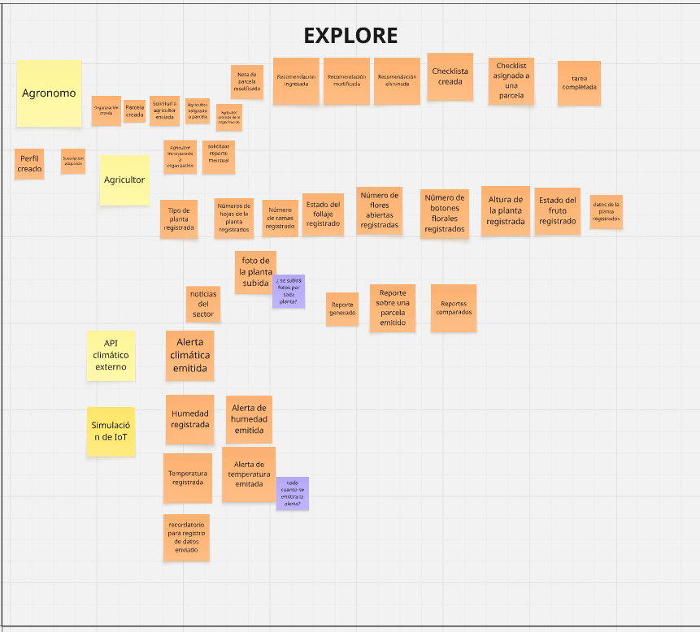
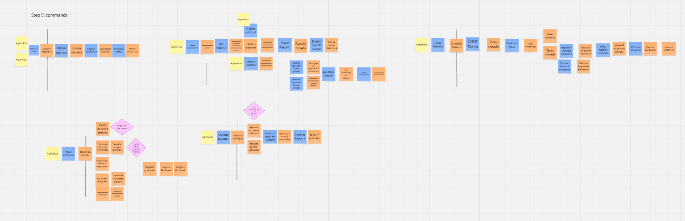
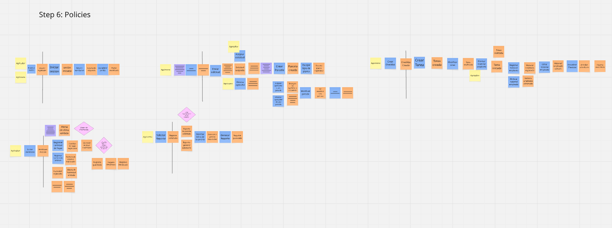
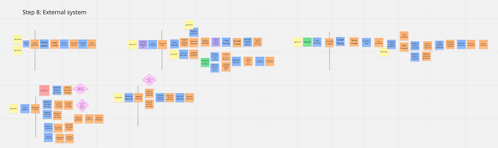

<h3>Universidad Peruana de Ciencias Aplicadas</h3>

 

<strong>Ingeniería de Software - 2025-20</strong> 
<strong>1ASI0729 - Desarrollo de Aplicaciones Open Source</strong> 
<strong>NRC: 7349</strong> 
<strong>Profesor: Efraín Ricardo Bautista Ubillús</strong> 

 <strong>Informe del Trabajo Final</strong>   

<strong>Startup: GITECH </strong> 
<strong>Producto: AgroTrack</strong> 

### Team Members:
  
|                Member                |   Code    |
|:------------------------------------:|:---------:|
| Almandroz Carbajal Pierina Marysabel |    ...    |
|         Amaro Villar Anjali          | 20221G044 |
|     Jara Benites Quique Vladimir     |    ...    |
|   Quintanilla Pozo Gonzalo Samuel    |    ...    |
|     Vilca Saboya Diego Alejandro     | 20231A778 |

<strong> Setiembre 2025</strong> 

# Registro de Versiones del Informe

| Versión | Fecha      | Autor        | Descripción de modificación                   |
|---------|------------|--------------|-----------------------------------------------|
| 1.0     | 26/08/2025 | Anjali Amaro | Creación de la estructura inicial del reporte |
|         |            |              |                                               |
|         |            |              |                                               |
|         |            |              |                                               |
|         |            |              |                                               |
|         |            |              |                                               |

# Project Report Collaboration Insights

---

# Contenido
## Tabla de contenidos
- [Student Outcome](#student-outcome)
- [Capítulo I: Introducción](#capítulo-i-introducción)
    - [1.1. Startup Profile](#11-startup-profile)
        - [1.1.1. Descripción de la Startup](#111-descripción-de-la-startup)
        - [1.1.2. Perfiles de integrantes del equipo](#112-perfiles-de-integrantes-del-equipo)
    - [1.2. Solution Profile](#12-solution-profile)
        - [1.2.1. Antecedentes y problemática](#121-antecedentes-y-problemática)
        - [1.2.2. Lean UX Process](#122-lean-ux-process)
            - [1.2.2.1. Lean UX Problem Statements](#1221-lean-ux-problem-statements)
            - [1.2.2.2. Lean UX Assumptions](#1222-lean-ux-assumptions)
            - [1.2.2.3. Lean UX Hypothesis Statements](#1223-lean-ux-hypothesis-statements)
            - [1.2.2.4. Lean UX Canvas](#1224-lean-ux-canvas)
    - [1.3. Segmentos objetivo](#13-segmentos-objetivo)
- [Capítulo II: Requirements Elicitation & Analysis](#capítulo-ii-requirements-elicitation--analysis)
    - [2.1. Competidores](#21-competidores)
        - [2.1.1. Análisis competitivo](#211-análisis-competitivo)
        - [2.1.2. Estrategias y tácticas frente a competidores](#212-estrategias-y-tácticas-frente-a-competidores)
    - [2.2. Entrevistas](#22-entrevistas)
        - [2.2.1. Diseño de entrevistas](#221-diseño-de-entrevistas)
        - [2.2.2. Registro de entrevistas](#222-registro-de-entrevistas)
        - [2.2.3. Análisis de entrevistas](#223-análisis-de-entrevistas)
    - [2.3. Needfinding](#23-needfinding)
        - [2.3.1. User Personas](#231-user-personas)
        - [2.3.2. User Task Matrix](#232-user-task-matrix)
        - [2.3.3. User Journey Mapping](#233-user-journey-mapping)
        - [2.3.4. Empathy Mapping](#234-empathy-mapping)
    - [2.4. Big Picture Event Storming](#24-big-picture-event-storming)
    - [2.5. Ubiquitous Language](#25-ubiquitous-language)
- [Capítulo III: Requirements Specification](#capítulo-iii-requirements-specification)
    - [3.1. User Stories](#31-user-stories)
    - [3.2. Impact Mapping](#32-impact-mapping)
    - [3.3. Product Backlog](#33-product-backlog)
- [Capítulo IV: Product Design](#capítulo-iv-product-design)
    - [4.1. Style Guidelines](#41-style-guidelines)
        - [4.1.1. General Style Guidelines](#411-general-style-guidelines)
        - [4.1.2. Web Style Guidelines](#412-web-style-guidelines)
    - [4.2. Information Architecture](#42-information-architecture)
        - [4.2.1. Organization Systems](#421-organization-systems)
        - [4.2.2. Labeling Systems](#422-labeling-systems)
        - [4.2.3. SEO Tags and Meta Tags](#423-seo-tags-and-meta-tags)
        - [4.2.4. Searching Systems](#424-searching-systems)
        - [4.2.5. Navigation Systems](#425-navigation-systems)
    - [4.3. Landing Page UI Design](#43-landing-page-ui-design)
        - [4.3.1. Landing Page Wireframe](#431-landing-page-wireframe)
        - [4.3.2. Landing Page Mock-up](#432-landing-page-mock-up)
    - [4.4. Web Applications UX/UI Design](#44-web-applications-uxui-design)
        - [4.4.1. Web Applications Wireframes](#441-web-applications-wireframes)
        - [4.4.2. Web Applications Wireflow Diagrams](#442-web-applications-wireflow-diagrams)
        - [4.4.2. Web Applications Mock-ups](#442-web-applications-mock-ups)
        - [4.4.3. Web Applications User Flow Diagrams](#443-web-applications-user-flow-diagrams)
    - [4.5. Web Applications Prototyping](#45-web-applications-prototyping)
    - [4.6. Domain-Driven Software Architecture](#46-domain-driven-software-architecture)
        - [4.6.1. Design-Level Event Storming](#461-design-level-event-storming)
        - [4.6.2. Software Architecture Context Diagram](#462-software-architecture-context-diagram)
        - [4.6.3. Software Architecture Container Diagrams](#463-software-architecture-container-diagrams)
        - [4.6.4. Software Architecture Components Diagrams](#464-software-architecture-components-diagrams)
    - [4.7. Software Object-Oriented Design](#47-software-object-oriented-design)
        - [4.7.1. Class Diagrams](#471-class-diagrams)
    - [4.8. Database Design](#48-database-design)
        - [4.8.1. Database Diagrams](#481-database-diagrams)
- [Capítulo V: Product Implementation, Validation & Deployment](#capítulo-v-product-implementation-validation--deployment)
    - [5.1. Software Configuration Management](#51-software-configuration-management)
        - [5.1.1. Software Development Environment Configuration](#511-software-development-environment-configuration)
        - [5.1.2. Source Code Management](#512-source-code-management)
        - [5.1.3. Source Code Style Guide & Conventions](#513-source-code-style-guide--conventions)
        - [5.1.4. Software Deployment Configuration](#514-software-deployment-configuration)
    - [5.2. Landing Page, Services & Applications Implementation](#52-landing-page-services--applications-implementation)
        - [5.2.1. Sprint 1](#521-sprint-1)
            - [5.2.1.1. Sprint Planning 1](#5211-sprint-planning-1)
            - [5.2.1.2. Aspect Leaders and Collaborators](#5212-aspect-leaders-and-collaborators)
            - [5.2.1.3. Sprint Backlog 1](#5213-sprint-backlog-1)
            - [5.2.1.4. Development Evidence for Sprint Review](#5214-development-evidence-for-sprint-review)
            - [5.2.1.5. Execution Evidence for Sprint Review](#5215-execution-evidence-for-sprint-review)
            - [5.2.1.6. Services Documentation Evidence for Sprint Review](#5216-services-documentation-evidence-for-sprint-review)
            - [5.2.1.7. Software Deployment Evidence for Sprint Review](#5217-software-deployment-evidence-for-sprint-review)
            - [5.2.1.8. Team Collaboration Insights during Sprint](#5218-team-collaboration-insights-during-sprint)
- [Conclusiones](#conclusiones)
- [Bibliografía](#bibliografía)
- [Anexos](#anexos)

---

## Student Outcome

El curso contribuye al cumplimiento del Student Outcome ABET:

**ABET – EAC - Student Outcome 3**
**Criterio:** *Capacidad de comunicarse efectivamente con un rango de audiencias.*

En el siguiente cuadro se describe las acciones realizadas y enunciados de
conclusiones por parte del grupo, que permiten sustentar el haber alcanzado el logro
del ABET – EAC - Student Outcome 3.

| Criterio específico                                                             | Acciones realizadas | Conclusiones |
|---------------------------------------------------------------------------------|---------------------|--------------|
| Comunica oralmente con   efectividad a diferentes rangos  de audiencia.   |                     |              |
| Comunica por escrito con   efectividad a diferentes rangos  de audiencia. |                     |              |

## Capítulo I: Introducción
### 1.1. Startup Profile
#### 1.1.1. Descripción de la Startup    
#### 1.1.2. Perfiles de integrantes del equipo
### 1.2. Solution Profile
#### 1.2.1. Antecedentes y problemática
#### 1.2.2. Lean UX Process
##### 1.2.2.1. Lean UX Problem Statements
##### 1.2.2.2. Lean UX Assumptions
##### 1.2.2.3. Lean UX Hypothesis Statements
##### 1.2.2.4. Lean UX Canvas
### 1.3. Segmentos objetivo

## Capítulo II: Requirements Elicitation & Analysis
### 2.1. Competidores
#### 2.1.1. Análisis competitivo
#### 2.1.2. Estrategias y tácticas frente a competidores
### 2.2. Entrevistas
#### 2.2.1. Diseño de entrevistas
#### 2.2.2. Registro de entrevistas
#### 2.2.3. Análisis de entrevistas
### 2.3. Needfinding
#### 2.3.1. User Personas
#### 2.3.2. User Task Matrix
#### 2.3.3. User Journey Mapping
#### 2.3.4. Empathy Mapping
### 2.4. Big Picture Event Storming
En esta sección se introduce y resume el proceso realizado por el equipo para el Big Picture Event Storming, que fue  
realizado mediante una llamada en discord y plasmado con la ayuda de la herramienta Miro. A continuación, se explica el proceso  

**1. Open:** 
En esta etapa el equipo se concentró en generar la mayor cantidad de eventos de dominio posibles (cosas que suceden  
en el negocio) escribiendo en los post-its naranjas.

**2. Explore:**  
Después de la anterior etapa, en esta se concentró en ordenar cronológicamente los eventos, eliminar los eventos repetidos, 
identificar sus actores y posibles sistemas externos, y finalmente algunos puntos de dolor en post-its morados.

**3. Close:**  
En esta última etapa, se documentaron en post-its rosados los problemas más relevantes detectados,junto con aspectos que  
debíamos investigar más a fondo o descartar según el alcance definido.

Luego de conversar un poco, el equipo descartó algunos eventos y identificó mejor un sistema externo:

Finalmente, se presenta el Big Picture Event Storming:

[Enlace del Miro donde se realizó el Big Picture Event Storming](https://miro.com/app/board/uXjVJOtE1kQ=/?share_link_id=250621093579)

Este proceso permitió al equipo obtener una visión de alto nivel de los principales eventos del negocio, identificar puntos  
críticos y definir prioridades para las siguientes etapas del proyecto

### 2.5. Ubiquitous Language

**Farmer(Agricultor)**  
Persona que se dedica a trabajar la tierra y cultivar alimentos, ya sea para una empresa o para sustento propio. 

**Agronomist(Agrónomo)**  
Profesional que trabaja a par con los Agricultores y les brinda asesoría experta sobre técnicas de cultivo, fertilización, protección contra plagas y enfermedades. Así mismo, les ayuda a gestionar sus recursos y evalúan la salud y rendimiento de sus cultivos.

**Plot(Parcela)**  
Porción de tierra que mide entre 100 y 500 metros cuadrados, donde se siembra un tipo de cultivo y representa un espacio delimitado para registrar observaciones sobre los cultivos.

**Crop (Cultivo):**  
Conjunto de plantas de un mismo tipo sembradas en una parcela.

**Plant(Planta)**  
Ejemplar individual o muestra representativa de un cultivo en una parcela.  
Se utiliza para registrar observaciones específicas como altura o cantidad de hojas.

**Organization(Organización)**    
Espacio de trabajo colaborativo entre el agrónomo y varios agricultores asignados en varias parcelas

**Monitoring(Monitoreo)**  
Es la revisión del entorno donde crece el cultivo como la temperatura, humedad o pH del suelo.

**Activity management (Gestión de actividades)**  
Es la gestión de tareas dejadas por el agrónomo a realizar en una o varias parcelas, donde también se registra el material empleado dado el caso.

## Capítulo III: Requirements Specification
### 3.1. User Stories
### 3.2. Impact Mapping
### 3.3. Product Backlog

## Capítulo IV: Product Design
### 4.1. Style Guidelines
#### 4.1.1. General Style Guidelines
#### 4.1.2. Web Style Guidelines
### 4.2. Information Architecture
#### 4.2.1. Organization Systems
#### 4.2.2. Labeling Systems
#### 4.2.3. SEO Tags and Meta Tags
#### 4.2.4. Searching Systems
#### 4.2.5. Navigation Systems
### 4.3. Landing Page UI Design
#### 4.3.1. Landing Page Wireframe
**Landing Page para Desktop Browser**  
En esta sección se presenta los wireframes de la versión Desktop de la landing page, donde se observa la estructura que tiene como el Header o el Hero section para llamar a nuestros segmentos objetivos.  
Esta cumple con lo definido en nuestra guía de estilos y refleja los principios de arquitectura de la información y diseño inclusivo con la opción de cambiar de idioma.  
  

  

  

  

  

**Landing Page para Mobile Browser**  
A continuación, se muestra la landing page visualizada desde un navegador web en un dispositivo móvil.
  

#### 4.3.2. Landing Page Mock-up
### 4.4. Web Applications UX/UI Design
#### 4.4.1. Web Applications Wireframes
#### 4.4.2. Web Applications Wireflow Diagrams
#### 4.4.2. Web Applications Mock-ups
#### 4.4.3. Web Applications User Flow Diagrams
### 4.5. Web Applications Prototyping
### 4.6. Domain-Driven Software Architecture
#### 4.6.1. Design-Level Event Storming
En esta sección se explica y evidencia el proceso de Design-Level EventStorming, que sirvió para plantear una aproximación revisada y mejorada al modelado de nivel general para el dominio del problema.  

**Step 1: Unstructured Exploration**  
  
En este paso el equipo comenzó con una lluvia de ideas de los eventos del dominio.

**Step 2: Timelines**  
  
En este segundo paso, el equipo ordeno los eventos de dominio en el orden que ocurren en el dominio empresarial.  
Se tuvo en cuenta los happy path y luego se agregaron los escenarios alternativos.

**Step 3: Pain Points**  
  
En este tercer paso, el equipo colocó dudas sobre el dominio o documentación faltante en algunas partes del flujo que ya había sido ordenado anteriormente.

**Step 4: Pivotal Points**  
  
En este cuarto paso, el equipo buscó eventos comerciales importantes que indiquen un cambio en el contexto y los marcó con una línea.

**Step 5: Commands**  
  
En este quinto paso, el equipo añadió comandos que desencadenen eventos o el flujo de eventos, junto a sus actores.

**Step 6: Policies**  
  
En este sexto paso, el equipo añadió policies, que son reglas de negocio que hace que se ejecuten comandos sin la necesidad de un actor.

**Step 7: Read Models**  
  
En este séptimo paso, el equipo añadió read models, que son como la vista de datos que el usuario usa para tomar la decisión de ejecutar un comando.

**Step 8: External Systems**  
  
En este octavo paso, el equipo identifico sistemas externos, en este caso solo se tiene uno que es la API que usaremos para el consumo de datos climáticos. 

**Step 9: Aggregates**  
  
En este noveno paso, el equipo antes de agregar los agregados, discutió bastantes cosas sobre pasos anteriores y se decidió hacer algunos cambios en los read models, policies, eventos y commands.

**Step 10: Bounded Contexts**  
  
En este último paso, el equipo buscó agregados que estén relacionados entre sí mediante policies para luego identificar bounded contexts.  
[Ver en Miro](https://miro.com/app/board/uXjVJKW5IPg=/?share_link_id=208743433890)

#### 4.6.2. Software Architecture Context Diagram
#### 4.6.3. Software Architecture Container Diagrams
#### 4.6.4. Software Architecture Components Diagrams
### 4.7. Software Object-Oriented Design
#### 4.7.1. Class Diagrams
### 4.8. Database Design
#### 4.8.1. Database Diagrams

## Capítulo V: Product Implementation, Validation & Deployment
### 5.1. Software Configuration Management
#### 5.1.1. Software Development Environment Configuration
#### 5.1.2. Source Code Management
#### 5.1.3. Source Code Style Guide & Conventions
#### 5.1.4. Software Deployment Configuration
### 5.2. Landing Page, Services & Applications Implementation
#### 5.2.1. Sprint 1
##### 5.2.1.1. Sprint Planning 1
##### 5.2.1.2. Aspect Leaders and Collaborators
##### 5.2.1.3. Sprint Backlog 1
##### 5.2.1.4. Development Evidence for Sprint Review
##### 5.2.1.5. Execution Evidence for Sprint Review
##### 5.2.1.6. Services Documentation Evidence for Sprint Review
##### 5.2.1.7. Software Deployment Evidence for Sprint Review
##### 5.2.1.8. Team Collaboration Insights during Sprint

# Conclusiones

# Bibliografía

# Anexos  
